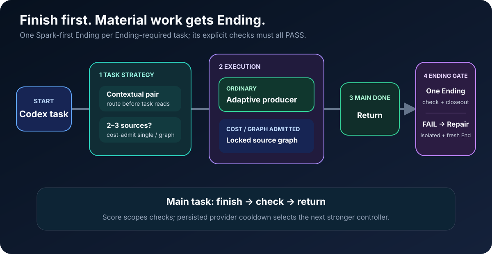

# 🚀 Auto Best Model

**Codex-only · score every task · finish the job first · launch a separate Ending for every new task**

[中文说明](./README.zh.md)

Saved highest-family quality ladder · refreshed only when you request a local model update

Small low-risk edits scoring 0–24 try Spark-low first · larger work uses the saved quality ladder

## 🔄 Core flow

<picture>
  <source media="(max-width: 600px)" srcset="./management-skill/assets/readme/core-flow-mobile.svg">
  
</picture>

## ✅ Finish first. Launch Ending for every new task.

Lifecycle:

1. **Score every submission from 0–100, then finish the requested job** and run the proportional implementation check.
2. **Return the completed result immediately.** The user is not held inside a verifier, poll loop, or repair cycle.
3. **After every new result, its entry parent starts one scored/model-routed projectless `End Task-<task name>-<check>` in the global task list, one per independent check.** The producer never starts Ending recursively; the parent binds its receipt/project context and requires a real thread acknowledgement.
4. **Every Ending runs its assigned real/completion check and terminal closeout; all required checks must PASS.** Terminal closeout always records routing classification/model history and runs the bounded personal-memory scan; no preference candidate means no preference-memory write, never no Ending. PASS/FAIL/BLOCKED tasks remain visible and report stage difficulty/pairs, attempt count, first/retry pass, suitability, next route, and Obsidian record link/status. Failure or acceptance mismatch sends an exact repair prompt through `codex_app__send_message_to_thread` to the immutable origin session; that session repairs result and starts a projectless End Task to rerun it, for up to three repairs. Ending tasks and repair handoffs never auto-archive or delete themselves.

Main work and Ending use different task sessions. A summary is not verification: heavy changes need real tests, API evidence, builds, renders, or visual checks.

## ⚡ Models & private learning

<picture>
  <source media="(max-width: 600px)" srcset="./management-skill/assets/readme/model-router-mobile.svg">
  
</picture>

- **Cold start / entry-aware:** Step-capability/difficulty history chooses the lowest correct pair. Sol/high may route down; Luna-max/lower may route up. Without a match, start at or below entry; eligible 0–24 work still tries Spark-low.
- **Learning:** A receipt-valid Real PASS retains the pair; two matched PASS outcomes may try one weaker rung; quality failure upgrades one rung. Recovered pairs are reused for exact matches; implementation and local-test steps keep separate histories.
- **Operational:** A zero-result failure gets one stronger fallback and is not learned as a quality failure.
- **Scheduling:** Compound requests split into quantifiable owned steps; each step routes independently. Two or three read-only sources are cost-admitted before reads; dependent multi-file work stays with one contextual producer.
- **Memory:** Native project → Model Switch → category → shared-category links hold every terminal Ending record; no JSON sidecar or full-history read. Receipt-backed outcomes may move routing; known assignments without receipts remain visible, non-learning observations.

## Rules

- **Producer:** Show score/band and entry/selected route; reuse the frozen lowest-correct pair. Two PASS descend; quality FAIL ascends.
- **Prompt:** Reusable prompts and durable AI instructions load Prompt Skill.
- **Route:** Delegate only on explicit request or current end-to-end proof.
- **Deliver:** Finish and return the completed main result before background verification.
- **Verify:** Every task gets a scored End Task; all checks PASS. FAIL → origin repair + fresh Ending, max 3. Simple results use a completion/record check.
- **Files:** Recall project/module/file history before editing; record the verified change after.
- **Memory:** Change history is local JSONL + optional Obsidian; project/module + code symbols (`__module__`) required; context kept as fields.
- **Models:** Use saved ladder; explicit update refreshes the highest GPT family; eligible small edits prioritize Spark-low; missing cache preserves it.
- **Privacy:** Secrets, raw prompts/results, receipts, ledgers, caches, and work artifacts stay local.

## 📊 Real adaptive benchmark: finish first, verify in background

Current frozen v47 compares **Without skill** fixed at `gpt-5.6-sol | ultra` with **With skill** entering at `gpt-5.6-luna | max`, then routing each step from frozen history. The primary metric starts after the correct route is frozen: selected producer/graph execution is counted, while entry matching, controller work, calibration failures, retry/fallback/repair, and Ending are reported separately.

<picture><source media="(max-width: 600px)" srcset="./management-skill/assets/readme/model-benchmark-example-mobile.svg"></picture>

**6 A/B pairs · 12 runs · 12/12 exact results and 12/12 Endings PASS · 3/3 Sol-entry route probes PASS · 0 retries/fallbacks/repairs**

| Tier | Direct steady tokens | Auto steady tokens | Saved | Direct steady execution | Auto steady execution | Saved |
|---|---:|---:|---:|---:|---:|---:|
| Simple | 32,654 | 93,448 | -186.176% | 22.896s | 17.561s | +23.301% |
| Medium | 49,451 | 91,398 | -84.825% | 27.676s | 28.057s | -1.377% |
| Complex | 538,903 | 273,442 | **+49.260%** | 67.047s | 45.481s | **+32.165%** |
| **All** | **621,008** | **458,288** | **+26.203%** | **117.619s** | **91.099s** | **+22.547%** |

**Measured result: correctness/evidence PASS; frozen-route aggregate performance PASS.** Stable execution saved 26.520s and 162,720 logical tokens. Actual first-result time was slower (`117.619s → 211.145s`) because 120.046s of route/controller work is deliberately excluded from the steady-state claim and shown separately. Simple and medium token regressions remain visible; this is cohort evidence, not a universal or billing-price claim.

[Read the exact v47 report.](./task-analyze-skill/TEST_AND_BENCHMARK.md) · [Open sanitized benchmark evidence.](./task-analyze-skill/assets/model-routing-benchmark-example.json)

## 🧩 Eight public Skills

- [`Task Analyze`](./task-analyze-skill/SKILL.md) — route strategy, benchmarks, and admission.
- [`Workflow`](./workflow-skill/SKILL.md) — admitted locked-route execution.
- [`Prompt`](./prompt-skill/SKILL.md) — reusable prompt and durable AI-instruction gate.
- [`Code`](./code-skill/SKILL.md) — Python, C#, Unity C#, and registered code domains.
- [`Project Memory`](./project-memory-skill/SKILL.md) — mandatory project/module/method coverage, file recall, and verified records.
- [`Verify`](./verify-skill/SKILL.md) — post-result Real Verify and regression evidence.
- [`Optimization`](./optimization-skill/SKILL.md) — stable repeated work into reusable tools.
- [`Management`](./management-skill/SKILL.md) — private profiles and public mirror management.

## 🛠️ Registered execution domains

- `general` · general · `workflow-skill` · active · Spark schedule: no · [rules](./task-analyze-skill/references/model-selection.md)
- `python` · code · `code-skill` · active · Spark schedule: source-eligible · [rules](./code-skill/references/python-rules.md)
- `csharp` · code · `code-skill` · active · Spark schedule: source-eligible · [rules](./code-skill/references/csharp-rules.md)
- `unity_csharp` · code · `code-skill` · active · Spark schedule: source-eligible · [rules](./code-skill/references/unity-csharp-rules.md)
- `code_unspecified` · code · `code-skill` · history-only · Spark schedule: source-eligible · [rules](./code-skill/references/spark-small-code.md)

## Install

1. Put the eight Skill folders under `~/.codex/skills/`.
2. Deploy [`global-agents-entry-rule.md`](./task-analyze-skill/assets/global-agents-entry-rule.md) into both `~/.codex/AGENTS.md` and the host-discoverable user-level `~/AGENTS.md`.
3. Start Codex normally; no lifecycle hook is installed.

**Privacy:** The mirror excludes auth, secrets, private ledgers, routing history, caches, raw prompts/results, receipts, and work artifacts; every publish runs a safety scan.

**Mirrors:** `qin-codex-skills` · `auto-best-model`
