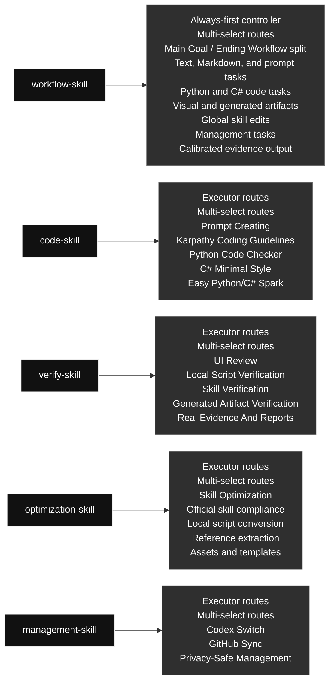
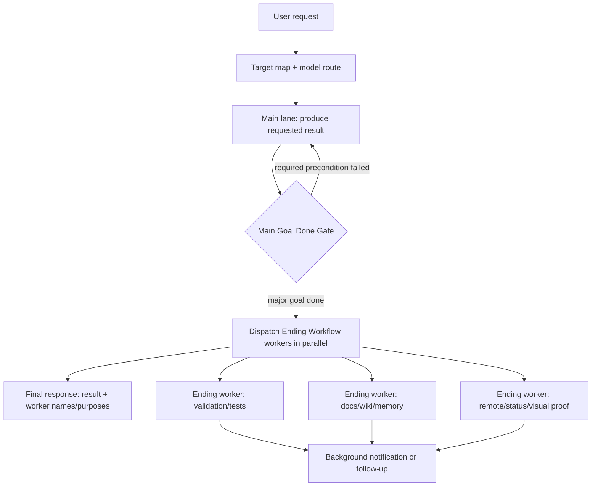

# qin-codex-skills

Chinese version: [README.zh.md](./README.zh.md)

## Skill Map

## Main Goal And Ending Workflow

This README shows the high-level global workflow contract. The full rule lives in [`workflow-skill/SKILL.md`](./workflow-skill/SKILL.md).

- **Main lane / main-goal worker:** produces or changes the requested artifact/state and handles required public-safety, privacy, or irreversible-action preconditions. The main agent waits for a worker only when that worker's output is required for the requested result.
- **Main Goal Done Gate:** the requested edit, artifact, push, publish, command, or primary state change is complete and required preconditions have passed.
- **Ending Workflow workers:** start after Main Goal Done Gate for local mini tests, real tests, validation/verification, docs/Markdown, Obsidian/wiki/DailyLog/log updates, remote hash/status proof, visual/browser review, and no-op inventory.
- **Parallel dispatch:** independent ending purposes must be spawned as subagents in parallel. The final response reports worker names/purposes and returns without waiting for every ending worker unless the user explicitly asks to wait.

### Skill Contents At A Glance

#### [`workflow-skill`](./workflow-skill/) · Workflow / 工作流类

- **Role:** Always-first controller
- **Big function:** Always-first controller that fast-paths simple work, shows diagrams and model routes, drives the main goal to Main Goal Done Gate, then dispatches parallel Ending Workflow workers.
- **Selectable modules (multi-select):** Main Goal / Ending Workflow split; Text, Markdown, and prompt tasks; Python and C# code tasks; Visual and generated artifacts; Global skill edits; Management tasks; Calibrated evidence output
- **Selection rule:** Use every module that applies to the task; this is not one-of, and unrelated modules should not run.

#### [`code-skill`](./code-skill/) · Code / 代码类

- **Role:** Executor started by workflow-skill
- **Big function:** Python/C# executor for implementation, debugging, refactoring, prompt-in-code, Unity C#, and focused code tests after workflow-skill routes the task.
- **Selectable modules (multi-select):** Prompt Creating; Karpathy Coding Guidelines; Python Code Checker; C# Minimal Style; Easy Python/C# Spark
- **Selection rule:** Use every module that applies to the task; this is not one-of, and unrelated modules should not run.

#### [`verify-skill`](./verify-skill/) · Verification / 验证类

- **Role:** Executor started by workflow-skill
- **Big function:** Runs proof after workflow-skill routes the task: one mini real test by default, real result testing for major/user-requested checks, and calibrated evidence.
- **Selectable modules (multi-select):** UI Review; Local Script Verification; Skill Verification; Generated Artifact Verification; Real Evidence And Reports
- **Selection rule:** Use every module that applies to the task; this is not one-of, and unrelated modules should not run.

#### [`optimization-skill`](./optimization-skill/) · Optimization / 优化类

- **Role:** Executor started by workflow-skill
- **Big function:** Turns explicit, repeated, or clearly reusable workflows into scripts, references, prompts, assets, or templates while preserving behavior.
- **Selectable modules (multi-select):** Skill Optimization; Official skill compliance; Local script conversion; Reference extraction; Assets and templates
- **Selection rule:** Use every module that applies to the task; this is not one-of, and unrelated modules should not run.

#### [`management-skill`](./management-skill/) · Management / 管理类

- **Role:** Executor started by workflow-skill
- **Big function:** Handles Codex profile operations and global skill GitHub sync without exposing private data.
- **Selectable modules (multi-select):** Codex Switch; GitHub Sync; Privacy-Safe Management
- **Selection rule:** Use every module that applies to the task; this is not one-of, and unrelated modules should not run.

## Operating Rules

- Python and C# code work enters through `code-skill`; frontend/UI and other language code should use the relevant production skill instead.
- Prompt/instruction authoring, updates, and optimization start through `workflow-skill`; use `code-skill` only when embedding prompts in Python or C# executable code.
- Repeated fixed workflow optimization enters through `optimization-skill`.
- Verification, real tests, and calibrated evidence outputs sit under `verify-skill`; simple results stay in chat, while PDF reports are reserved for long, visual, table-heavy, comparison-based, explicit, or repo-required evidence.
- Auth and GitHub mirror maintenance enter through `management-skill` internal routes.
- Each skill may contain multiple internal routes; select every route needed for the current request. This is multi-select, not one-of, and unrelated cases should not run.

## Current Structure

- The old code skills were merged into `code-skill`.
- The old testing skills were merged into `verify-skill`.
- UI review was broadened into `verify-skill`.
- The old image workflow skill was deleted.
