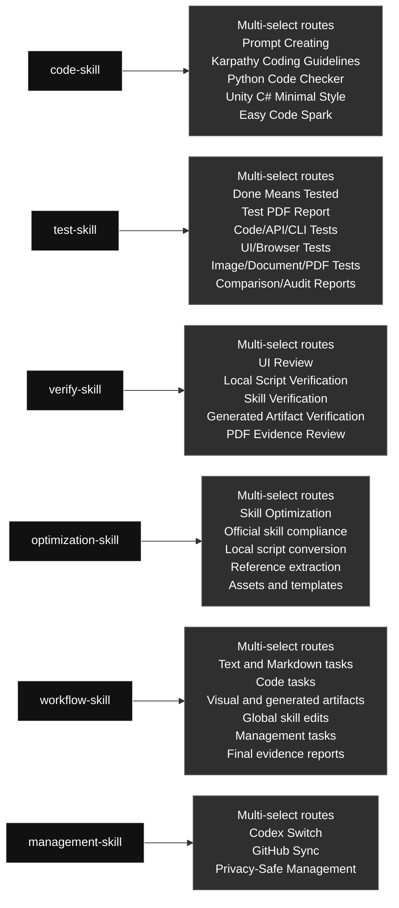

# qin-codex-skills

Chinese version: [README.zh.md](./README.zh.md)

## Skill Map

Codex skill source and multi-select routing overview.

### Skill Contents At A Glance

#### [`code-skill`](./code-skill/) · Code / 代码类

- **Big function:** Combines prompt, coding approach, Python, Unity C#, and small-code modules, selecting every applicable module for the task.
- **Selectable modules (multi-select):** Prompt Creating; Karpathy Coding Guidelines; Python Code Checker; Unity C# Minimal Style; Easy Code Spark
- **Selection rule:** Use every module that applies to the task; this is not one-of, and unrelated modules should not run.

#### [`test-skill`](./test-skill/) · Testing / 测试类

- **Big function:** Runs real executable checks and produces evidence-rich PDF reports, combining evidence routes when a result spans code, UI, images, documents, or PDFs.
- **Selectable modules (multi-select):** Done Means Tested; Test PDF Report; Code/API/CLI Tests; UI/Browser Tests; Image/Document/PDF Tests; Comparison/Audit Reports
- **Selection rule:** Use every module that applies to the task; this is not one-of, and unrelated modules should not run.

#### [`verify-skill`](./verify-skill/) · Verification / 验证类

- **Big function:** Checks UI, scripts, generated artifacts, skills, and workflows, combining verification routes when the user's requirement spans artifacts.
- **Selectable modules (multi-select):** UI Review; Local Script Verification; Skill Verification; Generated Artifact Verification; PDF Evidence Review
- **Selection rule:** Use every module that applies to the task; this is not one-of, and unrelated modules should not run.

#### [`optimization-skill`](./optimization-skill/) · Optimization / 优化类

- **Big function:** Turns stable repeated workflows into reusable local scripts, references, or assets, combining optimization routes when that saves tokens.
- **Selectable modules (multi-select):** Skill Optimization; Official skill compliance; Local script conversion; Reference extraction; Assets and templates
- **Selection rule:** Use every module that applies to the task; this is not one-of, and unrelated modules should not run.

#### [`workflow-skill`](./workflow-skill/) · Workflow / 工作流类

- **Big function:** Controls task decomposition, goal checks, routing, iteration, and final evidence, with multi-select routes for mixed Codex requests.
- **Selectable modules (multi-select):** Text and Markdown tasks; Code tasks; Visual and generated artifacts; Global skill edits; Management tasks; Final evidence reports
- **Selection rule:** Use every module that applies to the task; this is not one-of, and unrelated modules should not run.

#### [`management-skill`](./management-skill/) · Management / 管理类

- **Big function:** Routes Codex profile management and global skill GitHub sync, using one or both management routes as required.
- **Selectable modules (multi-select):** Codex Switch; GitHub Sync; Privacy-Safe Management
- **Selection rule:** Use every module that applies to the task; this is not one-of, and unrelated modules should not run.

