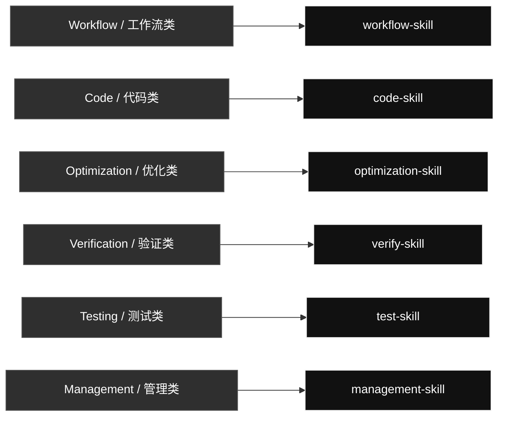

# qin-codex-skills

Codex skill source and routing overview.

## Skill Map

## Skill Contents

### Workflow / 工作流类

#### [`workflow-skill`](./workflow-skill/)

Controls task decomposition, goal checks, routing, iteration, and final evidence for Codex requests.

- **Text and Markdown tasks**: Text, markdown, explanation, classification, and rewrite requests with explicit format targets.
- **Code tasks**: Code, Python, Unity C#, prompt-in-code, frontend/UI, scripts, and executable behavior requests.
- **Visual and generated artifacts**: Image, UI, browser screenshot, document, PDF, report, and generated file tasks.
- **Global skill edits**: Create, merge, rename, delete, reorganize, or update global Codex skills.
- **Management tasks**: Account/profile switching and global skill GitHub sync through management-skill.
- **Final evidence reports**: Evidence PDFs and completion reports when the task needs proof.

### Code / 代码类

#### [`code-skill`](./code-skill/)

Combines prompt, coding approach, Python, Unity C#, and small-code content.

- **Prompt Creating**: Prompt generation only: create, rewrite, or embed prompts into the corresponding text or code.
- **Karpathy Coding Guidelines**: Code thinking and implementation approach for assumptions, simple design, naming, branching, and surgical edits.
- **Python Code Checker**: Python modules, scripts, tests, snippets, prompt assignments, formatting, contracts, error handling, and logging rules.
- **Unity C# Minimal Style**: Unity MonoBehaviours, ScriptableObjects, managers, gameplay systems, editor scripts, lifecycle methods, and Unity C# style.
- **Easy Code Spark**: Small bounded code tasks that can use the Spark small-task route when the task is obvious and low risk.

### Optimization / 优化类

#### [`optimization-skill`](./optimization-skill/)

Turns stable repeated workflows into reusable local scripts, references, or assets when that saves tokens.

- **Skill Optimization**: Optimize fixed or repeated skill workflows into local scripts, references, assets, or templates that save tokens.
- **Official skill compliance**: Audit skill structure, frontmatter, trigger descriptions, references, scripts, assets, and token-use behavior.
- **Local script conversion**: Turn stable repeated test, image, browser, computer-control, report, or generation steps into reusable local code.
- **Reference extraction**: Move long stable instructions into references/ so they load only when the task needs them.
- **Assets and templates**: Store reusable fixtures, templates, or media in assets/ when those files are part of the optimized skill.

### Verification / 验证类

#### [`verify-skill`](./verify-skill/)

Checks UI, scripts, generated artifacts, skills, and workflows against the user's requirement.

- **UI Review**: UI/UX, layout, responsive checks, screenshots, frontend polish, browser states, and Taste Skill visual QA.
- **Local Script Verification**: Optimized local scripts and workflows with concrete cache inputs, real outputs, rerun behavior, and output paths.
- **Skill Verification**: SKILL.md frontmatter, trigger wording, referenced files, old-name cleanup, route behavior, and skill structure.
- **Generated Artifact Verification**: Markdown, images, PDFs, documents, reports, data files, and exports through open/render/parse/inspect checks.
- **PDF Evidence Review**: Verify generated PDF reports contain real Input, Used, Output, and Why Pass evidence.

### Testing / 测试类

#### [`test-skill`](./test-skill/)

Runs real executable checks and produces evidence-rich PDF reports.

- **Done Means Tested**: After code or workflow changes, run a small real usage test with concrete inputs and real outputs.
- **Test PDF Report**: Generate a PDF report that records exactly what input was given, what command/tool was used, what output came back, and why it passes.
- **Code/API/CLI Tests**: Real scripts, commands, CLI invocations, API calls, local handlers, stdout, files, JSON, and returned values.
- **UI/Browser Tests**: Real page states, screenshots, viewport sizes, console/runtime evidence, and interaction results.
- **Image/Document/PDF Tests**: Real source/output images, generated files, rendered documents, parsed PDFs, and artifact paths.
- **Comparison/Audit Reports**: Before/after, expected/actual, audit findings, and pass/fail evidence with concrete artifacts.

### Management / 管理类

#### [`management-skill`](./management-skill/)

Routes Codex profile management and global skill GitHub sync through the right support skill.

- **Codex Switch**: Local Codex auth profiles, saved profile listing, usage snapshots, login refresh, profile backup/import, and confirmed account switching.
- **GitHub Sync**: Global skill mirror status, preuse checks, public-safety scan, sync, pull, push, commit, and remote hash verification.
- **Privacy-Safe Management**: Auth files, tokens, cookies, profile IDs, raw logs, cache files, and secrets stay local and are never published.

## Management Support Skill Contents

These are real mirrored skills used by `management-skill`, but they are not shown as separate primary map rows.

### [`codex-switch`](./codex-switch/)

Manages local Codex auth profiles and account switching without exposing private auth data.

- **List profiles**: Inspect saved local auth profile files.
- **Live usage probes**: Run isolated live checks only when current usage matters.
- **Switch profile**: Copy a confirmed saved profile onto auth.json after explicit confirmation.
- **Refresh/login backup**: Run browser login and save a refreshed profile backup.
- **Save current auth**: Back up the current auth.json under a requested local profile name.
- **Import auth file**: Import a user-supplied auth file into a named local profile.
- **Privacy guardrails**: Never expose or publish tokens, auth files, account IDs, or raw logs.

### [`github-sync`](./github-sync/)

Syncs, commits, and pushes Codex skill changes to the public GitHub mirror with privacy checks.

- **sync**: Normal before/after route for skill work.
- **status**: Dry-run preview of local-to-remote changes.
- **preuse**: Read-only inspection before using or editing skills.
- **pull**: Accept remote changes into local skills.
- **push**: Publish local skill changes to GitHub.
- **public safety scan**: Block auth files, secrets, cache, logs, and generated private artifacts.
