# qin-codex-skills

Public mirror of Qin's user global Codex skills from `~/.codex/skills`.

This repository stores global skill source files only. Do not copy the repository `.git` directory into `~/.codex/skills`.

## Global Skill Map

```mermaid
flowchart LR
  root((Global Codex Skills))
  root --- category_Workflow["Workflow / 工作流类"]
  category_Workflow --- skill_workflow_skill["workflow-skill"]
  skill_workflow_skill --- branch_workflow_skill_Task_decomposition["Task decomposition"]
  skill_workflow_skill --- branch_workflow_skill_Artifact_target_map["Artifact target map"]
  skill_workflow_skill --- branch_workflow_skill_Skill_routing["Skill routing"]
  skill_workflow_skill --- branch_workflow_skill_Code_test_verify_spine["Code-test-verify spine"]
  skill_workflow_skill --- branch_workflow_skill_Completion_loop["Completion loop"]
  skill_workflow_skill --- branch_workflow_skill_Final_evidence_report["Final evidence report"]
  root --- category_Code["Code / 代码类"]
  category_Code --- skill_code_skill["code-skill"]
  skill_code_skill --- branch_code_skill_Prompt_generation["Prompt generation"]
  skill_code_skill --- branch_code_skill_Coding_approach["Coding approach"]
  skill_code_skill --- branch_code_skill_Spark_small_task_routing["Spark small-task routing"]
  skill_code_skill --- branch_code_skill_Python_rules["Python rules"]
  skill_code_skill --- branch_code_skill_Unity_C_rules["Unity C# rules"]
  skill_code_skill --- branch_code_skill_Real_test_report_flow["Real test/report flow"]
  root --- category_Optimization["Optimization / 优化类"]
  category_Optimization --- skill_optimization_skill["optimization-skill"]
  skill_optimization_skill --- branch_optimization_skill_Official_compliance_audit["Official compliance audit"]
  skill_optimization_skill --- branch_optimization_skill_Instruction_tightening["Instruction tightening"]
  skill_optimization_skill --- branch_optimization_skill_References_extraction["References extraction"]
  skill_optimization_skill --- branch_optimization_skill_Script_conversion["Script conversion"]
  skill_optimization_skill --- branch_optimization_skill_Assets_templates["Assets/templates"]
  skill_optimization_skill --- branch_optimization_skill_No_op_decision["No-op decision"]
  skill_optimization_skill --- branch_optimization_skill_Code_skill_gate["Code-skill gate"]
  root --- category_Verification["Verification / 验证类"]
  category_Verification --- skill_verify_skill["verify-skill"]
  skill_verify_skill --- branch_verify_skill_UI_verification["UI verification"]
  skill_verify_skill --- branch_verify_skill_Local_script_process_verification["Local script/process verification"]
  skill_verify_skill --- branch_verify_skill_Code_behavior_verification["Code behavior verification"]
  skill_verify_skill --- branch_verify_skill_Skill_instruction_verification["Skill/instruction verification"]
  skill_verify_skill --- branch_verify_skill_Generated_artifact_review["Generated artifact review"]
  skill_verify_skill --- branch_verify_skill_Mixed_route["Mixed route"]
  root --- category_Testing["Testing / 测试类"]
  category_Testing --- skill_test_skill["test-skill"]
  skill_test_skill --- branch_test_skill_Code_API_CLI_evidence["Code/API/CLI evidence"]
  skill_test_skill --- branch_test_skill_UI_browser_evidence["UI/browser evidence"]
  skill_test_skill --- branch_test_skill_Image_evidence["Image evidence"]
  skill_test_skill --- branch_test_skill_Document_PDF_evidence["Document/PDF evidence"]
  skill_test_skill --- branch_test_skill_Comparison_audit_reports["Comparison/audit reports"]
  skill_test_skill --- branch_test_skill_Evidence_contract["Evidence contract"]
  root --- category_Management["Management / 管理类"]
  category_Management --- skill_codex_switch["codex-switch"]
  skill_codex_switch --- branch_codex_switch_List_profiles["List profiles"]
  skill_codex_switch --- branch_codex_switch_Live_usage_probes["Live usage probes"]
  skill_codex_switch --- branch_codex_switch_Switch_profile["Switch profile"]
  skill_codex_switch --- branch_codex_switch_Refresh_login_backup["Refresh/login backup"]
  skill_codex_switch --- branch_codex_switch_Save_current_auth["Save current auth"]
  skill_codex_switch --- branch_codex_switch_Import_auth_file["Import auth file"]
  skill_codex_switch --- branch_codex_switch_Privacy_guardrails["Privacy guardrails"]
  category_Management --- skill_github_sync["github-sync"]
  skill_github_sync --- branch_github_sync_sync["sync"]
  skill_github_sync --- branch_github_sync_status["status"]
  skill_github_sync --- branch_github_sync_preuse["preuse"]
  skill_github_sync --- branch_github_sync_pull["pull"]
  skill_github_sync --- branch_github_sync_push["push"]
  skill_github_sync --- branch_github_sync_public_safety_scan["public safety scan"]
  classDef root fill:#000,color:#fff,stroke:#111,stroke-width:2px;
  classDef category fill:#2f2f2f,color:#fff,stroke:#555;
  classDef skill fill:#111,color:#fff,stroke:#eee;
  classDef branch fill:#1f1f1f,color:#fff,stroke:#777;
  class root root;
  class category_Workflow,category_Code,category_Optimization,category_Verification,category_Testing,category_Management category;
  class skill_workflow_skill,skill_code_skill,skill_optimization_skill,skill_verify_skill,skill_test_skill,skill_codex_switch,skill_github_sync skill;
  class branch_workflow_skill_Task_decomposition,branch_workflow_skill_Artifact_target_map,branch_workflow_skill_Skill_routing,branch_workflow_skill_Code_test_verify_spine,branch_workflow_skill_Completion_loop,branch_workflow_skill_Final_evidence_report,branch_code_skill_Prompt_generation,branch_code_skill_Coding_approach,branch_code_skill_Spark_small_task_routing,branch_code_skill_Python_rules,branch_code_skill_Unity_C_rules,branch_code_skill_Real_test_report_flow,branch_optimization_skill_Official_compliance_audit,branch_optimization_skill_Instruction_tightening,branch_optimization_skill_References_extraction,branch_optimization_skill_Script_conversion,branch_optimization_skill_Assets_templates,branch_optimization_skill_No_op_decision,branch_optimization_skill_Code_skill_gate,branch_verify_skill_UI_verification,branch_verify_skill_Local_script_process_verification,branch_verify_skill_Code_behavior_verification,branch_verify_skill_Skill_instruction_verification,branch_verify_skill_Generated_artifact_review,branch_verify_skill_Mixed_route,branch_test_skill_Code_API_CLI_evidence,branch_test_skill_UI_browser_evidence,branch_test_skill_Image_evidence,branch_test_skill_Document_PDF_evidence,branch_test_skill_Comparison_audit_reports,branch_test_skill_Evidence_contract,branch_codex_switch_List_profiles,branch_codex_switch_Live_usage_probes,branch_codex_switch_Switch_profile,branch_codex_switch_Refresh_login_backup,branch_codex_switch_Save_current_auth,branch_codex_switch_Import_auth_file,branch_codex_switch_Privacy_guardrails,branch_github_sync_sync,branch_github_sync_status,branch_github_sync_preuse,branch_github_sync_pull,branch_github_sync_push,branch_github_sync_public_safety_scan branch;
```

## Diagram Explanation

- The center node is the full set of user global Codex skills.
- First-level nodes are skill categories.
- Second-level nodes are the actual skill names that Codex can invoke.
- Third-level nodes are internal branches selected by task type; Codex should not run every branch every time.

## Skills

### [`code-skill`](./code-skill/)

Unified code skill for all code-related Codex work. Use for writing, editing, refactoring, debugging, reviewing, optimizing, or explaining code; prompt generation and prompt-in-code work; Python modules, scripts, tests, and snippets; Unity C# MonoBehaviours, ScriptableObjects, managers, and gameplay systems; and obvious bounded code tasks that may use Spark when an allowed model route exists.

### [`codex-switch`](./codex-switch/)

Inspect, manage, and switch local Codex auth profiles under `~/.codex`. Use when the user wants local Codex account/profile switching, finding `auth*.json` files, identifying which account each file belongs to, reviewing the latest locally observed Codex usage or rate-limit snapshot for each account, refreshing or backing up a local login, or switching the active profile by copying one saved auth file onto `auth.json` without deleting anything or exposing raw tokens.

### [`github-sync`](./github-sync/)

Sync, commit, and push Qin's user global Codex skills with the GitHub repository qin-codex-skills. Use when Codex needs to read, use, create, edit, rename, delete, or update global skills under ~/.codex/skills; when global skill changes should be committed and pushed to GitHub; or when local and remote global-skill state must be compared without placing .git metadata inside ~/.codex/skills. Always keep the public mirror safe by excluding caches, generated artifacts, auth files, tokens, secrets, local logs, and other private personal data.

### [`optimization-skill`](./optimization-skill/)

Optimize repetitive Codex skills and fixed workflows into reusable local files, scripts, references, or assets that save tokens and execution time. Use when the user explicitly asks to optimize a skill or repeated process into local code/files; when a skill workflow is stable but too verbose; when repeated test, image, browser, computer-control, report, or generation steps can become deterministic Python scripts; or when Codex notices a highly repeated fixed flow that should be made reusable. Must prepare references first, follow code-skill for all code/script work, and verify the optimized workflow with real execution before finishing.

### [`test-skill`](./test-skill/)

Unified testing and report skill. Use when code, UI, scripts, automations, generated assets, or content have been created or changed; when the user asks to test, verify, QA, smoke test, validate, prove, or generate a report; and whenever completed work needs real executable evidence plus a concise visual PDF report. Requires real runnable tests with concrete generated inputs, real inputs/outputs, the exact command/tool used, and a clear pass reason instead of mock-only, signature-only, or pass/OK-only checks.

### [`verify-skill`](./verify-skill/)

General verification skill for checking whether workflows, local scripts, UI/UX, generated artifacts, skill edits, and process optimizations actually satisfy the user's requirement. Use when Codex is asked to verify, review, audit, validate, inspect quality, confirm a workflow, check UI/visual quality, or validate that an optimized local script/process still works. For UI verification, fetch/read leonxlnx/taste-skill and combine it with the local UI problem index before deciding whether the UI passes.

### [`workflow-skill`](./workflow-skill/)

Global task workflow controller for Codex requests. Use at the start of any user task that needs decomposition, explicit goals, skill routing, code/script/workflow work, testing, verification, iteration to completion, or a final evidence report. It breaks the request into steps, defines artifact-specific pass criteria, routes code work through code-skill before test-skill and verify-skill, loops until the stated goals pass, and keeps process detail in the report instead of the final chat.
