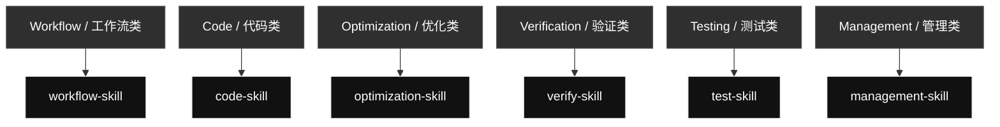
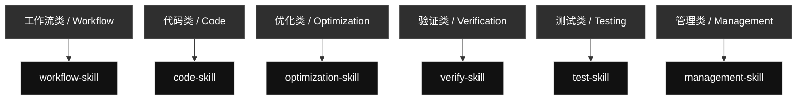

# qin-codex-skills

Language: [English](#english) | [中文](#zh)

## English

Codex skill source and routing overview.

### Skill Contents At A Glance

#### [`workflow-skill`](./workflow-skill/) · Workflow / 工作流类

- **Big function:** Controls task decomposition, goal checks, routing, iteration, and final evidence for Codex requests.
- **Internal flow:** Text and Markdown tasks -> Code tasks -> Visual and generated artifacts -> Global skill edits -> Management tasks -> Final evidence reports

#### [`code-skill`](./code-skill/) · Code / 代码类

- **Big function:** Combines prompt, coding approach, Python, Unity C#, and small-code content.
- **Internal flow:** Prompt Creating -> Karpathy Coding Guidelines -> Python Code Checker -> Unity C# Minimal Style -> Easy Code Spark

#### [`optimization-skill`](./optimization-skill/) · Optimization / 优化类

- **Big function:** Turns stable repeated workflows into reusable local scripts, references, or assets when that saves tokens.
- **Internal flow:** Skill Optimization -> Official skill compliance -> Local script conversion -> Reference extraction -> Assets and templates

#### [`verify-skill`](./verify-skill/) · Verification / 验证类

- **Big function:** Checks UI, scripts, generated artifacts, skills, and workflows against the user's requirement.
- **Internal flow:** UI Review -> Local Script Verification -> Skill Verification -> Generated Artifact Verification -> PDF Evidence Review

#### [`test-skill`](./test-skill/) · Testing / 测试类

- **Big function:** Runs real executable checks and produces evidence-rich PDF reports.
- **Internal flow:** Done Means Tested -> Test PDF Report -> Code/API/CLI Tests -> UI/Browser Tests -> Image/Document/PDF Tests -> Comparison/Audit Reports

#### [`management-skill`](./management-skill/) · Management / 管理类

- **Big function:** Routes Codex profile management and global skill GitHub sync through the right support skill.
- **Internal flow:** Codex Switch -> GitHub Sync -> Privacy-Safe Management

### Skill Map

### Management Support Skill Contents

These are real mirrored skills used by `management-skill`, but they are not shown as separate primary map rows.

#### [`codex-switch`](./codex-switch/)

- **Big function:** Manages local Codex auth profiles and account switching without exposing private auth data.
- **Internal flow:** List profiles -> Live usage probes -> Switch profile -> Refresh/login backup -> Save current auth -> Import auth file -> Privacy guardrails

#### [`github-sync`](./github-sync/)

- **Big function:** Syncs, commits, and pushes Codex skill changes to the public GitHub mirror with privacy checks.
- **Internal flow:** sync -> status -> preuse -> pull -> push -> public safety scan

## 中文

语言: [English](#english) | [中文](#zh)

这是全局 Codex skills 的公开镜像和路由说明。下面先列出每个 skill 的具体能力，再展示主 skill 图。

### Skill 内容一览

#### [`workflow-skill`](./workflow-skill/) · 工作流类 / Workflow

- **大功能：** 统一控制 Codex 任务拆分、目标检查、skill 路由、循环验证和最终证据。
- **内部流程：** 文本和 Markdown 任务 -> 代码任务 -> 视觉和生成物 -> 全局 skill 编辑 -> 管理任务 -> 最终证据报告

#### [`code-skill`](./code-skill/) · 代码类 / Code

- **大功能：** 合并 prompt、代码思路、Python、Unity C# 和小代码任务相关内容。
- **内部流程：** Prompt Creating -> Karpathy Coding Guidelines -> Python Code Checker -> Unity C# Minimal Style -> Easy Code Spark

#### [`optimization-skill`](./optimization-skill/) · 优化类 / Optimization

- **大功能：** 把稳定重复的流程优化成本地脚本、引用资料、资产或模板，用来节省 token 和执行时间。
- **内部流程：** Skill Optimization -> 官方 skill 合规检查 -> 本地脚本转换 -> 引用资料抽取 -> 资产和模板

#### [`verify-skill`](./verify-skill/) · 验证类 / Verification

- **大功能：** 检查 UI、脚本、生成物、skill 和工作流是否真的满足用户要求。
- **内部流程：** UI Review -> 本地脚本验证 -> Skill 验证 -> 生成物验证 -> PDF 证据检查

#### [`test-skill`](./test-skill/) · 测试类 / Testing

- **大功能：** 执行真实测试，并生成带输入、方法、输出和通过原因的 PDF 报告。
- **内部流程：** Done Means Tested -> Test PDF Report -> Code/API/CLI Tests -> UI/Browser Tests -> Image/Document/PDF Tests -> Comparison/Audit Reports

#### [`management-skill`](./management-skill/) · 管理类 / Management

- **大功能：** 统一管理 Codex 本地账号/Profile 操作，以及全局 skill 的 GitHub 同步。
- **内部流程：** Codex Switch -> GitHub Sync -> 隐私安全管理

### 技能图

### 管理支持 Skill 内容

这些也是真实同步到仓库的 skill，由 `management-skill` 调用，但不作为主图里的单独主入口展示。

#### [`codex-switch`](./codex-switch/)

- **大功能：** 管理本地 Codex auth profile 和账号切换，同时避免暴露私密 auth 数据。
- **内部流程：** 列出 profiles -> 实时用量探测 -> 切换 profile -> 刷新/登录备份 -> 保存当前 auth -> 导入 auth 文件 -> 隐私保护

#### [`github-sync`](./github-sync/)

- **大功能：** 把全局 Codex skill 安全同步、提交并推送到公开 GitHub 镜像。
- **内部流程：** sync -> status -> preuse -> pull -> push -> 公开安全扫描
