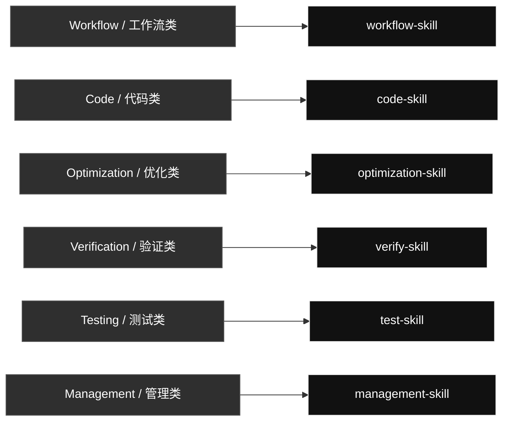

# qin-codex-skills

Codex skill source and routing overview.

## Skill Map

## Skill Details

### Workflow / 工作流类

#### [`workflow-skill`](./workflow-skill/)

Controls task decomposition, goal checks, routing, iteration, and final evidence for Codex requests.

- **Task decomposition**: Break the request into ordered task slices before execution.
- **Artifact target map**: Define text, image, code, UI, PDF, skill, GitHub, or management pass targets.
- **Skill routing**: Choose only the relevant production, test, verify, sync, or management route.
- **Code-test-verify spine**: For executable behavior, enforce code-skill -> test-skill -> verify-skill.
- **Completion loop**: Compare evidence against the target map and continue until goals pass or a real blocker appears.
- **Final evidence report**: Keep process detail in the report and keep the final chat concise.

### Code / 代码类

#### [`code-skill`](./code-skill/)

Routes code work to the right coding, prompt, Python, Unity C#, or small-task branch.

- **Prompt generation**: Only for creating, rewriting, or embedding prompts.
- **Coding approach**: Use for assumptions, smallest viable implementation, and surgical edits.
- **Spark small-task routing**: Use only for obvious bounded low-risk code tasks when an allowed route exists.
- **Python rules**: Use for Python modules, scripts, tests, snippets, and Python prompt assignments.
- **Unity C# rules**: Use for Unity MonoBehaviours, ScriptableObjects, managers, and gameplay systems.
- **Real test/report flow**: After code changes, route real executable evidence through test-skill unless testing is explicitly forbidden.

### Optimization / 优化类

#### [`optimization-skill`](./optimization-skill/)

Turns stable repeated workflows into reusable local scripts, references, or assets when that saves tokens.

- **Official compliance audit**: Check a whole user skill collection against official structure, trigger, reference, and token-use rules.
- **Instruction tightening**: Tighten triggers, workflow wording, guardrails, and duplicated requirements.
- **References extraction**: Move long stable context into references/ when it should be loaded only when needed.
- **Script conversion**: Move repeated deterministic steps into scripts/ when it saves tokens and remains testable.
- **Assets/templates**: Store reusable fixtures, templates, or media in assets/ when they are part of the skill.
- **No-op decision**: Leave the skill unchanged when optimization is not justified.
- **Code-skill gate**: Use code-skill before writing or editing helper code.

### Verification / 验证类

#### [`verify-skill`](./verify-skill/)

Checks UI, scripts, generated artifacts, skills, and workflows against the user's requirement.

- **UI verification**: Use Taste Skill plus the local problem index for visual/UI checks.
- **Local script/process verification**: Run local scripts with concrete cache inputs and inspect outputs.
- **Code behavior verification**: Define the behavior that test-skill must prove with real execution.
- **Skill/instruction verification**: Check frontmatter, triggers, references, paths, old names, and route behavior.
- **Generated artifact review**: Open, render, parse, or inspect generated files and reports.
- **Mixed route**: Combine only the relevant verification routes when the task spans artifacts.

### Testing / 测试类

#### [`test-skill`](./test-skill/)

Runs real executable checks and produces evidence-rich PDF reports.

- **Code/API/CLI evidence**: Run real commands, API calls, or scripts and record input, used method, output, and pass reason.
- **UI/browser evidence**: Capture real screenshots, page states, console/runtime evidence, and viewport details.
- **Image evidence**: Use real source/output images and visual artifacts.
- **Document/PDF evidence**: Render, parse, or inspect documents and PDFs with local tools.
- **Comparison/audit reports**: Show before/after, expected/actual, or audit findings with concrete evidence.
- **Evidence contract**: Every passing case needs Input, Used, Output, and Why Pass.

### Management / 管理类

#### [`management-skill`](./management-skill/)

Routes Codex profile management and global skill GitHub sync through the right support skill.

- **codex-switch route**: Use the existing codex-switch skill for local Codex auth profiles, profile inspection, backups, imports, and confirmed account switching.
- **github-sync route**: Use the existing github-sync skill for global skill status, public-safety scan, sync, pull, push, and remote commit verification.
- **Privacy guardrails**: Never expose auth files, tokens, cookies, profile IDs, raw logs, cache files, or secrets.
- **Route selection**: Run only the management route needed by the request; do not run account switching and GitHub sync just because both exist.
- **Evidence**: Record the real local command or tool used, output state, remote hash or profile result, and why it satisfies the request.

## Management Support Skills

These are real mirrored skills used by `management-skill`, but they are not shown as separate primary map rows.

- [`codex-switch`](./codex-switch/): Manages local Codex auth profiles and account switching without exposing private auth data.
- [`github-sync`](./github-sync/): Syncs, commits, and pushes Codex skill changes to the public GitHub mirror with privacy checks.