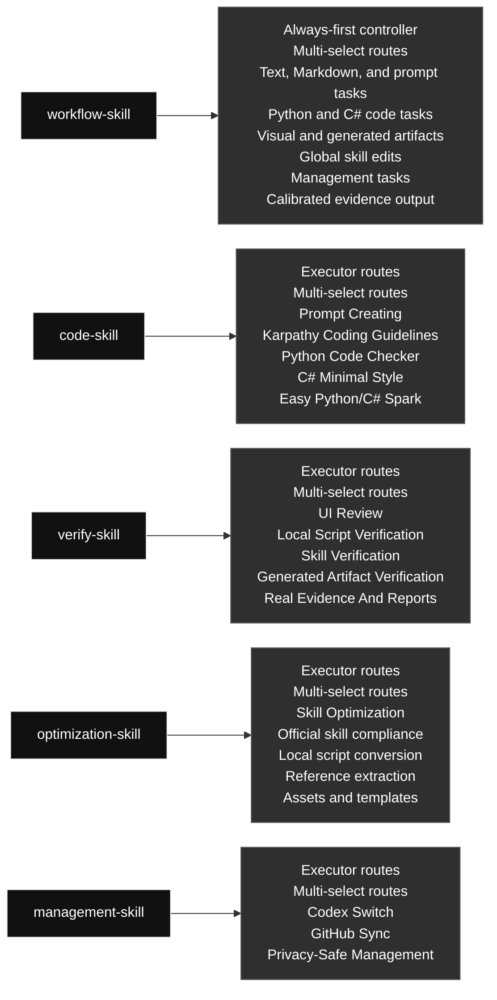

# qin-codex-skills

Chinese version: [README.zh.md](./README.zh.md)

## Skill Map

`workflow-skill` is the always-first controller. Every other primary skill is an executor selected by it. This is the Codex skill source and multi-select routing overview.

### Skill Contents At A Glance

#### [`workflow-skill`](./workflow-skill/) · Workflow / 工作流类

- **Role:** Always-first controller
- **Big function:** Always starts task execution, including prompt/instruction authoring and updates, defines goals, selects executor skills, routes work, iterates, and checks final evidence.
- **Selectable modules (multi-select):** Text, Markdown, and prompt tasks; Python and C# code tasks; Visual and generated artifacts; Global skill edits; Management tasks; Calibrated evidence output
- **Selection rule:** Use every module that applies to the task; this is not one-of, and unrelated modules should not run.

#### [`code-skill`](./code-skill/) · Code / 代码类

- **Role:** Executor started by workflow-skill
- **Big function:** Executes Python and C# code work only after workflow-skill routes the task, combining prompt embedding, coding approach, Python, C#/Unity C#, and small-code modules.
- **Selectable modules (multi-select):** Prompt Creating; Karpathy Coding Guidelines; Python Code Checker; C# Minimal Style; Easy Python/C# Spark
- **Selection rule:** Use every module that applies to the task; this is not one-of, and unrelated modules should not run.

#### [`verify-skill`](./verify-skill/) · Verification / 验证类

- **Role:** Executor started by workflow-skill
- **Big function:** Executes real tests, evidence capture, report generation, and verification after workflow-skill routes the task, checking outputs against the user's requirement.
- **Selectable modules (multi-select):** UI Review; Local Script Verification; Skill Verification; Generated Artifact Verification; Real Evidence And Reports
- **Selection rule:** Use every module that applies to the task; this is not one-of, and unrelated modules should not run.

#### [`optimization-skill`](./optimization-skill/) · Optimization / 优化类

- **Role:** Executor started by workflow-skill
- **Big function:** Executes optional post-verification optimization for explicit, repeated, or clearly reusable stable workflows, turning them into reusable scripts, references, prompts, or assets.
- **Selectable modules (multi-select):** Skill Optimization; Official skill compliance; Local script conversion; Reference extraction; Assets and templates
- **Selection rule:** Use every module that applies to the task; this is not one-of, and unrelated modules should not run.

#### [`management-skill`](./management-skill/) · Management / 管理类

- **Role:** Executor started by workflow-skill
- **Big function:** Executes management work after workflow-skill routes the task, covering Codex profiles and global skill GitHub sync.
- **Selectable modules (multi-select):** Codex Switch; GitHub Sync; Privacy-Safe Management
- **Selection rule:** Use every module that applies to the task; this is not one-of, and unrelated modules should not run.

