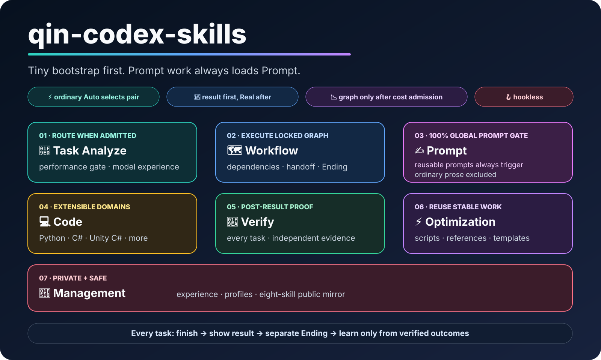
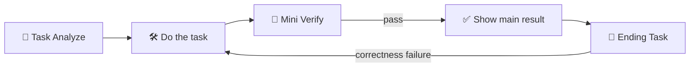
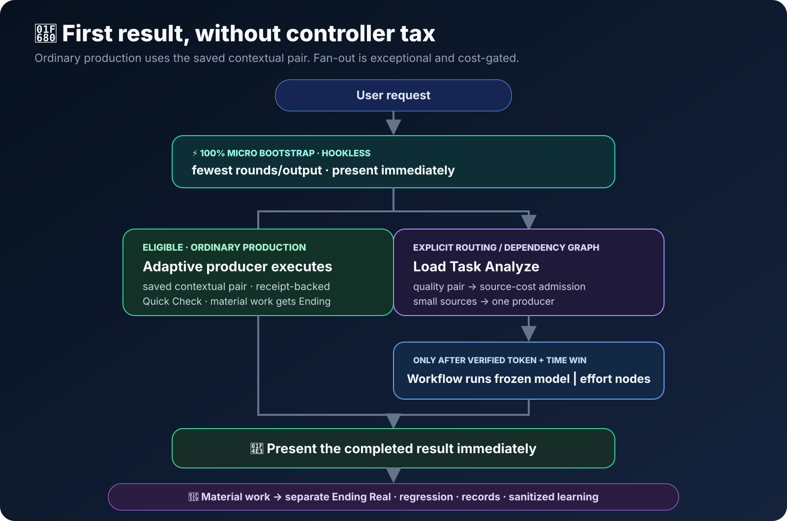
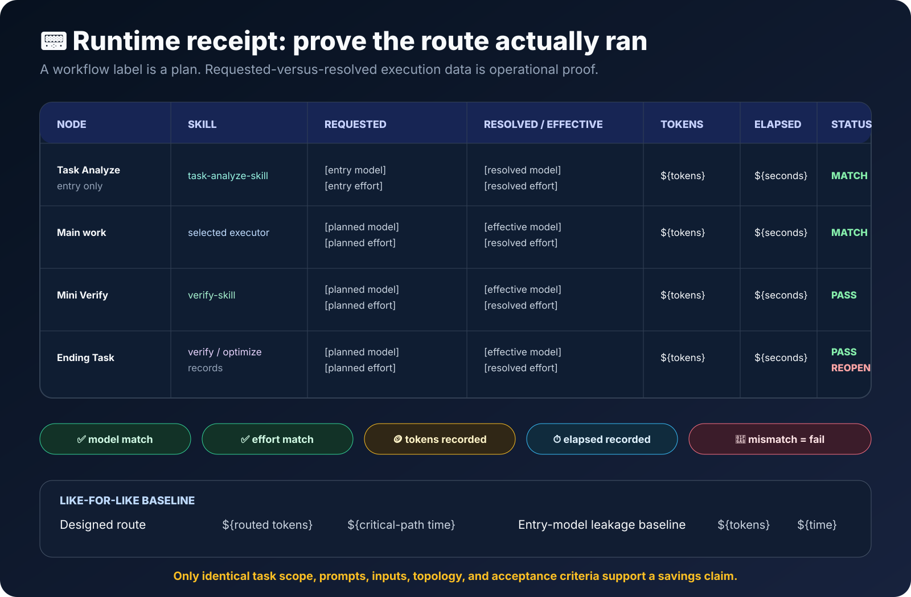
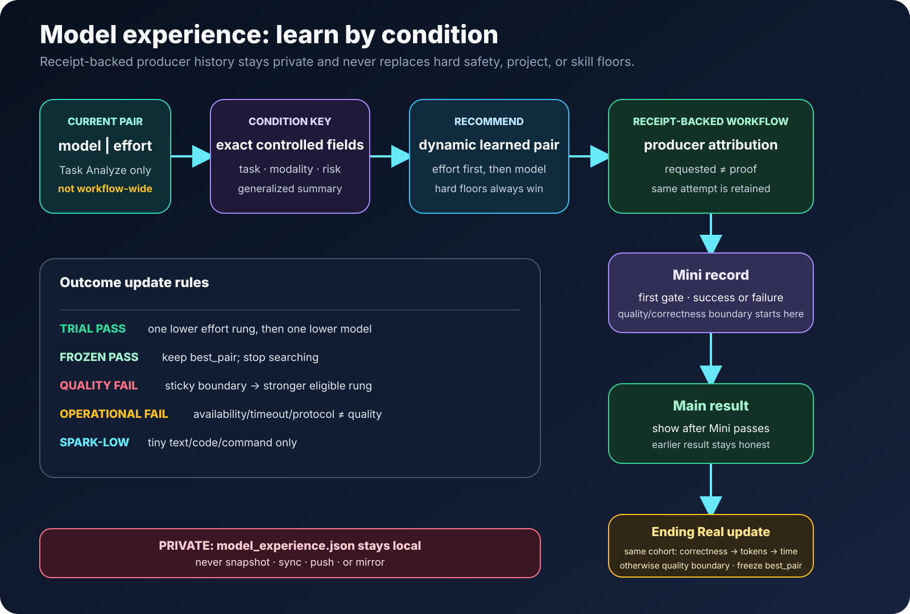
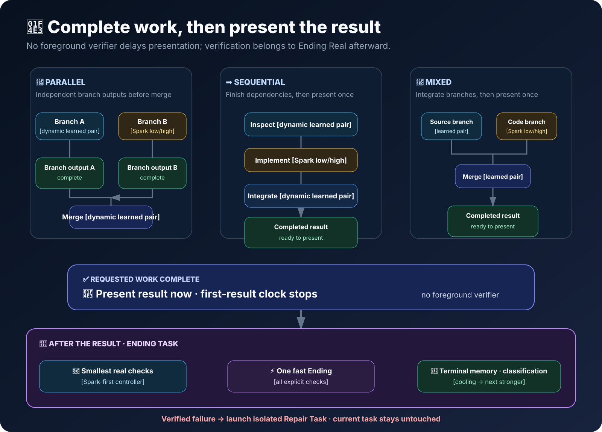

<picture>
  <source media="(max-width: 600px)" srcset="./management-skill/assets/readme/qin-codex-skills-hero-mobile.svg">
  
</picture>

# qin-codex-skills

### 🧭 Analyze once · 🤖 route per node · 🧪 prove the basic result · 🌙 finish deeply

## ✨ Hookless First Result Principle

This is a public, privacy-safe mirror of exactly six public skills. **Finish the task, run the smallest meaningful Mini Verify, show the basically verified result immediately, then run deeper Ending Task work.** If later work finds a correctness failure, notify the user, reopen the task, repair it, rerun Mini Verify, and present the corrected result.

Every request enters through [`task-analyze-skill`](./task-analyze-skill/SKILL.md): a **hookless, 100% entry**. The user-selected entry model and effort analyze and route only—never the entire workflow. [`workflow-skill`](./workflow-skill/SKILL.md) then executes the locked per-node choices without silently inheriting that entrance pair.

## 🧩 Six independent skills

| Skill | Main goal | Clear submodules / components |
|---|---|---|
| 🧭 [`Task Analyze`](./task-analyze-skill/SKILL.md) | Classify every request and lock its route. | entry resolver · complexity/topology classifier · installed-skill resolver · adaptive pair selector · plan/receipt handoff |
| 🗺️ [`Workflow`](./workflow-skill/SKILL.md) | Execute the locked graph and protect the first-result boundary. | plan-lock validator · direct-tool/model runners · dependency scheduler · Mini gate/result release · Ending dispatcher |
| 💻 [`Code`](./code-skill/SKILL.md) | Deliver owned code changes and authored probes. | Python · C# · Unity C# · prompt-in-code · Spark-first small-code route · probes |
| 🧪 [`Verify`](./verify-skill/SKILL.md) | Gate the result proportionally, then test deeper. | Mini · Real · visual/UI/artifact review · receipt match · independent optimization verifier |
| ⚡ [`Optimization`](./optimization-skill/SKILL.md) | Improve repeatable work without changing behavior. | candidate gate · scripts/references/assets/templates · same-behavior comparison · verifier handoff |
| 🔐 [`Management`](./management-skill/SKILL.md) | Safely manage profiles, records, and the public mirror. | learner records · auth/profiles · README renderer · approved-six snapshot · privacy scan · explicit publish |

## 🚦 How a task runs

<picture>
  <source media="(max-width: 600px)" srcset="./management-skill/assets/readme/task-lifecycle-mobile.svg">
  
</picture>

1. 🧭 Task Analyze reads only enough context to select a skill, dependencies, stop condition, and per-node `model | effort`.
2. 🔒 Workflow executes the locked route. Active registry-owned code work loads [`code-skill`](./code-skill/SKILL.md); Spark is first where its domain rules apply.
3. 🧪 Mini Verify checks the smallest meaningful observable proof.
4. ✅ The basically verified result is shown immediately.
5. 🌙 Ending Task performs relevant Real Verify, optimization proof, reports, logs, documentation, and learning.

<strong>Easy versus complex routes</strong>

Easy tasks do not need a forced diagram; they show the compact route Task Analyze → direct task → Mini Verify → Main result → Ending Task. Complex work shows a Mermaid dependency graph and numbered workflow: sequential, parallel, and mixed branches are allowed, but every model node keeps its own locked pair. Workflow enforces show result → `release-main-result <handoff>` → Ending Task.

## 🤖 Model + effort router

<picture>
  <source media="(max-width: 600px)" srcset="./management-skill/assets/readme/model-router-mobile.svg">
  
</picture>

| Model | Best role | Full supported effort rung |
|---|---|---|
| Sol | Ambiguous context, architecture, difficult judgment | `low → medium → high → xhigh → max → ultra` |
| Terra | Grounded integration, repository evidence, realistic testing | `low → medium → high → xhigh → max → ultra` |
| Luna | Bounded non-code work, concise delivery, reports/logs | `low → medium → high → xhigh → max` |
| Spark | Text-only Python/C#/Unity C# implementation and authored probes | `low → medium → high → xhigh` |

Routing uses the complete `model | effort` rung on a weak-to-strong quality ladder, not a model name alone. Downgrade exactly one eligible rung—**effort first**, then the next weaker model at its highest eligible effort; upgrade in the exact reverse direction. Once the exact similar-task quality range is known, reuse the calibrated/frozen pair. A safe tiny text/code/command task may start at Spark-low; runtime failure uses the static fallback without a quality penalty. Static floors, safety, domain ownership, and correctness always win; an exhausted top boundary returns no selected pair.

Optimize response time and token use only among correctness-passing routes. This is correctness-first routing, never a reason to choose an expensive model by default.

## 📟 Receipt-backed execution

<picture>
  <source media="(max-width: 600px)" srcset="./management-skill/assets/readme/runtime-receipt-mobile.svg">
  
</picture>

A diagram label is a plan—not proof. Each model-executed node emits a sanitized runtime receipt that matches the requested/resolved/effective model and effort, completion status, bounded prompt hash, token totals, and elapsed timing. It is useful operational evidence, not a cryptographic backend attestation.

🪙 Claim token or time savings only against a **like-for-like** baseline: same prompts and inputs, topology, sandbox, output contract, and acceptance criteria. Cached input belongs in input; reasoning output belongs in output; parallel work compares critical-path time. Repeated alternating runs and medians support durable claims.

## 🧠 Private model experience

<picture>
  <source media="(max-width: 600px)" srcset="./management-skill/assets/readme/model-experience-mobile.svg">
  
</picture>

The private `local/model_experience.json` ledger is **condition-keyed**, including execution domain, rather than a global model ranking. It stores compact sanitized outcomes and full-pair `success_model` / `failed_model` quality boundaries. Verified Mini and Real outcomes can calibrate a range; neutral operational events—availability, timeout, protocol, telemetry, execution, or unverified-receipt failures—may justify a temporary fallback but never rewrite quality learning.

The entry pair is route metadata, never a learner feature. The local ledger is never mirrored, and it contains no raw prompts, results, paths, identities, or secrets.

| Domain | Kind | Owner | Spark first | Reference |
|---|---|---|---|---|
| `general` (active) | general | `workflow-skill` | no | [`task-analyze-skill/references/model-selection.md`](./task-analyze-skill/references/model-selection.md) |
| `python` (active) | code | `code-skill` | yes | [`code-skill/references/python-rules.md`](./code-skill/references/python-rules.md) |
| `csharp` (active) | code | `code-skill` | yes | [`code-skill/references/csharp-rules.md`](./code-skill/references/csharp-rules.md) |
| `unity_csharp` (active) | code | `code-skill` | yes | [`code-skill/references/unity-csharp-rules.md`](./code-skill/references/unity-csharp-rules.md) |
| `code_unspecified` (history-only) | code | `code-skill` | yes | [`code-skill/references/spark-small-code.md`](./code-skill/references/spark-small-code.md) |

## 🧪 Verify, then finish

<picture>
  <source media="(max-width: 600px)" srcset="./management-skill/assets/readme/verification-topologies-mobile.svg">
  
</picture>

| Gate | When | What it proves |
|---|---|---|
| 🧪 **Mini Verify** | Before the result | The main-result gate: the requested change is basically intact through a changed-line, syntax, focused I/O, render, schema, or receipt-match check. Never describe Mini Verify as exhaustive proof. |
| 🌙 **Real Verify** | Background Ending Task | Real Verify runs in background Ending Task for realistic paths, broader regressions, integrations, visual quality, route replay, or deeper evidence. A correctness failure reopens the task. |

For an optimization, [`optimization-skill`](./optimization-skill/SKILL.md) makes the change and a **different** [`verify-skill`](./verify-skill/SKILL.md) worker checks before/after behavior, order, side effects, errors, dependencies, and any claimed savings. If a different verifier cannot run, status is `independent optimization verification blocked`, never self-certification.

## ⚡ Direct action boundary + four graduated examples

Task Analyze still runs every time. One obvious reversible action with no dependency graph can use its installed tool skill directly: no cached plan, child model, fabricated receipt, or learner sample; Mini Verify only observes the requested stop condition.

| Request | Route | Mini Verify |
|---|---|---|
| Open Chrome | Tool-only `chrome:control-chrome` | Chrome is open. |
| Open YouTube | Tool-only browser action | `youtube.com` is loaded. |
| Search CCTV on YouTube | Tool-only browser interaction | Query and visible results match. |
| Design a YouTube-like website | Complex `build-web-apps:frontend-app-builder` route with per-node pairs | Responsive UI, console, navigation, accessibility, and visual review are checked. |

## 🧰 Extend safely

Follow the authoritative [`router extension guide`](./task-analyze-skill/references/router-extension-guide.md) at `routing_policy.py::EXECUTION_DOMAINS`. Add the registry metadata, executor reference, and registry-driven tests required by that guide; the generated table above is injected at the exact `EXECUTION_DOMAIN_TABLE` marker. Keep direct tools tool-only and receipt-free; model work needs a precise pair, receipt, and Mini/Real learning.

## 🛠️ Install and use

1. Place the six public skill folders under `~/.codex/skills/`.
2. Merge [`global-agents-entry-rule.md`](./task-analyze-skill/assets/global-agents-entry-rule.md) into your `AGENTS.md`.
3. Start any task normally: the entry skill shows the human route, then workflow continues hooklessly.

Useful contracts: [`task-analyze validator`](./task-analyze-skill/scripts/validate_task_analyze_skill.py), [`workflow validator`](./workflow-skill/scripts/validate_workflow_skill.py), [`route dispatcher`](./task-analyze-skill/scripts/task_route_dispatcher.py), [`receipt runner`](./task-analyze-skill/scripts/model_execution_receipt.py), and [`mirror generator`](./management-skill/scripts/sync_global_skills.py).

## 🔐 Privacy + explicit publishing

The public mirror excludes local learner data, caches, work outputs, auth material, tokens, cookies, keys, raw prompts, private logs, and secret-looking values. Pulling a mirror preserves private history.

Editing or testing skills never authorizes a push. [`management-skill`](./management-skill/SKILL.md) publishes only after an explicit current request and public-safety checks.

## 📚 Source contracts

- [`task-analyze-skill/SKILL.md`](./task-analyze-skill/SKILL.md) — hookless entry, route policy, per-node choice, receipts
- [`workflow-skill/SKILL.md`](./workflow-skill/SKILL.md) — locked execution, result release, Ending Task
- [`code-skill/SKILL.md`](./code-skill/SKILL.md) — owned code domains and Spark-first rules
- [`verify-skill/SKILL.md`](./verify-skill/SKILL.md) — Mini/Real evidence routes
- [`optimization-skill/SKILL.md`](./optimization-skill/SKILL.md) — behavior-preserving improvements and independent proof
- [`management-skill/SKILL.md`](./management-skill/SKILL.md) — privacy, profiles, and approved-six mirror management
- [`adaptive-routing.md`](./task-analyze-skill/references/adaptive-routing.md) — private quality-bound learning

---

**🧭 One entry analysis · 🧩 six independent skills · 🤖 per-node models · 🧪 basic proof first · 🌙 deep proof afterward**

