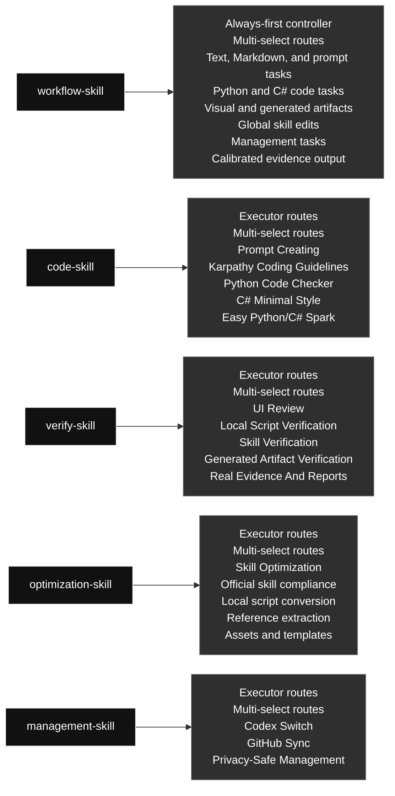

# qin-codex-skills

Chinese version: [README.zh.md](./README.zh.md)

## Skill Map

### Skill Contents At A Glance

#### [`workflow-skill`](./workflow-skill/) · Workflow / 工作流类

- **Role:** Always-first controller
- **Big function:** Always starts task execution, including prompt/instruction authoring and updates, defines goals, selects executor skills, routes work, iterates, and checks final evidence.
- **Selectable modules (multi-select):** Text, Markdown, and prompt tasks; Python and C# code tasks; Visual and generated artifacts; Global skill edits; Management tasks; Calibrated evidence output
- **Selection rule:** Use every module that applies to the task; this is not one-of, and unrelated modules should not run.

#### [`code-skill`](./code-skill/) · Code / 代码类

- **Role:** Executor started by workflow-skill
- **Big function:** Executes Python and C# code work only after workflow-skill routes the task, combining prompt embedding, coding approach, Python, C#/Unity C#, and small-code modules.
- **Selectable modules (multi-select):** Prompt Creating; Karpathy Coding Guidelines; Python Code Checker; C# Minimal Style; Easy Python/C# Spark
- **Selection rule:** Use every module that applies to the task; this is not one-of, and unrelated modules should not run.

#### [`verify-skill`](./verify-skill/) · Verification / 验证类

- **Role:** Executor started by workflow-skill
- **Big function:** Executes real tests, evidence capture, report generation, and verification after workflow-skill routes the task, checking outputs against the user's requirement.
- **Selectable modules (multi-select):** UI Review; Local Script Verification; Skill Verification; Generated Artifact Verification; Real Evidence And Reports
- **Selection rule:** Use every module that applies to the task; this is not one-of, and unrelated modules should not run.

#### [`optimization-skill`](./optimization-skill/) · Optimization / 优化类

- **Role:** Executor started by workflow-skill
- **Big function:** Executes optional post-verification optimization for explicit, repeated, or clearly reusable stable workflows, turning them into reusable scripts, references, prompts, or assets.
- **Selectable modules (multi-select):** Skill Optimization; Official skill compliance; Local script conversion; Reference extraction; Assets and templates
- **Selection rule:** Use every module that applies to the task; this is not one-of, and unrelated modules should not run.

#### [`management-skill`](./management-skill/) · Management / 管理类

- **Role:** Executor started by workflow-skill
- **Big function:** Executes management work after workflow-skill routes the task, covering Codex profiles and global skill GitHub sync.
- **Selectable modules (multi-select):** Codex Switch; GitHub Sync; Privacy-Safe Management
- **Selection rule:** Use every module that applies to the task; this is not one-of, and unrelated modules should not run.

Generated: 2026-07-08

### Skill Contents

#### Workflow / 工作流类

##### `workflow-skill`

- **Role:** Always-first controller
- **Big function:** Always starts task execution, including prompt/instruction authoring and updates, defines goals, selects executor skills, routes work, iterates, and checks final evidence.
- **Selectable modules (multi-select):** Text, Markdown, and prompt tasks; Python and C# code tasks; Visual and generated artifacts; Global skill edits; Management tasks; Calibrated evidence output
- **Selection rule:** Use every module that applies to the task; this is not one-of, and unrelated modules should not run.

#### Code / 代码类

##### `code-skill`

- **Role:** Executor started by workflow-skill
- **Big function:** Executes Python and C# code work only after workflow-skill routes the task, combining prompt embedding, coding approach, Python, C#/Unity C#, and small-code modules.
- **Selectable modules (multi-select):** Prompt Creating; Karpathy Coding Guidelines; Python Code Checker; C# Minimal Style; Easy Python/C# Spark
- **Selection rule:** Use every module that applies to the task; this is not one-of, and unrelated modules should not run.

#### Optimization / 优化类

##### `optimization-skill`

- **Role:** Executor started by workflow-skill
- **Big function:** Executes optional post-verification optimization for explicit, repeated, or clearly reusable stable workflows, turning them into reusable scripts, references, prompts, or assets.
- **Selectable modules (multi-select):** Skill Optimization; Official skill compliance; Local script conversion; Reference extraction; Assets and templates
- **Selection rule:** Use every module that applies to the task; this is not one-of, and unrelated modules should not run.

#### Verification / 验证类

##### `verify-skill`

- **Role:** Executor started by workflow-skill
- **Big function:** Executes real tests, evidence capture, report generation, and verification after workflow-skill routes the task, checking outputs against the user's requirement.
- **Selectable modules (multi-select):** UI Review; Local Script Verification; Skill Verification; Generated Artifact Verification; Real Evidence And Reports
- **Selection rule:** Use every module that applies to the task; this is not one-of, and unrelated modules should not run.

#### Management / 管理类

##### `management-skill`

- **Role:** Executor started by workflow-skill
- **Big function:** Executes management work after workflow-skill routes the task, covering Codex profiles and global skill GitHub sync.
- **Selectable modules (multi-select):** Codex Switch; GitHub Sync; Privacy-Safe Management
- **Selection rule:** Use every module that applies to the task; this is not one-of, and unrelated modules should not run.

## Skill List

| Category | Skill | Purpose |
|---|---|---|
| Code | `code-skill` | Executor skill under workflow-skill for Python and C# Codex code work only. Use when workflow-skill routes a task into writing, editing, refactoring, debugging, reviewing, optimizing, or explaining Python or C# code; any Python/C# prompt-related work including prompt generation, prompt review, prompt testing, prompt editing/add/update/remove/rewrite, and prompt-in-code work; Python modules, scripts, tests, and snippets; C# and Unity C# MonoBehaviours, ScriptableObjects, managers, and gameplay systems; performance and parallelization opportunities for independent Python or C# workloads; and obvious bounded Python/C# code tasks that may use Spark when an allowed model route exists. Do not use this skill to author JavaScript, TypeScript, frontend, shell, SQL, or other languages unless another active instruction explicitly routes that work elsewhere. Its internal routes are multi-select: use every route that applies to the task, not a one-of choice. |
| Management | `management-skill` | Executor skill under workflow-skill for management. Use after workflow-skill routes a task into local Codex account/profile operations or global skill GitHub synchronization. Use when the user asks to manage Codex auth profiles, switch local accounts, inspect profile state, sync global skills, commit or push skill changes, compare local and remote skill state, or run management workflows without exposing private data. Its management routes are multi-select when a request genuinely needs both profile and GitHub sync work. |
| Optimization | `optimization-skill` | Executor skill under workflow-skill for post-verification optimization of repetitive user workflows into reusable skill resources. Use only when the user explicitly asks to optimize a skill/process, the same or substantially identical workflow has repeated at least three times, or Codex has high confidence that a stable deterministic workflow will be reused many times and can save future token cost. Optimize after the original task passes verification unless optimization is the task. Check whether code, workflow steps, prompts, references, scripts, or assets can reduce repeated work while preserving behavior. Use code-skill for Python/C# helper code and verify-skill for same-behavior proof after optimization. |
| Verification | `verify-skill` | Executor skill under workflow-skill for all verification, including real tests, QA, evidence capture, report generation, result comparison, UI/visual checks, generated artifact review, skill verification, and optimized workflow validation. Use when asked to verify, test, review, audit, validate, inspect quality, confirm a workflow, check UI/visual quality, prove code or scripts still work, compare against previous behavior, or decide whether a failure is fixable. Run concrete checks with real inputs/outputs, choose evidence format by complexity, require Input/Used/Output/Why Pass for reports, and run an Obsidian regression sweep for relevant prior repeated or fixed AI-caused project failures before pass verdicts. When verification fails, classify feasibility, try safe repair routes, and stop only for logical impossibility or missing user-controlled access. Routes are multi-select: combine every route needed by the artifact. |
| Workflow | `workflow-skill` | Global workflow controller for task work. Use for routing checks, Python/C# coding, prompt task gate matches, any prompt-related task including prompt/instruction authoring, prompt files/templates/strings, system/developer/user instructions, AI output behavior, review, editing, add/update/remove/rewrite, testing, or optimization, file-changing, multi-step, skill-editing, UI/artifact/report, visual/image generation, or evidence-heavy tasks. Before task action, show a workflow diagram: compact direct route for lightweight mode, or full diagram plus target map for explicit mode. For visual/image tasks that need or would benefit from ChatGPT-generated images or references (even without a user-provided image), use the internal image-generation route before implementation and verify the final visual result. For Python/C# work, route code or scripts through code-skill before verify-skill. After verification passes, run optimization only when explicitly requested, repeated 3+ times, or clearly reusable. |

## Structure

- Python and C# code work enters through `code-skill`; frontend/UI and other language code should use the relevant production skill instead.
- Prompt/instruction authoring, updates, and optimization start through `workflow-skill`; use `code-skill` only when embedding prompts in Python or C# executable code.
- Repeated fixed workflow optimization enters through `optimization-skill`.
- Verification, real tests, and calibrated evidence outputs sit under `verify-skill`; simple results stay in chat, while PDF reports are reserved for long, visual, table-heavy, comparison-based, explicit, or repo-required evidence.
- Auth and GitHub mirror maintenance enter through `management-skill` internal routes.
- Each skill may contain multiple internal routes; select every route needed for the current request. This is multi-select, not one-of, and unrelated cases should not run.

## Current Notes

- The old code skills were merged into `code-skill`.
- The old testing skills were merged into `verify-skill`.
- UI review was broadened into `verify-skill`.
- The old image workflow skill was deleted.
