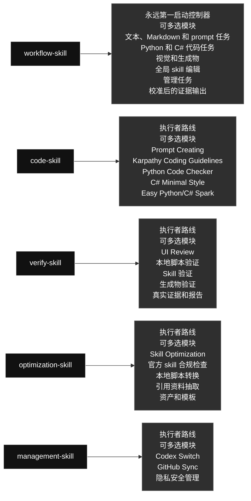

# qin-codex-skills

英文版: [README.md](./README.md)

## 技能图

这是全局 Codex skills 的公开镜像和路由说明。`workflow-skill` 永远先启动并选择执行者；其他 skill 都是它路由后的执行者。顶部先展示主图，下面列每个 skill 的角色、大功能、可多选模块和选择规则。

### Skill 内容一览

#### [`workflow-skill`](./workflow-skill/) · 工作流类 / Workflow

- **角色：** 永远第一启动控制器
- **大功能：** 永远第一个启动任务执行，包括 prompt/instruction 编写和更新，定义目标、选择执行者 skill、路由工作、循环验证并检查最终证据。
- **可多选模块：** 文本、Markdown 和 prompt 任务; Python 和 C# 代码任务; 视觉和生成物; 全局 skill 编辑; 管理任务; 校准后的证据输出
- **选择规则：** 需要哪个模块就用哪个；同一个任务可以同时使用多个模块，不是单选，也不要运行无关模块。

#### [`code-skill`](./code-skill/) · 代码类 / Code

- **角色：** 由 workflow-skill 路由启动的执行者
- **大功能：** 在 workflow-skill 路由后只执行 Python 和 C# 代码工作，组合 prompt 嵌入、代码思路、Python、C#/Unity C# 和小代码模块。
- **可多选模块：** Prompt Creating; Karpathy Coding Guidelines; Python Code Checker; C# Minimal Style; Easy Python/C# Spark
- **选择规则：** 需要哪个模块就用哪个；同一个任务可以同时使用多个模块，不是单选，也不要运行无关模块。

#### [`verify-skill`](./verify-skill/) · 验证类 / Verification

- **角色：** 由 workflow-skill 路由启动的执行者
- **大功能：** 在 workflow-skill 路由后执行真实测试、证据捕获、报告生成和验证，检查输出是否满足用户要求。
- **可多选模块：** UI Review; 本地脚本验证; Skill 验证; 生成物验证; 真实证据和报告
- **选择规则：** 需要哪个模块就用哪个；同一个任务可以同时使用多个模块，不是单选，也不要运行无关模块。

#### [`optimization-skill`](./optimization-skill/) · 优化类 / Optimization

- **角色：** 由 workflow-skill 路由启动的执行者
- **大功能：** 在 workflow-skill 路由后执行可选的后置优化，只处理明确要求、重复多次或明显可复用的稳定流程，把它们变成本地脚本、引用资料、prompt 或资产。
- **可多选模块：** Skill Optimization; 官方 skill 合规检查; 本地脚本转换; 引用资料抽取; 资产和模板
- **选择规则：** 需要哪个模块就用哪个；同一个任务可以同时使用多个模块，不是单选，也不要运行无关模块。

#### [`management-skill`](./management-skill/) · 管理类 / Management

- **角色：** 由 workflow-skill 路由启动的执行者
- **大功能：** 在 workflow-skill 路由后执行管理工作，处理 Codex profiles 和全局 skill 的 GitHub 同步。
- **可多选模块：** Codex Switch; GitHub Sync; 隐私安全管理
- **选择规则：** 需要哪个模块就用哪个；同一个任务可以同时使用多个模块，不是单选，也不要运行无关模块。

