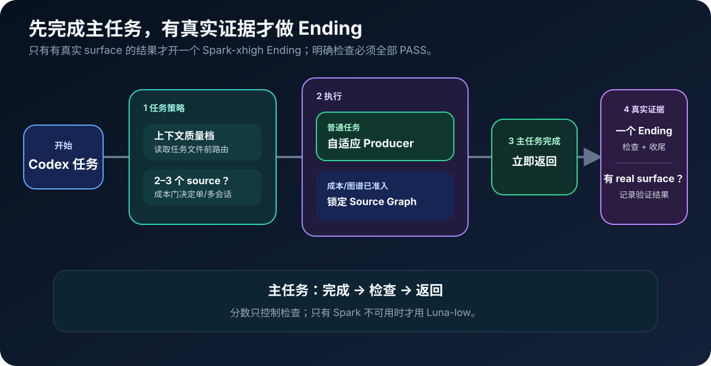
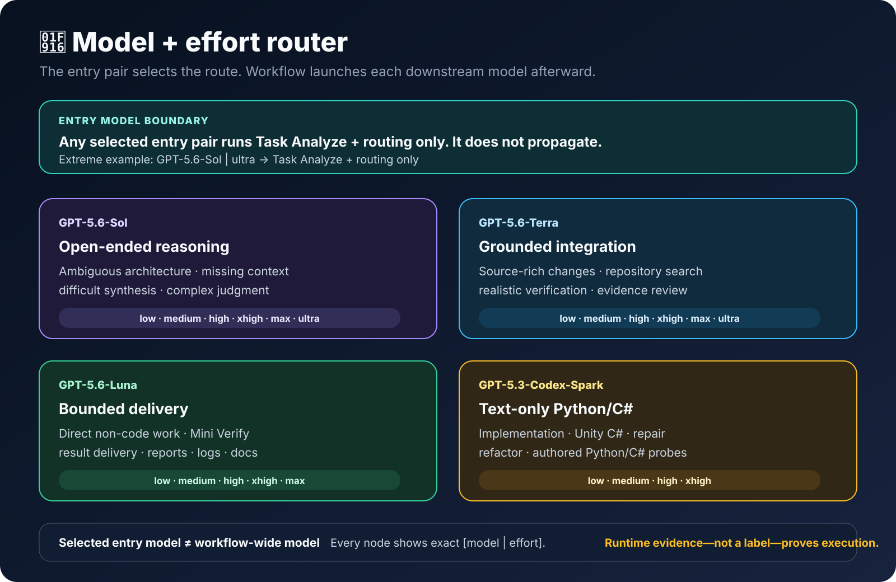
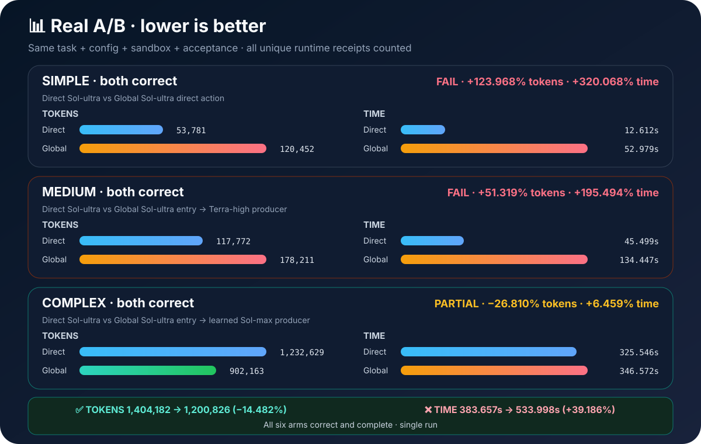

# 🚀 Auto Best Model

**专用于 Codex · 每个任务评分 · 先完成主任务 · 只有真实证据才做 Ending**

[English](./README.md)

已保存的最高版本家族质量梯级 · 只有你主动要求本地模型更新时才刷新 · 0–24 分小型低风险编辑先经同会话结果门再试 Spark-low · 更大任务使用已保存的质量梯级

## 🔄 核心流程

<picture>
  <source media="(max-width: 600px)" srcset="./management-skill/assets/readme/core-flow-zh-mobile.svg">
  
</picture>

## ✅ 先完成主任务，有真实证据才做 Ending

这是整个生命周期最重要的结构规则：

1. **每个提交先按 0–100 评分并读取相关 Skill，再完成用户要求的工作。** 代码只运行一次最小本地 Quick Check。
2. **立即返回已完成结果。** 不让用户被验证、轮询或修复流程卡住。
3. **只有存在 `real_test`、`information_update` 或 `memory_update` 的结果才发出 `ending-required`；没有这些 surface 时记录 `intentionally_skipped_simple_task` 和 `ending_skip_reason=no_real_test_or_information_or_memory_update`，分数、风险和阶段数都不会强行创建 Ending。** 是否创建 Ending 由 surface 决定，不由分数、风险或阶段数决定。producer 在一次 Quick Check 后立即返回 `CODE READY`；广泛测试、构建、UI、全量 lint、日志清理、发布门禁和重复审查都不能阻塞首个结果。
4. **唯一 Ending 运行最小真实/完成检查和一次终态收尾，所有必需检查都要 PASS。** `gpt-5.3-codex-spark|xhigh` 是唯一主控。确定性检查直接执行；语义、代码规范、prompt、UI 和视觉检查可交给 Terra/Sol `ENDING_CHECK_WORKER`。worker 读取 Skill 并写证据，禁止编辑、修复、路由或拥有生命周期。Ending 只能用 `create_thread.target={"type":"projectless"}` 创建到全局任务列表，origin 项目只作为执行上下文，不能附着到 thread；确认前必须用 `list_threads` 读回并看到 `projectId=null` 或字段不存在。项目 session、当前任务或同任务 subtask 全部 BLOCKED；缺少 thread 回执就是 BLOCKED。通过 `codex_app__send_message_to_thread` 把精确证据送回不可变 origin 并启动新的 Spark-first Ending；PASS/FAIL/BLOCKED 永久可见。0–100 分只控制检查范围，只有主控不可用才允许 registry-floor Luna-low。复用当前不可变发布报告前校验 digest 与终态。终态写入路由分类和模型历史；任务不自动归档或删除。

主工作与 Ending 刻意使用不同任务会话。文字总结不算验证；无 surface 时，低风险、单结果 small 任务同样跳过 Ending，只跑能证明交付状态的最小真实检查。

## ⚡ 模型与私有学习

<picture>
  <source media="(max-width: 600px)" srcset="./management-skill/assets/readme/model-router-mobile.svg">
  
</picture>

- **入口感知启动：** 用步骤能力 fingerprint 与难度历史选择最低正确档。Sol/高入口可向下降；Luna-max/更低入口可向上升。没有匹配历史时从不高于入口冷启动；0–24 分的小型低风险编辑先通过同会话结果判断再试 Spark-low。
- **学习：** receipt 有效的 Real PASS 保留当前档；两次匹配 PASS 才可向下降一级；质量失败向上升一级。失败后恢复成功的强档会被下一次精确匹配直接复用；实现与本地测试分别记忆。
- **操作故障：** 零结果故障只允许一次更强 fallback，不把它当质量失败学习。
- **Schedule：** 复合任务拆成可量化、责任明确的步骤并逐步选模；两到三个独立只读 source 先做成本准入，有依赖的多文件工作使用一个上下文 producer。
- **记忆：** Model Switch 与原生类别链接按项目 → Model Switch → 类别 → 共享类别保存每个终态 Ending；不读完整历史，也不用 JSON sidecar。receipt 结果可调整路线，无 receipt 的已知 assignment 只做可见观察，不参与自动升降级；项目/任务等保持为字段。

## 规则

- **Producer：** 显示 score/band/route；两次 PASS 降级，质量 FAIL 升级。
- **Prompt：** 可复用 Prompt 和持久 AI 指令加载 Prompt Skill。
- **路由：** 只有明确要求或当前端到端证据成立时才委派。
- **交付：** 先完成并返回主任务结果，再进行后台验证。
- **验证：** 三个 surface 才做 Ending；否则 skip。Spark-xhigh；worker 查语义；PASS。
- **文件：** 修改前回溯项目/模块/文件历史；修改后记录已验证结果。
- **记忆：** 本地 JSONL；Obsidian 可选；项目/模块覆盖，代码需 symbol。
- **模型：** 用已保存梯级；主动更新才刷新；小编辑先过会话门再试 Spark-low。
- **隐私：** secret、原始 Prompt/结果、receipt、ledger、cache 和临时文件留在本地。

## 📊 真实自适应 Benchmark：先完成，再后台验证

当前冻结 v47 比较：**无 Skill** 固定使用 `gpt-5.6-sol | ultra`；**有 Skill** 从 `gpt-5.6-luna | max` 进入，再按冻结历史逐步骤选模。主指标从正确路由已经冻结后开始：计入选中的 producer/graph 执行；入口匹配、controller、校准失败、retry/fallback/repair 和 Ending 全部单列。

<picture><source media="(max-width: 600px)" srcset="./management-skill/assets/readme/model-benchmark-example-mobile.svg"></picture>

**6 组 A/B · 12 次运行 · 12/12 精确结果与 12/12 Ending PASS · 3/3 Sol 入口路由探针 PASS · 0 retry/fallback/repair**

| 档位 | Direct 稳定 token | Auto 稳定 token | 节省 | Direct 稳定执行 | Auto 稳定执行 | 节省 |
|---|---:|---:|---:|---:|---:|---:|
| 简单 | 32,654 | 93,448 | -186.176% | 22.896s | 17.561s | +23.301% |
| 中等 | 49,451 | 91,398 | -84.825% | 27.676s | 28.057s | -1.377% |
| 复杂 | 538,903 | 273,442 | **+49.260%** | 67.047s | 45.481s | **+32.165%** |
| **总体** | **621,008** | **458,288** | **+26.203%** | **117.619s** | **91.099s** | **+22.547%** |

**实测结论：正确率/证据 PASS；冻结路由后的总体性能 PASS。** 稳定执行节省 26.520 秒和 162,720 logical token。实际首结果时间更慢（`117.619s → 211.145s`），因为 120.046 秒的路由/controller 工作按定义不计入稳定态节省，并且单独公开。简单和中等档的 token 退化仍然保留；这只是本组冻结任务的证据，不是普遍结论或计费价格结论。

[查看精确 v47 报告。](./task-analyze-skill/TEST_AND_BENCHMARK.md) · [打开脱敏 benchmark 证据。](./task-analyze-skill/assets/model-routing-benchmark-example.json)
**最新确定性路由验证（2026-08-19）：** 46 个公开用例 × 100 = 4,600 次分类：**46/46 通过；中位耗时 0.0872 ms；总耗时 417.156 ms。** 这只验证本地确定性路由，不代表实时模型调用、价格或端到端延迟。源端 + 安装副本的发布门禁：31/31 个保留能力、1,696/1,696 项测试；经过核验的全局 projectless Ending 已通过。

## 🧩 八个公开 Skill

- [`Task Analyze`](./task-analyze-skill/SKILL.md) — 路由策略、benchmark 和准入。
- [`Workflow`](./workflow-skill/SKILL.md) — 执行已准入的锁定路线。
- [`Prompt`](./prompt-skill/SKILL.md) — 可复用 Prompt 和持久 AI 指令入口。
- [`Code`](./code-skill/SKILL.md) — Python、C#、Unity C# 和已注册代码域。
- [`Project Memory`](./project-memory-skill/SKILL.md) — 强制项目/模块/方法覆盖、文件回溯和验证记录。
- [`Verify`](./verify-skill/SKILL.md) — 结果之后的 Real Verify 和回归证据。
- [`Optimization`](./optimization-skill/SKILL.md) — 把稳定重复流程变成工具。
- [`Management`](./management-skill/SKILL.md) — 私有 profile 和公共镜像管理。

## 🛠️ 已注册执行域

- `general` · general · `workflow-skill` · active · Spark schedule: no · [rules](./task-analyze-skill/references/model-selection.md)
- `python` · code · `code-skill` · active · Spark schedule: source-eligible · [rules](./code-skill/references/python-rules.md)
- `csharp` · code · `code-skill` · active · Spark schedule: source-eligible · [rules](./code-skill/references/csharp-rules.md)
- `unity_csharp` · code · `code-skill` · active · Spark schedule: source-eligible · [rules](./code-skill/references/unity-csharp-rules.md)
- `code_unspecified` · code · `code-skill` · history-only · Spark schedule: source-eligible · [rules](./code-skill/references/spark-small-code.md)

## 安装

1. 把八个 Skill 文件夹放进 `~/.codex/skills/`。
2. 将 [`global-agents-entry-rule.md`](./task-analyze-skill/assets/global-agents-entry-rule.md) 部署到 `~/.codex/AGENTS.md` 和宿主可发现的用户级 `~/AGENTS.md`。
3. 正常启动 Codex；不安装生命周期 hook。

**隐私：** 镜像排除 auth、secret、私有 ledger、路由历史、cache、原始 Prompt/结果、receipt 和临时文件；每次发布都运行安全检查。

**镜像：** `qin-codex-skills` · `auto-best-model`
