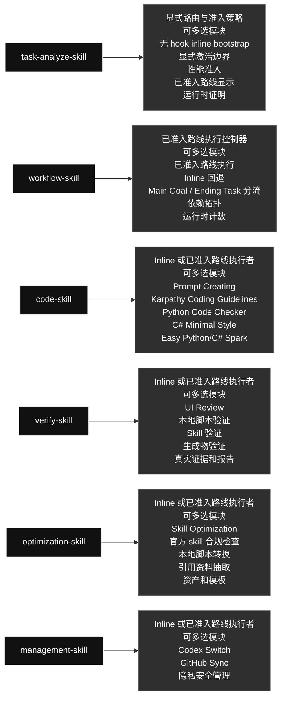
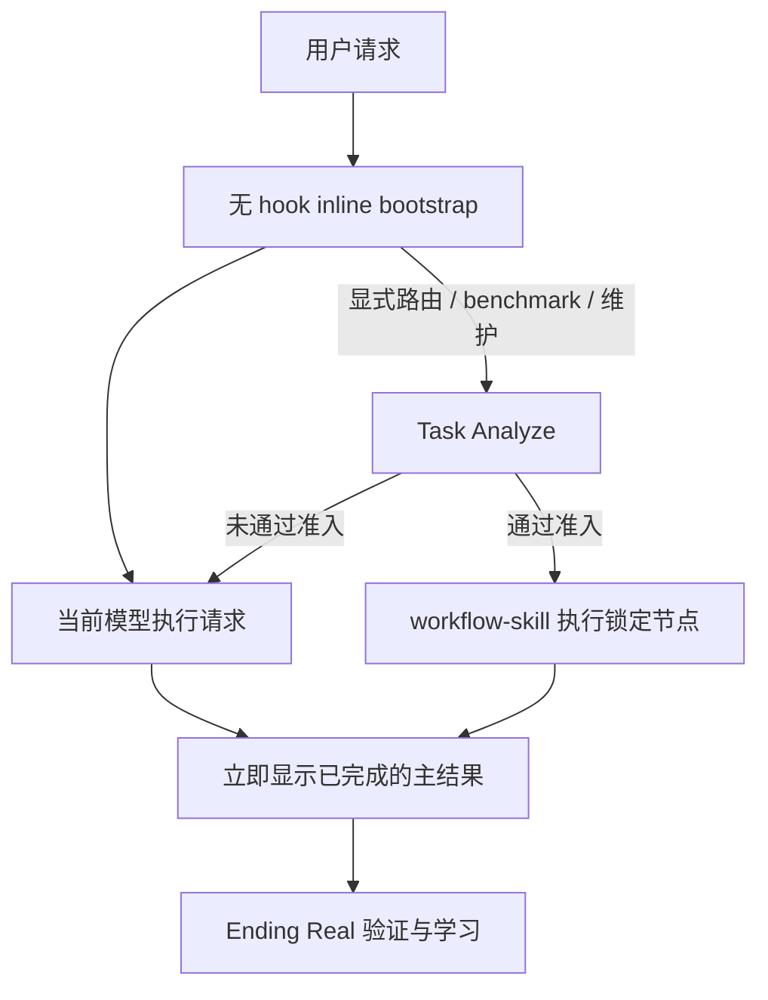

# qin-codex-skills

英文版: [README.md](./README.md)

## 技能图

## Main Goal 和 Ending Task

普通任务无论表面复杂度如何，都由当前模型 inline 完成；完整 Task Analyze 只处理显式路由/benchmark/维护或评估图谱，Workflow 只执行已通过端到端准入的路线。

- **Inline：** 默认且适用于所有表面复杂度；不加载完整 Task Analyze 或 Workflow。
- **主结果：** 任务完成后立即展示，不运行前台 Mini/Fast Verify；first-result 时间在此停止。
- **Ending Real：** 在展示后做真实验证、失败通知、修复与学习。
- **Workflow：** 只有完整 Global 路径有当前可比的正确性、token 和时间准入证据时才运行。

### Skill 内容一览

#### [`task-analyze-skill`](./task-analyze-skill/) · 工作流类 / Workflow

- **角色：** 显式路由与准入策略
- **大功能：** 显式路由、benchmark 和维护策略：常驻的无 hook inline bootstrap 让普通任务直接使用当前模型；完整 skill 默认仍返回 inline，只有端到端可比证据通过才允许委派。
- **可多选模块：** 无 hook inline bootstrap; 显式激活边界; 性能准入; 已准入路线显示; 运行时证明
- **选择规则：** 需要哪个模块就用哪个；同一个任务可以同时使用多个模块，不是单选，也不要运行无关模块。

#### [`workflow-skill`](./workflow-skill/) · 工作流类 / Workflow

- **角色：** 已准入路线执行控制器
- **大功能：** 只执行已经通过端到端性能准入的 Task Analyze 锁定路线。无论表面复杂度如何，普通任务都保持 inline；已准入节点保留锁定 pair 和 receipt。
- **可多选模块：** 已准入路线执行; Inline 回退; Main Goal / Ending Task 分流; 依赖拓扑; 运行时计数
- **选择规则：** 需要哪个模块就用哪个；同一个任务可以同时使用多个模块，不是单选，也不要运行无关模块。

#### [`code-skill`](./code-skill/) · 代码类 / Code

- **角色：** Inline 或已准入路线执行者
- **大功能：** 活动注册代码域的 direct-inline 或已准入路线执行者；Python、普通 C#、Unity C# 是内置示例。普通任务保留当前模型；Spark 只用于已准入的明显小任务路线。
- **可多选模块：** Prompt Creating; Karpathy Coding Guidelines; Python Code Checker; C# Minimal Style; Easy Python/C# Spark
- **选择规则：** 需要哪个模块就用哪个；同一个任务可以同时使用多个模块，不是单选，也不要运行无关模块。

#### [`verify-skill`](./verify-skill/) · 验证类 / Verification

- **角色：** Inline 或已准入路线执行者
- **大功能：** 完成的主结果先立即展示；Real Verify 之后在 Ending Task 中执行，并把判定回填到原始的 receipt-backed 结果尝试。
- **可多选模块：** UI Review; 本地脚本验证; Skill 验证; 生成物验证; 真实证据和报告
- **选择规则：** 需要哪个模块就用哪个；同一个任务可以同时使用多个模块，不是单选，也不要运行无关模块。

#### [`optimization-skill`](./optimization-skill/) · 优化类 / Optimization

- **角色：** Inline 或已准入路线执行者
- **大功能：** 把明确要求、重复多次或明显可复用的流程变成本地脚本、引用资料、prompt、资产或模板，同时保持行为不变。
- **可多选模块：** Skill Optimization; 官方 skill 合规检查; 本地脚本转换; 引用资料抽取; 资产和模板
- **选择规则：** 需要哪个模块就用哪个；同一个任务可以同时使用多个模块，不是单选，也不要运行无关模块。

#### [`management-skill`](./management-skill/) · 管理类 / Management

- **角色：** Inline 或已准入路线执行者
- **大功能：** 处理 Codex profile 操作和全局 skill GitHub 同步，不暴露私人数据，并保留本地私有路由历史。
- **可多选模块：** Codex Switch; GitHub Sync; 隐私安全管理
- **选择规则：** 需要哪个模块就用哪个；同一个任务可以同时使用多个模块，不是单选，也不要运行无关模块。

## 运行规则

- 单范围任务由当前模型一次读取、一次输出，完成后立即显示；不运行前台 Mini/Fast Verify。
- 三个及以上独立非简单部分可由父任务保留最大部分，并只开两个互不重叠的同模型子任务；禁止重复读取和集中复核。
- 只有显式路由、benchmark、Task Analyze 维护或待评估图谱才加载完整 `task-analyze-skill`；激活后默认仍是 inline。
- `workflow-skill` 只有完整 Global 路径在相同 workload/config/entry cohort 下通过正确性、token 和时间准入时才运行。
- first-result 时间在已完成结果展示时停止，排除之后的所有 Ending Real 工作。
- 正确性是 gate；只有至少两个 Real 通过 pair 在相同 workload hash cohort 中且 token/time 完整时，才按总 token、process time、较弱 rung 排序；否则使用质量边界，不声明节省。
- 模型降级先降低 effort，再降低 model；升级顺序相反。相似任务一旦找到已验证最佳 pair 就冻结，只有 Ending Real 失败或 profile/ladder 漂移才重新搜索。
- Ending Real 在结果展示后验证并更新同一个 producer attempt，持久化并冻结 `best_pair`；验证失败则通知、重新打开并修复。
- 非 tiny 委派路线保留完整 Luna/Terra/Sol ladder；tiny 路线必须是 `Spark-low + 完整常规 fallback`。
- 每个活动的注册代码域都进入 `code-skill`；Python、普通 C#、Unity C# 是内置示例。
- benchmark 两边固定相同的 `model|effort`（本次为 `gpt-5.6-sol | ultra`）：Direct 使用 raw `--direct-task`，Global 使用 raw `--bootstrap-task`；两者都在 entry context 外运行，不使用 `LOCKED_ROUTE_NODE`，也不忽略用户配置。
- 私有 ledger 在 `task-analyze-skill/local/adaptive-routing/model_experience.json`，不进入镜像。
