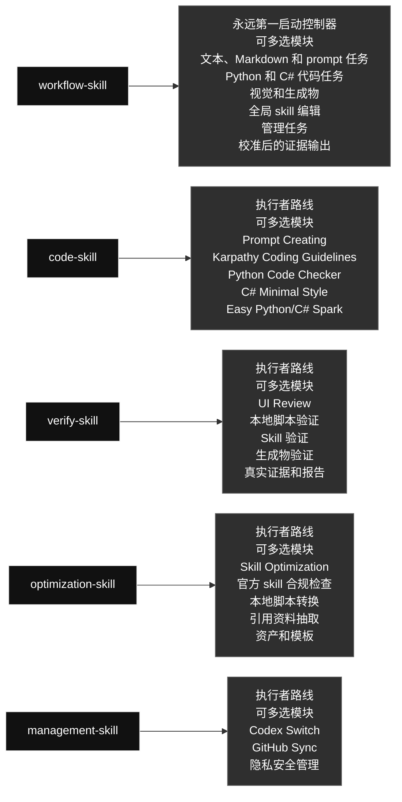

# qin-codex-skills

英文版: [README.md](./README.md)

## 技能图

### Skill 内容一览

#### [`workflow-skill`](./workflow-skill/) · 工作流类 / Workflow

- **角色：** 永远第一启动控制器
- **大功能：** 永远第一启动控制器：简单任务快走，复杂任务显示图和模型路线，选择执行者，并推进到已验证完成。
- **可多选模块：** 文本、Markdown 和 prompt 任务; Python 和 C# 代码任务; 视觉和生成物; 全局 skill 编辑; 管理任务; 校准后的证据输出
- **选择规则：** 需要哪个模块就用哪个；同一个任务可以同时使用多个模块，不是单选，也不要运行无关模块。

#### [`code-skill`](./code-skill/) · 代码类 / Code

- **角色：** 由 workflow-skill 路由启动的执行者
- **大功能：** Python/C# 执行者：在 workflow-skill 路由后处理实现、调试、重构、prompt-in-code、Unity C# 和聚焦代码测试。
- **可多选模块：** Prompt Creating; Karpathy Coding Guidelines; Python Code Checker; C# Minimal Style; Easy Python/C# Spark
- **选择规则：** 需要哪个模块就用哪个；同一个任务可以同时使用多个模块，不是单选，也不要运行无关模块。

#### [`verify-skill`](./verify-skill/) · 验证类 / Verification

- **角色：** 由 workflow-skill 路由启动的执行者
- **大功能：** 执行验证：默认一个 mini real test；重大或用户要求的结果测试走真实结果验证，并输出校准证据。
- **可多选模块：** UI Review; 本地脚本验证; Skill 验证; 生成物验证; 真实证据和报告
- **选择规则：** 需要哪个模块就用哪个；同一个任务可以同时使用多个模块，不是单选，也不要运行无关模块。

#### [`optimization-skill`](./optimization-skill/) · 优化类 / Optimization

- **角色：** 由 workflow-skill 路由启动的执行者
- **大功能：** 把明确要求、重复多次或明显可复用的流程变成本地脚本、引用资料、prompt、资产或模板，同时保持行为不变。
- **可多选模块：** Skill Optimization; 官方 skill 合规检查; 本地脚本转换; 引用资料抽取; 资产和模板
- **选择规则：** 需要哪个模块就用哪个；同一个任务可以同时使用多个模块，不是单选，也不要运行无关模块。

#### [`management-skill`](./management-skill/) · 管理类 / Management

- **角色：** 由 workflow-skill 路由启动的执行者
- **大功能：** 处理 Codex profile 操作和全局 skill GitHub 同步，不暴露私人数据。
- **可多选模块：** Codex Switch; GitHub Sync; 隐私安全管理
- **选择规则：** 需要哪个模块就用哪个；同一个任务可以同时使用多个模块，不是单选，也不要运行无关模块。

## 运行规则

- Python 和 C# 代码工作进入 `code-skill`；前端/UI 等其他语言代码使用对应生产 skill。
- Prompt/instruction 编写、更新和优化先进入 `workflow-skill`；只有嵌入 Python/C# 可执行代码时才进入 `code-skill`。
- 固定重复流程优化进入 `optimization-skill`。
- 验证、真实测试和校准后的证据输出进入 `verify-skill`；简单结果留在聊天里，只有长数据、视觉、表格多、对比型、明确要求或仓库规则需要时才生成 PDF 报告。
- Auth 和 GitHub 镜像维护进入 `management-skill` 内部路由。
- 每个 skill 可能包含多个内部路由；需要哪个就选哪个，同一个任务可以多选，不是单选，也不要运行无关分支。

## 当前结构

- 旧代码类 skill 已合并到 `code-skill`。
- 旧测试类 skill 已合并到 `verify-skill`。
- UI review 已扩展到 `verify-skill`。
- 旧图片 workflow skill 已删除。
