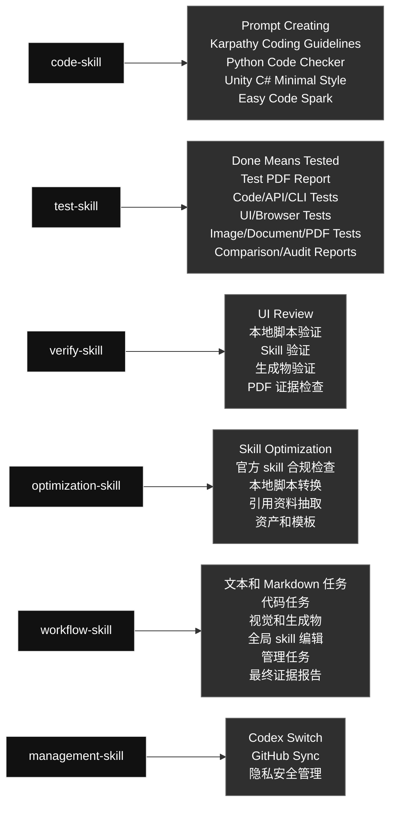

# qin-codex-skills

英文版: [README.md](./README.md)

## 技能图

这是全局 Codex skills 的公开镜像和路由说明。顶部先展示主图，下面列每个 skill 的大功能和内部流程。

### Skill 内容一览

#### [`code-skill`](./code-skill/) · 代码类 / Code

- **大功能：** 合并 prompt、代码思路、Python、Unity C# 和小代码任务相关内容。
- **内部流程：** Prompt Creating -> Karpathy Coding Guidelines -> Python Code Checker -> Unity C# Minimal Style -> Easy Code Spark

#### [`test-skill`](./test-skill/) · 测试类 / Testing

- **大功能：** 执行真实测试，并生成带输入、方法、输出和通过原因的 PDF 报告。
- **内部流程：** Done Means Tested -> Test PDF Report -> Code/API/CLI Tests -> UI/Browser Tests -> Image/Document/PDF Tests -> Comparison/Audit Reports

#### [`verify-skill`](./verify-skill/) · 验证类 / Verification

- **大功能：** 检查 UI、脚本、生成物、skill 和工作流是否真的满足用户要求。
- **内部流程：** UI Review -> 本地脚本验证 -> Skill 验证 -> 生成物验证 -> PDF 证据检查

#### [`optimization-skill`](./optimization-skill/) · 优化类 / Optimization

- **大功能：** 把稳定重复的流程优化成本地脚本、引用资料、资产或模板，用来节省 token 和执行时间。
- **内部流程：** Skill Optimization -> 官方 skill 合规检查 -> 本地脚本转换 -> 引用资料抽取 -> 资产和模板

#### [`workflow-skill`](./workflow-skill/) · 工作流类 / Workflow

- **大功能：** 统一控制 Codex 任务拆分、目标检查、skill 路由、循环验证和最终证据。
- **内部流程：** 文本和 Markdown 任务 -> 代码任务 -> 视觉和生成物 -> 全局 skill 编辑 -> 管理任务 -> 最终证据报告

#### [`management-skill`](./management-skill/) · 管理类 / Management

- **大功能：** 统一管理 Codex 本地账号/Profile 操作，以及全局 skill 的 GitHub 同步。
- **内部流程：** Codex Switch -> GitHub Sync -> 隐私安全管理

