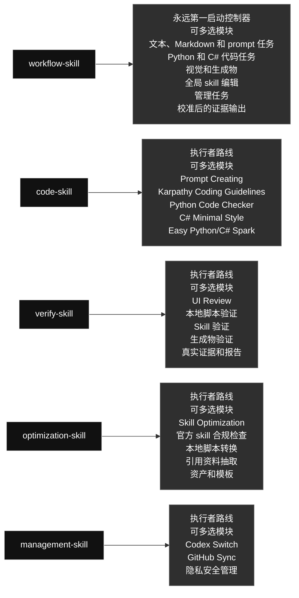

# qin-codex-skills

英文版: [README.md](./README.md)

## 技能图

### Skill 内容一览

#### [`workflow-skill`](./workflow-skill/) · 工作流类 / Workflow

- **角色：** 永远第一启动控制器
- **大功能：** 永远第一个启动任务执行，包括 prompt/instruction 编写和更新，定义目标、选择执行者 skill、路由工作、循环验证并检查最终证据。
- **可多选模块：** 文本、Markdown 和 prompt 任务; Python 和 C# 代码任务; 视觉和生成物; 全局 skill 编辑; 管理任务; 校准后的证据输出
- **选择规则：** 需要哪个模块就用哪个；同一个任务可以同时使用多个模块，不是单选，也不要运行无关模块。

#### [`code-skill`](./code-skill/) · 代码类 / Code

- **角色：** 由 workflow-skill 路由启动的执行者
- **大功能：** 在 workflow-skill 路由后只执行 Python 和 C# 代码工作，组合 prompt 嵌入、代码思路、Python、C#/Unity C# 和小代码模块。
- **可多选模块：** Prompt Creating; Karpathy Coding Guidelines; Python Code Checker; C# Minimal Style; Easy Python/C# Spark
- **选择规则：** 需要哪个模块就用哪个；同一个任务可以同时使用多个模块，不是单选，也不要运行无关模块。

#### [`verify-skill`](./verify-skill/) · 验证类 / Verification

- **角色：** 由 workflow-skill 路由启动的执行者
- **大功能：** 在 workflow-skill 路由后执行真实测试、证据捕获、报告生成和验证，检查输出是否满足用户要求。
- **可多选模块：** UI Review; 本地脚本验证; Skill 验证; 生成物验证; 真实证据和报告
- **选择规则：** 需要哪个模块就用哪个；同一个任务可以同时使用多个模块，不是单选，也不要运行无关模块。

#### [`optimization-skill`](./optimization-skill/) · 优化类 / Optimization

- **角色：** 由 workflow-skill 路由启动的执行者
- **大功能：** 在 workflow-skill 路由后执行可选的后置优化，只处理明确要求、重复多次或明显可复用的稳定流程，把它们变成本地脚本、引用资料、prompt 或资产。
- **可多选模块：** Skill Optimization; 官方 skill 合规检查; 本地脚本转换; 引用资料抽取; 资产和模板
- **选择规则：** 需要哪个模块就用哪个；同一个任务可以同时使用多个模块，不是单选，也不要运行无关模块。

#### [`management-skill`](./management-skill/) · 管理类 / Management

- **角色：** 由 workflow-skill 路由启动的执行者
- **大功能：** 在 workflow-skill 路由后执行管理工作，处理 Codex profiles 和全局 skill 的 GitHub 同步。
- **可多选模块：** Codex Switch; GitHub Sync; 隐私安全管理
- **选择规则：** 需要哪个模块就用哪个；同一个任务可以同时使用多个模块，不是单选，也不要运行无关模块。

生成日期: 2026-07-08

### 技能内容

#### 工作流类 / Workflow

##### `workflow-skill`

- **角色：** 永远第一启动控制器
- **大功能：** 永远第一个启动任务执行，包括 prompt/instruction 编写和更新，定义目标、选择执行者 skill、路由工作、循环验证并检查最终证据。
- **可多选模块：** 文本、Markdown 和 prompt 任务; Python 和 C# 代码任务; 视觉和生成物; 全局 skill 编辑; 管理任务; 校准后的证据输出
- **选择规则：** 需要哪个模块就用哪个；同一个任务可以同时使用多个模块，不是单选，也不要运行无关模块。

#### 代码类 / Code

##### `code-skill`

- **角色：** 由 workflow-skill 路由启动的执行者
- **大功能：** 在 workflow-skill 路由后只执行 Python 和 C# 代码工作，组合 prompt 嵌入、代码思路、Python、C#/Unity C# 和小代码模块。
- **可多选模块：** Prompt Creating; Karpathy Coding Guidelines; Python Code Checker; C# Minimal Style; Easy Python/C# Spark
- **选择规则：** 需要哪个模块就用哪个；同一个任务可以同时使用多个模块，不是单选，也不要运行无关模块。

#### 优化类 / Optimization

##### `optimization-skill`

- **角色：** 由 workflow-skill 路由启动的执行者
- **大功能：** 在 workflow-skill 路由后执行可选的后置优化，只处理明确要求、重复多次或明显可复用的稳定流程，把它们变成本地脚本、引用资料、prompt 或资产。
- **可多选模块：** Skill Optimization; 官方 skill 合规检查; 本地脚本转换; 引用资料抽取; 资产和模板
- **选择规则：** 需要哪个模块就用哪个；同一个任务可以同时使用多个模块，不是单选，也不要运行无关模块。

#### 验证类 / Verification

##### `verify-skill`

- **角色：** 由 workflow-skill 路由启动的执行者
- **大功能：** 在 workflow-skill 路由后执行真实测试、证据捕获、报告生成和验证，检查输出是否满足用户要求。
- **可多选模块：** UI Review; 本地脚本验证; Skill 验证; 生成物验证; 真实证据和报告
- **选择规则：** 需要哪个模块就用哪个；同一个任务可以同时使用多个模块，不是单选，也不要运行无关模块。

#### 管理类 / Management

##### `management-skill`

- **角色：** 由 workflow-skill 路由启动的执行者
- **大功能：** 在 workflow-skill 路由后执行管理工作，处理 Codex profiles 和全局 skill 的 GitHub 同步。
- **可多选模块：** Codex Switch; GitHub Sync; 隐私安全管理
- **选择规则：** 需要哪个模块就用哪个；同一个任务可以同时使用多个模块，不是单选，也不要运行无关模块。

## Skill 列表

| 类别 | Skill | 用途 |
|---|---|---|
| 代码类 / Code | `code-skill` | Executor skill under workflow-skill for Python and C# Codex code work only. Use when workflow-skill routes a task into writing, editing, refactoring, debugging, reviewing, optimizing, or explaining Python or C# code; any Python/C# prompt-related work including prompt generation, prompt review, prompt testing, prompt editing/add/update/remove/rewrite, and prompt-in-code work; Python modules, scripts, tests, and snippets; C# and Unity C# MonoBehaviours, ScriptableObjects, managers, and gameplay systems; performance and parallelization opportunities for independent Python or C# workloads; and obvious bounded Python/C# code tasks that may use Spark when an allowed model route exists. Do not use this skill to author JavaScript, TypeScript, frontend, shell, SQL, or other languages unless another active instruction explicitly routes that work elsewhere. Its internal routes are multi-select: use every route that applies to the task, not a one-of choice. |
| 管理类 / Management | `management-skill` | Executor skill under workflow-skill for management. Use after workflow-skill routes a task into local Codex account/profile operations or global skill GitHub synchronization. Use when the user asks to manage Codex auth profiles, switch local accounts, inspect profile state, sync global skills, commit or push skill changes, compare local and remote skill state, or run management workflows without exposing private data. Its management routes are multi-select when a request genuinely needs both profile and GitHub sync work. |
| 优化类 / Optimization | `optimization-skill` | Executor skill under workflow-skill for post-verification optimization of repetitive user workflows into reusable skill resources. Use only when the user explicitly asks to optimize a skill/process, the same or substantially identical workflow has repeated at least three times, or Codex has high confidence that a stable deterministic workflow will be reused many times and can save future token cost. Optimize after the original task passes verification unless optimization is the task. Check whether code, workflow steps, prompts, references, scripts, or assets can reduce repeated work while preserving behavior. Use code-skill for Python/C# helper code and verify-skill for same-behavior proof after optimization. |
| 验证类 / Verification | `verify-skill` | Executor skill under workflow-skill for all verification, including real tests, QA, evidence capture, report generation, result comparison, UI/visual checks, generated artifact review, skill verification, and optimized workflow validation. Use when asked to verify, test, review, audit, validate, inspect quality, confirm a workflow, check UI/visual quality, prove code or scripts still work, compare against previous behavior, or decide whether a failure is fixable. Run concrete checks with real inputs/outputs, choose evidence format by complexity, require Input/Used/Output/Why Pass for reports, and run an Obsidian regression sweep for relevant prior repeated or fixed AI-caused project failures before pass verdicts. When verification fails, classify feasibility, try safe repair routes, and stop only for logical impossibility or missing user-controlled access. Routes are multi-select: combine every route needed by the artifact. |
| 工作流类 / Workflow | `workflow-skill` | Global workflow controller for task work. Use for routing checks, Python/C# coding, prompt task gate matches, any prompt-related task including prompt/instruction authoring, prompt files/templates/strings, system/developer/user instructions, AI output behavior, review, editing, add/update/remove/rewrite, testing, or optimization, file-changing, multi-step, skill-editing, UI/artifact/report, visual/image generation, or evidence-heavy tasks. Before task action, show a workflow diagram: compact direct route for lightweight mode, or full diagram plus target map for explicit mode. For visual/image tasks that need or would benefit from ChatGPT-generated images or references (even without a user-provided image), use the internal image-generation route before implementation and verify the final visual result. For Python/C# work, route code or scripts through code-skill before verify-skill. After verification passes, run optimization only when explicitly requested, repeated 3+ times, or clearly reusable. |

## 结构

- Python 和 C# 代码工作进入 `code-skill`；前端/UI 等其他语言代码使用对应生产 skill。
- Prompt/instruction 编写、更新和优化先进入 `workflow-skill`；只有嵌入 Python/C# 可执行代码时才进入 `code-skill`。
- 固定重复流程优化进入 `optimization-skill`。
- 验证、真实测试和校准后的证据输出进入 `verify-skill`；简单结果留在聊天里，只有长数据、视觉、表格多、对比型、明确要求或仓库规则需要时才生成 PDF 报告。
- Auth 和 GitHub 镜像维护进入 `management-skill` 内部路由。
- 每个 skill 可能包含多个内部路由；需要哪个就选哪个，同一个任务可以多选，不是单选，也不要运行无关分支。

## 当前说明

- 旧代码类 skill 已合并到 `code-skill`。
- 旧测试类 skill 已合并到 `verify-skill`。
- UI review 已扩展到 `verify-skill`。
- 旧图片 workflow skill 已删除。
