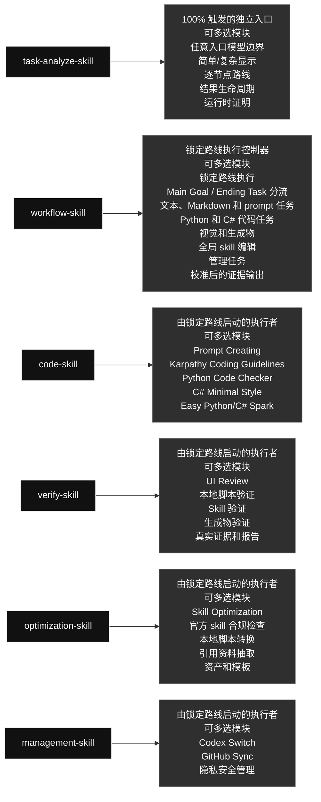
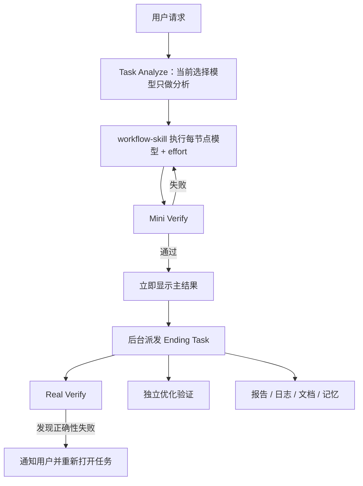

# qin-codex-skills

英文版: [README.md](./README.md)

## 技能图

## Main Goal 和 Ending Task

每个任务先进入独立 [`task-analyze-skill`](./task-analyze-skill/SKILL.md)；[`workflow-skill`](./workflow-skill/SKILL.md) 只执行返回的锁定路线。

- **Mini Verify：** 主结果的基础 gate。
- **主结果：** 请求工作完成且 Mini Verify 通过后立即显示。
- **Ending Task：** 结果之后运行 Real Verify、独立优化验证、报告、日志、文档和记忆；正确性失败必须通知并重新打开任务。

### Skill 内容一览

#### [`task-analyze-skill`](./task-analyze-skill/) · 工作流类 / Workflow

- **角色：** 100% 触发的独立入口
- **大功能：** 独立且 100% 触发的入口 skill：当前入口模型和 effort 只做 Task Analyze 路由，返回锁定的逐节点图谱，并使用本地 `model_experience.json` 的条件化汇总与 `success_model` / `failed_model` 边界。
- **可多选模块：** 任意入口模型边界; 简单/复杂显示; 逐节点路线; 结果生命周期; 运行时证明
- **选择规则：** 需要哪个模块就用哪个；同一个任务可以同时使用多个模块，不是单选，也不要运行无关模块。

#### [`workflow-skill`](./workflow-skill/) · 工作流类 / Workflow

- **角色：** 锁定路线执行控制器
- **大功能：** 执行 Task Analyze 锁定的路线，按节点先尝试不同 effort 再切换模型；先运行 Mini Verify 再派发 Ending Task。
- **可多选模块：** 锁定路线执行; Main Goal / Ending Task 分流; 文本、Markdown 和 prompt 任务; Python 和 C# 代码任务; 视觉和生成物; 全局 skill 编辑; 管理任务; 校准后的证据输出
- **选择规则：** 需要哪个模块就用哪个；同一个任务可以同时使用多个模块，不是单选，也不要运行无关模块。

#### [`code-skill`](./code-skill/) · 代码类 / Code

- **角色：** 由锁定路线启动的执行者
- **大功能：** 活动注册代码域执行者；Python、普通 C#、Unity C# 是内置示例。Spark 只适用于明显、低风险、小范围文本/代码/命令的特殊首选路线，不是每个代码任务，也不属于常规动态阶梯。
- **可多选模块：** Prompt Creating; Karpathy Coding Guidelines; Python Code Checker; C# Minimal Style; Easy Python/C# Spark
- **选择规则：** 需要哪个模块就用哪个；同一个任务可以同时使用多个模块，不是单选，也不要运行无关模块。

#### [`verify-skill`](./verify-skill/) · 验证类 / Verification

- **角色：** 由锁定路线启动的执行者
- **大功能：** Mini Verify 在主结果前做基础检查；Real Verify 在结果后的 Ending Task 中执行，并把两次结果回填到原始的 receipt-backed 结果尝试。
- **可多选模块：** UI Review; 本地脚本验证; Skill 验证; 生成物验证; 真实证据和报告
- **选择规则：** 需要哪个模块就用哪个；同一个任务可以同时使用多个模块，不是单选，也不要运行无关模块。

#### [`optimization-skill`](./optimization-skill/) · 优化类 / Optimization

- **角色：** 由锁定路线启动的执行者
- **大功能：** 把明确要求、重复多次或明显可复用的流程变成本地脚本、引用资料、prompt、资产或模板，同时保持行为不变。
- **可多选模块：** Skill Optimization; 官方 skill 合规检查; 本地脚本转换; 引用资料抽取; 资产和模板
- **选择规则：** 需要哪个模块就用哪个；同一个任务可以同时使用多个模块，不是单选，也不要运行无关模块。

#### [`management-skill`](./management-skill/) · 管理类 / Management

- **角色：** 由锁定路线启动的执行者
- **大功能：** 处理 Codex profile 操作和全局 skill GitHub 同步，不暴露私人数据，并保留本地私有路由历史。
- **可多选模块：** Codex Switch; GitHub Sync; 隐私安全管理
- **选择规则：** 需要哪个模块就用哪个；同一个任务可以同时使用多个模块，不是单选，也不要运行无关模块。

## 运行规则

- 每个任务先进入 `task-analyze-skill`；入口模型和 effort 只做 Task Analyze，不是工作流默认，也不是学习字段。
- 非 tiny 模型路线必须完整保留 `Luna-low → 全部 Luna effort → Terra → Sol-ultra`，且不含 Spark；tiny 路线必须是 `Spark-low + 完整常规 fallback`，不允许提高 Spark effort。
- 每个活动的注册代码域都进入 `code-skill`；Python、普通 C#、Unity C# 是内置示例。任务类型不会固定模型。
- 初次分发前必须用本地私有经验重新计算 recommendation；过期或自写的 plan 在执行前拒绝。
- 正确性是 gate；只有至少两个 Real 通过 pair 在相同 workload hash cohort 中且 token/time 完整时，才按总 token、process time、较弱 rung 排序；否则使用质量边界，不声明节省。
- Mini PASS 对 mini_real 只是临时结果；Ending Real 更新同一个 producer attempt，持久化并冻结 `best_pair`，验证失败才重新打开。
- 私有 ledger 在 `task-analyze-skill/local/adaptive-routing/model_experience.json`，不进入镜像。
