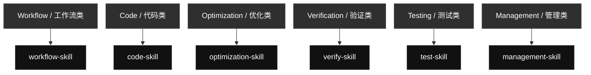
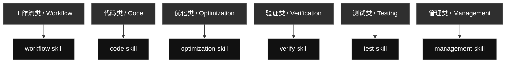

# Current Codex Skills

Language: [English](#english) | [中文](#zh)

## English

### Skill Contents At A Glance

#### [`workflow-skill`](./workflow-skill/) · Workflow / 工作流类

- **Text and Markdown tasks**: Text, markdown, explanation, classification, and rewrite requests with explicit format targets.
- **Code tasks**: Code, Python, Unity C#, prompt-in-code, frontend/UI, scripts, and executable behavior requests.
- **Visual and generated artifacts**: Image, UI, browser screenshot, document, PDF, report, and generated file tasks.
- **Global skill edits**: Create, merge, rename, delete, reorganize, or update global Codex skills.
- **Management tasks**: Account/profile switching and global skill GitHub sync through management-skill.
- **Final evidence reports**: Evidence PDFs and completion reports when the task needs proof.

#### [`code-skill`](./code-skill/) · Code / 代码类

- **Prompt Creating**: Prompt generation only: create, rewrite, or embed prompts into the corresponding text or code.
- **Karpathy Coding Guidelines**: Code thinking and implementation approach for assumptions, simple design, naming, branching, and surgical edits.
- **Python Code Checker**: Python modules, scripts, tests, snippets, prompt assignments, formatting, contracts, error handling, and logging rules.
- **Unity C# Minimal Style**: Unity MonoBehaviours, ScriptableObjects, managers, gameplay systems, editor scripts, lifecycle methods, and Unity C# style.
- **Easy Code Spark**: Small bounded code tasks that can use the Spark small-task route when the task is obvious and low risk.

#### [`optimization-skill`](./optimization-skill/) · Optimization / 优化类

- **Skill Optimization**: Optimize fixed or repeated skill workflows into local scripts, references, assets, or templates that save tokens.
- **Official skill compliance**: Audit skill structure, frontmatter, trigger descriptions, references, scripts, assets, and token-use behavior.
- **Local script conversion**: Turn stable repeated test, image, browser, computer-control, report, or generation steps into reusable local code.
- **Reference extraction**: Move long stable instructions into references/ so they load only when the task needs them.
- **Assets and templates**: Store reusable fixtures, templates, or media in assets/ when those files are part of the optimized skill.

#### [`verify-skill`](./verify-skill/) · Verification / 验证类

- **UI Review**: UI/UX, layout, responsive checks, screenshots, frontend polish, browser states, and Taste Skill visual QA.
- **Local Script Verification**: Optimized local scripts and workflows with concrete cache inputs, real outputs, rerun behavior, and output paths.
- **Skill Verification**: SKILL.md frontmatter, trigger wording, referenced files, old-name cleanup, route behavior, and skill structure.
- **Generated Artifact Verification**: Markdown, images, PDFs, documents, reports, data files, and exports through open/render/parse/inspect checks.
- **PDF Evidence Review**: Verify generated PDF reports contain real Input, Used, Output, and Why Pass evidence.

#### [`test-skill`](./test-skill/) · Testing / 测试类

- **Done Means Tested**: After code or workflow changes, run a small real usage test with concrete inputs and real outputs.
- **Test PDF Report**: Generate a PDF report that records exactly what input was given, what command/tool was used, what output came back, and why it passes.
- **Code/API/CLI Tests**: Real scripts, commands, CLI invocations, API calls, local handlers, stdout, files, JSON, and returned values.
- **UI/Browser Tests**: Real page states, screenshots, viewport sizes, console/runtime evidence, and interaction results.
- **Image/Document/PDF Tests**: Real source/output images, generated files, rendered documents, parsed PDFs, and artifact paths.
- **Comparison/Audit Reports**: Before/after, expected/actual, audit findings, and pass/fail evidence with concrete artifacts.

#### [`management-skill`](./management-skill/) · Management / 管理类

- **Codex Switch**: Local Codex auth profiles, saved profile listing, usage snapshots, login refresh, profile backup/import, and confirmed account switching.
- **GitHub Sync**: Global skill mirror status, preuse checks, public-safety scan, sync, pull, push, commit, and remote hash verification.
- **Privacy-Safe Management**: Auth files, tokens, cookies, profile IDs, raw logs, cache files, and secrets stay local and are never published.

Generated: 2026-06-14

### Skill Contents

#### Workflow / 工作流类

##### `workflow-skill`

Controls task decomposition, goal checks, routing, iteration, and final evidence for Codex requests.

- **Text and Markdown tasks**: Text, markdown, explanation, classification, and rewrite requests with explicit format targets.
- **Code tasks**: Code, Python, Unity C#, prompt-in-code, frontend/UI, scripts, and executable behavior requests.
- **Visual and generated artifacts**: Image, UI, browser screenshot, document, PDF, report, and generated file tasks.
- **Global skill edits**: Create, merge, rename, delete, reorganize, or update global Codex skills.
- **Management tasks**: Account/profile switching and global skill GitHub sync through management-skill.
- **Final evidence reports**: Evidence PDFs and completion reports when the task needs proof.

#### Code / 代码类

##### `code-skill`

Combines prompt, coding approach, Python, Unity C#, and small-code content.

- **Prompt Creating**: Prompt generation only: create, rewrite, or embed prompts into the corresponding text or code.
- **Karpathy Coding Guidelines**: Code thinking and implementation approach for assumptions, simple design, naming, branching, and surgical edits.
- **Python Code Checker**: Python modules, scripts, tests, snippets, prompt assignments, formatting, contracts, error handling, and logging rules.
- **Unity C# Minimal Style**: Unity MonoBehaviours, ScriptableObjects, managers, gameplay systems, editor scripts, lifecycle methods, and Unity C# style.
- **Easy Code Spark**: Small bounded code tasks that can use the Spark small-task route when the task is obvious and low risk.

#### Optimization / 优化类

##### `optimization-skill`

Turns stable repeated workflows into reusable local scripts, references, or assets when that saves tokens.

- **Skill Optimization**: Optimize fixed or repeated skill workflows into local scripts, references, assets, or templates that save tokens.
- **Official skill compliance**: Audit skill structure, frontmatter, trigger descriptions, references, scripts, assets, and token-use behavior.
- **Local script conversion**: Turn stable repeated test, image, browser, computer-control, report, or generation steps into reusable local code.
- **Reference extraction**: Move long stable instructions into references/ so they load only when the task needs them.
- **Assets and templates**: Store reusable fixtures, templates, or media in assets/ when those files are part of the optimized skill.

#### Verification / 验证类

##### `verify-skill`

Checks UI, scripts, generated artifacts, skills, and workflows against the user's requirement.

- **UI Review**: UI/UX, layout, responsive checks, screenshots, frontend polish, browser states, and Taste Skill visual QA.
- **Local Script Verification**: Optimized local scripts and workflows with concrete cache inputs, real outputs, rerun behavior, and output paths.
- **Skill Verification**: SKILL.md frontmatter, trigger wording, referenced files, old-name cleanup, route behavior, and skill structure.
- **Generated Artifact Verification**: Markdown, images, PDFs, documents, reports, data files, and exports through open/render/parse/inspect checks.
- **PDF Evidence Review**: Verify generated PDF reports contain real Input, Used, Output, and Why Pass evidence.

#### Testing / 测试类

##### `test-skill`

Runs real executable checks and produces evidence-rich PDF reports.

- **Done Means Tested**: After code or workflow changes, run a small real usage test with concrete inputs and real outputs.
- **Test PDF Report**: Generate a PDF report that records exactly what input was given, what command/tool was used, what output came back, and why it passes.
- **Code/API/CLI Tests**: Real scripts, commands, CLI invocations, API calls, local handlers, stdout, files, JSON, and returned values.
- **UI/Browser Tests**: Real page states, screenshots, viewport sizes, console/runtime evidence, and interaction results.
- **Image/Document/PDF Tests**: Real source/output images, generated files, rendered documents, parsed PDFs, and artifact paths.
- **Comparison/Audit Reports**: Before/after, expected/actual, audit findings, and pass/fail evidence with concrete artifacts.

#### Management / 管理类

##### `management-skill`

Routes Codex profile management and global skill GitHub sync through the right support skill.

- **Codex Switch**: Local Codex auth profiles, saved profile listing, usage snapshots, login refresh, profile backup/import, and confirmed account switching.
- **GitHub Sync**: Global skill mirror status, preuse checks, public-safety scan, sync, pull, push, commit, and remote hash verification.
- **Privacy-Safe Management**: Auth files, tokens, cookies, profile IDs, raw logs, cache files, and secrets stay local and are never published.

### Management Support Skill Contents

These are real mirrored skills used by `management-skill`, but they are not shown as separate primary map rows.

#### [`codex-switch`](./codex-switch/)

Manages local Codex auth profiles and account switching without exposing private auth data.

- **List profiles**: Inspect saved local auth profile files.
- **Live usage probes**: Run isolated live checks only when current usage matters.
- **Switch profile**: Copy a confirmed saved profile onto auth.json after explicit confirmation.
- **Refresh/login backup**: Run browser login and save a refreshed profile backup.
- **Save current auth**: Back up the current auth.json under a requested local profile name.
- **Import auth file**: Import a user-supplied auth file into a named local profile.
- **Privacy guardrails**: Never expose or publish tokens, auth files, account IDs, or raw logs.

#### [`github-sync`](./github-sync/)

Syncs, commits, and pushes Codex skill changes to the public GitHub mirror with privacy checks.

- **sync**: Normal before/after route for skill work.
- **status**: Dry-run preview of local-to-remote changes.
- **preuse**: Read-only inspection before using or editing skills.
- **pull**: Accept remote changes into local skills.
- **push**: Publish local skill changes to GitHub.
- **public safety scan**: Block auth files, secrets, cache, logs, and generated private artifacts.

## 中文

语言: [English](#english) | [中文](#zh)

### Skill 内容一览

#### [`workflow-skill`](./workflow-skill/) · 工作流类 / Workflow

- **文本和 Markdown 任务**: 文本、Markdown、解释、分类、改写，以及有明确格式要求的内容任务。
- **代码任务**: 代码、Python、Unity C#、prompt-in-code、前端/UI、脚本和可执行行为任务。
- **视觉和生成物**: 图片、UI、浏览器截图、文档、PDF、报告和生成文件任务。
- **全局 skill 编辑**: 创建、合并、重命名、删除、重组或更新全局 Codex skills。
- **管理任务**: 通过 management-skill 处理账号/Profile 切换和全局 skill 的 GitHub 同步。
- **最终证据报告**: 任务需要证明时生成证据 PDF 和完成报告。

#### [`code-skill`](./code-skill/) · 代码类 / Code

- **Prompt Creating**: 只负责 prompt 生成：创建、重写，或把 prompt 嵌入对应文本或代码。
- **Karpathy Coding Guidelines**: 代码思考和实现方式：假设、简单设计、命名、分支和精确修改。
- **Python Code Checker**: Python 模块、脚本、测试、片段、prompt 变量、格式、契约、错误处理和日志规则。
- **Unity C# Minimal Style**: Unity MonoBehaviour、ScriptableObject、manager、玩法系统、编辑器脚本、生命周期方法和 Unity C# 风格。
- **Easy Code Spark**: 明显、低风险、小范围的代码任务，可以走 Spark 小任务路线。

#### [`optimization-skill`](./optimization-skill/) · 优化类 / Optimization

- **Skill Optimization**: 把固定或重复的 skill 流程优化成本地脚本、引用资料、资产或模板。
- **官方 skill 合规检查**: 检查 skill 结构、frontmatter、触发描述、references、scripts、assets 和 token 使用方式。
- **本地脚本转换**: 把稳定重复的测试、图片、浏览器、电脑控制、报告或生成步骤转成本地可复用代码。
- **引用资料抽取**: 把较长且稳定的说明移到 references/，只在任务需要时加载。
- **资产和模板**: 当可复用 fixture、模板或媒体属于 skill 的一部分时，放进 assets/。

#### [`verify-skill`](./verify-skill/) · 验证类 / Verification

- **UI Review**: UI/UX、布局、响应式检查、截图、前端 polish、浏览器状态和 Taste Skill 视觉 QA。
- **本地脚本验证**: 验证优化后的本地脚本和流程，检查 cache 输入、真实输出、重复运行和输出路径。
- **Skill 验证**: 检查 SKILL.md frontmatter、触发说明、引用文件、旧名称清理、路由行为和 skill 结构。
- **生成物验证**: 通过打开、渲染、解析或检查来验证 Markdown、图片、PDF、文档、报告、数据文件和导出物。
- **PDF 证据检查**: 检查生成的 PDF 报告是否包含真实 Input、Used、Output 和 Why Pass。

#### [`test-skill`](./test-skill/) · 测试类 / Testing

- **Done Means Tested**: 代码或工作流改完后，必须用具体输入和真实输出跑一个小的真实使用测试。
- **Test PDF Report**: 生成 PDF 报告，写清楚给了什么输入、用了什么命令/工具、得到了什么输出，以及为什么通过。
- **Code/API/CLI Tests**: 真实脚本、命令、CLI 调用、API 调用、本地 handler、stdout、文件、JSON 和返回值。
- **UI/Browser Tests**: 真实页面状态、截图、viewport 尺寸、console/runtime 证据和交互结果。
- **Image/Document/PDF Tests**: 真实输入/输出图片、生成文件、渲染文档、解析 PDF 和 artifact 路径。
- **Comparison/Audit Reports**: before/after、expected/actual、审计发现，以及带具体 artifact 的 pass/fail 证据。

#### [`management-skill`](./management-skill/) · 管理类 / Management

- **Codex Switch**: 本地 Codex auth profile、已保存 profile 列表、使用快照、登录刷新、profile 备份/导入和确认后的账号切换。
- **GitHub Sync**: 全局 skill 镜像状态、preuse 检查、公开安全扫描、sync、pull、push、commit 和远端 hash 验证。
- **隐私安全管理**: auth 文件、token、cookie、profile ID、原始日志、cache 文件和 secret 保持本地，不发布出去。

生成日期: 2026-06-14

### 技能内容

#### 工作流类 / Workflow

##### `workflow-skill`

统一控制 Codex 任务拆分、目标检查、skill 路由、循环验证和最终证据。

- **文本和 Markdown 任务**: 文本、Markdown、解释、分类、改写，以及有明确格式要求的内容任务。
- **代码任务**: 代码、Python、Unity C#、prompt-in-code、前端/UI、脚本和可执行行为任务。
- **视觉和生成物**: 图片、UI、浏览器截图、文档、PDF、报告和生成文件任务。
- **全局 skill 编辑**: 创建、合并、重命名、删除、重组或更新全局 Codex skills。
- **管理任务**: 通过 management-skill 处理账号/Profile 切换和全局 skill 的 GitHub 同步。
- **最终证据报告**: 任务需要证明时生成证据 PDF 和完成报告。

#### 代码类 / Code

##### `code-skill`

合并 prompt、代码思路、Python、Unity C# 和小代码任务相关内容。

- **Prompt Creating**: 只负责 prompt 生成：创建、重写，或把 prompt 嵌入对应文本或代码。
- **Karpathy Coding Guidelines**: 代码思考和实现方式：假设、简单设计、命名、分支和精确修改。
- **Python Code Checker**: Python 模块、脚本、测试、片段、prompt 变量、格式、契约、错误处理和日志规则。
- **Unity C# Minimal Style**: Unity MonoBehaviour、ScriptableObject、manager、玩法系统、编辑器脚本、生命周期方法和 Unity C# 风格。
- **Easy Code Spark**: 明显、低风险、小范围的代码任务，可以走 Spark 小任务路线。

#### 优化类 / Optimization

##### `optimization-skill`

把稳定重复的流程优化成本地脚本、引用资料、资产或模板，用来节省 token 和执行时间。

- **Skill Optimization**: 把固定或重复的 skill 流程优化成本地脚本、引用资料、资产或模板。
- **官方 skill 合规检查**: 检查 skill 结构、frontmatter、触发描述、references、scripts、assets 和 token 使用方式。
- **本地脚本转换**: 把稳定重复的测试、图片、浏览器、电脑控制、报告或生成步骤转成本地可复用代码。
- **引用资料抽取**: 把较长且稳定的说明移到 references/，只在任务需要时加载。
- **资产和模板**: 当可复用 fixture、模板或媒体属于 skill 的一部分时，放进 assets/。

#### 验证类 / Verification

##### `verify-skill`

检查 UI、脚本、生成物、skill 和工作流是否真的满足用户要求。

- **UI Review**: UI/UX、布局、响应式检查、截图、前端 polish、浏览器状态和 Taste Skill 视觉 QA。
- **本地脚本验证**: 验证优化后的本地脚本和流程，检查 cache 输入、真实输出、重复运行和输出路径。
- **Skill 验证**: 检查 SKILL.md frontmatter、触发说明、引用文件、旧名称清理、路由行为和 skill 结构。
- **生成物验证**: 通过打开、渲染、解析或检查来验证 Markdown、图片、PDF、文档、报告、数据文件和导出物。
- **PDF 证据检查**: 检查生成的 PDF 报告是否包含真实 Input、Used、Output 和 Why Pass。

#### 测试类 / Testing

##### `test-skill`

执行真实测试，并生成带输入、方法、输出和通过原因的 PDF 报告。

- **Done Means Tested**: 代码或工作流改完后，必须用具体输入和真实输出跑一个小的真实使用测试。
- **Test PDF Report**: 生成 PDF 报告，写清楚给了什么输入、用了什么命令/工具、得到了什么输出，以及为什么通过。
- **Code/API/CLI Tests**: 真实脚本、命令、CLI 调用、API 调用、本地 handler、stdout、文件、JSON 和返回值。
- **UI/Browser Tests**: 真实页面状态、截图、viewport 尺寸、console/runtime 证据和交互结果。
- **Image/Document/PDF Tests**: 真实输入/输出图片、生成文件、渲染文档、解析 PDF 和 artifact 路径。
- **Comparison/Audit Reports**: before/after、expected/actual、审计发现，以及带具体 artifact 的 pass/fail 证据。

#### 管理类 / Management

##### `management-skill`

统一管理 Codex 本地账号/Profile 操作，以及全局 skill 的 GitHub 同步。

- **Codex Switch**: 本地 Codex auth profile、已保存 profile 列表、使用快照、登录刷新、profile 备份/导入和确认后的账号切换。
- **GitHub Sync**: 全局 skill 镜像状态、preuse 检查、公开安全扫描、sync、pull、push、commit 和远端 hash 验证。
- **隐私安全管理**: auth 文件、token、cookie、profile ID、原始日志、cache 文件和 secret 保持本地，不发布出去。

### 管理支持 Skill 内容

这些也是真实同步到仓库的 skill，由 `management-skill` 调用，但不作为主图里的单独主入口展示。

#### [`codex-switch`](./codex-switch/)

管理本地 Codex auth profile 和账号切换，同时避免暴露私密 auth 数据。

- **列出 profiles**: 检查已保存的本地 auth profile 文件。
- **实时用量探测**: 只有当当前用量重要时，才运行隔离的实时检查。
- **切换 profile**: 用户明确确认后，把指定已保存 profile 复制到 auth.json。
- **刷新/登录备份**: 通过浏览器登录刷新，并保存新的 profile 备份。
- **保存当前 auth**: 按用户指定的本地 profile 名备份当前 auth.json。
- **导入 auth 文件**: 把用户提供的 auth 文件导入成命名 profile。
- **隐私保护**: 不暴露或发布 token、auth 文件、account ID 或原始日志。

#### [`github-sync`](./github-sync/)

把全局 Codex skill 安全同步、提交并推送到公开 GitHub 镜像。

- **sync**: 全局 skill 工作前后的普通同步路线。
- **status**: 预览本地到远端会发生的变化。
- **preuse**: 使用或编辑 skill 前的只读检查。
- **pull**: 把远端 skill 变化接受到本地。
- **push**: 把本地 skill 变化发布到 GitHub。
- **公开安全扫描**: 阻止 auth 文件、secret、cache、日志和生成的私有 artifact 被发布。

## Skill List

| Category | Skill | Purpose |
|---|---|---|
| Code | `code-skill` | Unified code skill for all code-related Codex work. Use for writing, editing, refactoring, debugging, reviewing, optimizing, or explaining code; prompt generation and prompt-in-code work; Python modules, scripts, tests, and snippets; Unity C# MonoBehaviours, ScriptableObjects, managers, and gameplay systems; and obvious bounded code tasks that may use Spark when an allowed model route exists. |
| Management | `codex-switch` | Inspect, manage, and switch local Codex auth profiles under `~/.codex`. Use when the user wants local Codex account/profile switching, finding `auth*.json` files, identifying which account each file belongs to, reviewing the latest locally observed Codex usage or rate-limit snapshot for each account, refreshing or backing up a local login, or switching the active profile by copying one saved auth file onto `auth.json` without deleting anything or exposing raw tokens. |
| Management | `github-sync` | Sync, commit, and push Qin's user global Codex skills with the GitHub repository qin-codex-skills. Use when Codex needs to read, use, create, edit, rename, delete, or update global skills under ~/.codex/skills; when global skill changes should be committed and pushed to GitHub; or when local and remote global-skill state must be compared without placing .git metadata inside ~/.codex/skills. Always keep the public mirror safe by excluding caches, generated artifacts, auth files, tokens, secrets, local logs, and other private personal data. |
| Management | `management-skill` | Unified management skill for local Codex account/profile operations and global skill GitHub synchronization. Use when the user asks to manage Codex auth profiles, switch local accounts, inspect profile state, sync global skills, commit or push skill changes, compare local and remote skill state, or run management workflows that should route through codex-switch or github-sync without exposing private data. |
| Optimization | `optimization-skill` | Optimize repetitive Codex skills and fixed workflows into reusable local files, scripts, references, or assets that save tokens and execution time. Use when the user explicitly asks to optimize a skill or repeated process into local code/files; when a skill workflow is stable but too verbose; when repeated test, image, browser, computer-control, report, or generation steps can become deterministic Python scripts; or when Codex notices a highly repeated fixed flow that should be made reusable. Must prepare references first, follow code-skill for all code/script work, and verify the optimized workflow with real execution before finishing. |
| Testing | `test-skill` | Unified testing and report skill. Use when code, UI, scripts, automations, generated assets, or content have been created or changed; when the user asks to test, verify, QA, smoke test, validate, prove, or generate a report; and whenever completed work needs real executable evidence plus a concise visual PDF report. Requires real runnable tests with concrete generated inputs, real inputs/outputs, the exact command/tool used, and a clear pass reason instead of mock-only, signature-only, or pass/OK-only checks. |
| Verification | `verify-skill` | General verification skill for checking whether workflows, local scripts, UI/UX, generated artifacts, skill edits, and process optimizations actually satisfy the user's requirement. Use when Codex is asked to verify, review, audit, validate, inspect quality, confirm a workflow, check UI/visual quality, or validate that an optimized local script/process still works. For UI verification, fetch/read leonxlnx/taste-skill and combine it with the local UI problem index before deciding whether the UI passes. |
| Workflow | `workflow-skill` | Global task workflow controller for Codex requests. Use at the start of any user task that needs decomposition, explicit goals, skill routing, code/script/workflow work, testing, verification, iteration to completion, or a final evidence report. It breaks the request into steps, defines artifact-specific pass criteria, routes code work through code-skill before test-skill and verify-skill, loops until the stated goals pass, and keeps process detail in the report instead of the final chat. |

## Structure

- Code work enters through `code-skill`.
- Repeated fixed workflow optimization enters through `optimization-skill`.
- Verification work enters through `verify-skill`.
- Real tests and report artifacts sit under `test-skill`.
- Auth and GitHub mirror maintenance enter through `management-skill`, which selects `codex-switch` or `github-sync` internally.
- Each skill may contain multiple internal routes; choose only the route needed for the current request instead of running every listed case.

## Current Notes

- The old code skills were merged into `code-skill`.
- The old testing skills were merged into `test-skill`.
- UI review was broadened into `verify-skill`.
- The old image workflow skill was deleted.
