# Current Global Codex Skills

```mermaid
flowchart LR
  root((Global Codex Skills))
  root --- category_Code["Code / 代码类"]
  category_Code --- skill_code_skill["code-skill"]
  skill_code_skill --- branch_code_skill_Prompt_generation["Prompt generation"]
  skill_code_skill --- branch_code_skill_Coding_approach["Coding approach"]
  skill_code_skill --- branch_code_skill_Spark_small_task_routing["Spark small-task routing"]
  skill_code_skill --- branch_code_skill_Python_rules["Python rules"]
  skill_code_skill --- branch_code_skill_Unity_C_rules["Unity C# rules"]
  skill_code_skill --- branch_code_skill_Real_test_report_flow["Real test/report flow"]
  root --- category_Optimization["Optimization / 优化类"]
  category_Optimization --- skill_optimization_skill["optimization-skill"]
  skill_optimization_skill --- branch_optimization_skill_Instruction_tightening["Instruction tightening"]
  skill_optimization_skill --- branch_optimization_skill_References_extraction["References extraction"]
  skill_optimization_skill --- branch_optimization_skill_Script_conversion["Script conversion"]
  skill_optimization_skill --- branch_optimization_skill_Assets_templates["Assets/templates"]
  skill_optimization_skill --- branch_optimization_skill_No_op_decision["No-op decision"]
  skill_optimization_skill --- branch_optimization_skill_Code_skill_gate["Code-skill gate"]
  root --- category_Verification["Verification / 验证类"]
  category_Verification --- skill_verify_skill["verify-skill"]
  skill_verify_skill --- branch_verify_skill_UI_verification["UI verification"]
  skill_verify_skill --- branch_verify_skill_Local_script_process_verification["Local script/process verification"]
  skill_verify_skill --- branch_verify_skill_Code_behavior_verification["Code behavior verification"]
  skill_verify_skill --- branch_verify_skill_Skill_instruction_verification["Skill/instruction verification"]
  skill_verify_skill --- branch_verify_skill_Generated_artifact_review["Generated artifact review"]
  skill_verify_skill --- branch_verify_skill_Mixed_route["Mixed route"]
  root --- category_Testing["Testing / 测试类"]
  category_Testing --- skill_test_skill["test-skill"]
  skill_test_skill --- branch_test_skill_Code_API_CLI_evidence["Code/API/CLI evidence"]
  skill_test_skill --- branch_test_skill_UI_browser_evidence["UI/browser evidence"]
  skill_test_skill --- branch_test_skill_Image_evidence["Image evidence"]
  skill_test_skill --- branch_test_skill_Document_PDF_evidence["Document/PDF evidence"]
  skill_test_skill --- branch_test_skill_Comparison_audit_reports["Comparison/audit reports"]
  skill_test_skill --- branch_test_skill_Evidence_contract["Evidence contract"]
  root --- category_Management["Management / 管理类"]
  category_Management --- skill_codex_switch["codex-switch"]
  skill_codex_switch --- branch_codex_switch_List_profiles["List profiles"]
  skill_codex_switch --- branch_codex_switch_Live_usage_probes["Live usage probes"]
  skill_codex_switch --- branch_codex_switch_Switch_profile["Switch profile"]
  skill_codex_switch --- branch_codex_switch_Refresh_login_backup["Refresh/login backup"]
  skill_codex_switch --- branch_codex_switch_Save_current_auth["Save current auth"]
  skill_codex_switch --- branch_codex_switch_Import_auth_file["Import auth file"]
  skill_codex_switch --- branch_codex_switch_Privacy_guardrails["Privacy guardrails"]
  category_Management --- skill_github_sync["github-sync"]
  skill_github_sync --- branch_github_sync_sync["sync"]
  skill_github_sync --- branch_github_sync_status["status"]
  skill_github_sync --- branch_github_sync_preuse["preuse"]
  skill_github_sync --- branch_github_sync_pull["pull"]
  skill_github_sync --- branch_github_sync_push["push"]
  skill_github_sync --- branch_github_sync_public_safety_scan["public safety scan"]
  classDef root fill:#000,color:#fff,stroke:#111,stroke-width:2px;
  classDef category fill:#2f2f2f,color:#fff,stroke:#555;
  classDef skill fill:#111,color:#fff,stroke:#eee;
  classDef branch fill:#1f1f1f,color:#fff,stroke:#777;
  class root root;
  class category_Code,category_Optimization,category_Verification,category_Testing,category_Management category;
  class skill_code_skill,skill_optimization_skill,skill_verify_skill,skill_test_skill,skill_codex_switch,skill_github_sync skill;
  class branch_code_skill_Prompt_generation,branch_code_skill_Coding_approach,branch_code_skill_Spark_small_task_routing,branch_code_skill_Python_rules,branch_code_skill_Unity_C_rules,branch_code_skill_Real_test_report_flow,branch_optimization_skill_Instruction_tightening,branch_optimization_skill_References_extraction,branch_optimization_skill_Script_conversion,branch_optimization_skill_Assets_templates,branch_optimization_skill_No_op_decision,branch_optimization_skill_Code_skill_gate,branch_verify_skill_UI_verification,branch_verify_skill_Local_script_process_verification,branch_verify_skill_Code_behavior_verification,branch_verify_skill_Skill_instruction_verification,branch_verify_skill_Generated_artifact_review,branch_verify_skill_Mixed_route,branch_test_skill_Code_API_CLI_evidence,branch_test_skill_UI_browser_evidence,branch_test_skill_Image_evidence,branch_test_skill_Document_PDF_evidence,branch_test_skill_Comparison_audit_reports,branch_test_skill_Evidence_contract,branch_codex_switch_List_profiles,branch_codex_switch_Live_usage_probes,branch_codex_switch_Switch_profile,branch_codex_switch_Refresh_login_backup,branch_codex_switch_Save_current_auth,branch_codex_switch_Import_auth_file,branch_codex_switch_Privacy_guardrails,branch_github_sync_sync,branch_github_sync_status,branch_github_sync_preuse,branch_github_sync_pull,branch_github_sync_push,branch_github_sync_public_safety_scan branch;
```

Generated: 2026-06-14

## Diagram Explanation

- The center node is the full set of user global Codex skills.
- First-level nodes are skill categories.
- Second-level nodes are the actual skill names that Codex can invoke.
- Third-level nodes are internal branches. Codex should choose only the branch needed for the current task instead of running every branch.

## Skill Internal Branches

Each skill may contain multiple internal branches. These are alternatives selected by the current task, not a checklist to run every time.

### Code / 代码类

#### `code-skill`

- **Prompt generation**: Only for creating, rewriting, or embedding prompts.
- **Coding approach**: Use for assumptions, smallest viable implementation, and surgical edits.
- **Spark small-task routing**: Use only for obvious bounded low-risk code tasks when an allowed route exists.
- **Python rules**: Use for Python modules, scripts, tests, snippets, and Python prompt assignments.
- **Unity C# rules**: Use for Unity MonoBehaviours, ScriptableObjects, managers, and gameplay systems.
- **Real test/report flow**: After code changes, route real executable evidence through test-skill unless testing is explicitly forbidden.

### Optimization / 优化类

#### `optimization-skill`

- **Instruction tightening**: Tighten triggers, workflow wording, guardrails, and duplicated requirements.
- **References extraction**: Move long stable context into references/ when it should be loaded only when needed.
- **Script conversion**: Move repeated deterministic steps into scripts/ when it saves tokens and remains testable.
- **Assets/templates**: Store reusable fixtures, templates, or media in assets/ when they are part of the skill.
- **No-op decision**: Leave the skill unchanged when optimization is not justified.
- **Code-skill gate**: Use code-skill before writing or editing helper code.

### Verification / 验证类

#### `verify-skill`

- **UI verification**: Use Taste Skill plus the local problem index for visual/UI checks.
- **Local script/process verification**: Run local scripts with concrete cache inputs and inspect outputs.
- **Code behavior verification**: Define the behavior that test-skill must prove with real execution.
- **Skill/instruction verification**: Check frontmatter, triggers, references, paths, old names, and route behavior.
- **Generated artifact review**: Open, render, parse, or inspect generated files and reports.
- **Mixed route**: Combine only the relevant verification routes when the task spans artifacts.

### Testing / 测试类

#### `test-skill`

- **Code/API/CLI evidence**: Run real commands, API calls, or scripts and record input, used method, output, and pass reason.
- **UI/browser evidence**: Capture real screenshots, page states, console/runtime evidence, and viewport details.
- **Image evidence**: Use real source/output images and visual artifacts.
- **Document/PDF evidence**: Render, parse, or inspect documents and PDFs with local tools.
- **Comparison/audit reports**: Show before/after, expected/actual, or audit findings with concrete evidence.
- **Evidence contract**: Every passing case needs Input, Used, Output, and Why Pass.

### Management / 管理类

#### `codex-switch`

- **List profiles**: Inspect saved local auth profile files.
- **Live usage probes**: Run isolated live checks only when current usage matters.
- **Switch profile**: Copy a confirmed saved profile onto auth.json after explicit confirmation.
- **Refresh/login backup**: Run browser login and save a refreshed profile backup.
- **Save current auth**: Back up the current auth.json under a requested local profile name.
- **Import auth file**: Import a user-supplied auth file into a named local profile.
- **Privacy guardrails**: Never expose or publish tokens, auth files, account IDs, or raw logs.

#### `github-sync`

- **sync**: Normal before/after route for global skill work.
- **status**: Dry-run preview of local-to-remote changes.
- **preuse**: Read-only inspection before using or editing skills.
- **pull**: Accept remote changes into local global skills.
- **push**: Publish local global-skill changes to GitHub.
- **public safety scan**: Block auth files, secrets, cache, logs, and generated private artifacts.

## Skill List

| Category | Skill | Purpose |
|---|---|---|
| Code | `code-skill` | Unified code skill for all code-related Codex work. Use for writing, editing, refactoring, debugging, reviewing, optimizing, or explaining code; prompt generation and prompt-in-code work; Python modules, scripts, tests, and snippets; Unity C# MonoBehaviours, ScriptableObjects, managers, and gameplay systems; and obvious bounded code tasks that may use Spark when an allowed model route exists. |
| Management | `codex-switch` | Inspect, manage, and switch local Codex auth profiles under `~/.codex`. Use when the user wants local Codex account/profile switching, finding `auth*.json` files, identifying which account each file belongs to, reviewing the latest locally observed Codex usage or rate-limit snapshot for each account, refreshing or backing up a local login, or switching the active profile by copying one saved auth file onto `auth.json` without deleting anything or exposing raw tokens. |
| Management | `github-sync` | Sync, commit, and push Qin's user global Codex skills with the GitHub repository qin-codex-skills. Use before reading, using, creating, editing, renaming, deleting, or updating global skills under ~/.codex/skills, and after any global-skill edit when the saved skill code should be committed and pushed to GitHub without placing .git metadata inside ~/.codex/skills. Always keep the public mirror safe by excluding caches, generated artifacts, auth files, tokens, secrets, local logs, and other private personal data. |
| Optimization | `optimization-skill` | Optimize repetitive Codex skills and fixed workflows into reusable local files, scripts, references, or assets that save tokens and execution time. Use when the user explicitly asks to optimize a skill or repeated process into local code/files; when a skill workflow is stable but too verbose; when repeated test, image, browser, computer-control, report, or generation steps can become deterministic Python scripts; or when Codex notices a highly repeated fixed flow that should be made reusable. Must prepare references first, follow code-skill for all code/script work, and verify the optimized workflow with real execution before finishing. |
| Testing | `test-skill` | Unified testing and report skill. Use after code, UI, scripts, automations, generated assets, or content have been created or changed; when the user asks to test, verify, QA, smoke test, validate, prove, or generate a report; and whenever completed work needs real executable evidence plus a concise visual PDF report. Requires real runnable tests with concrete generated inputs, real inputs/outputs, the exact command/tool used, and a clear pass reason instead of mock-only, signature-only, or pass/OK-only checks. |
| Verification | `verify-skill` | General verification skill for checking whether workflows, local scripts, UI/UX, generated artifacts, skill edits, and process optimizations actually satisfy the user's requirement. Use when Codex is asked to verify, review, audit, validate, inspect quality, confirm a workflow, optimize a repeated process into a local script, or check UI/visual quality. For UI verification, fetch/read leonxlnx/taste-skill and combine it with the local UI problem index before deciding whether the UI passes. |

## Structure

- Code work enters through `code-skill`.
- Repeated fixed workflow optimization enters through `optimization-skill`.
- Verification work enters through `verify-skill`.
- Real tests and report artifacts sit under `test-skill`.
- Auth and GitHub mirror maintenance sit under Management.
- Each skill may contain multiple internal routes; choose only the route needed for the current request instead of running every listed case.

## Current Notes

- The old code skills were merged into `code-skill`.
- The old testing skills were merged into `test-skill`.
- UI review was broadened into `verify-skill`.
- The old image workflow skill was deleted.
