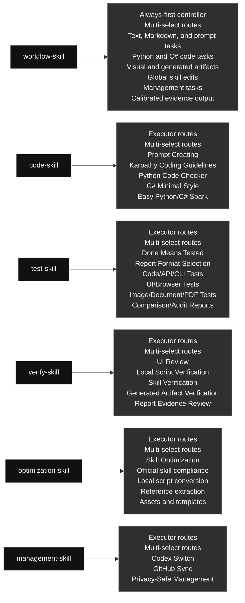

# Current Codex Skills

Chinese version: [current_global_skills_overview.zh.md](./current_global_skills_overview.zh.md)

## Skill Map

### Skill Contents At A Glance

#### [`workflow-skill`](./workflow-skill/) · Workflow / 工作流类

- **Role:** Always-first controller
- **Big function:** Always starts task execution, including prompt/instruction authoring and updates, defines goals, selects executor skills, routes work, iterates, and checks final evidence.
- **Selectable modules (multi-select):** Text, Markdown, and prompt tasks; Python and C# code tasks; Visual and generated artifacts; Global skill edits; Management tasks; Calibrated evidence output
- **Selection rule:** Use every module that applies to the task; this is not one-of, and unrelated modules should not run.

#### [`code-skill`](./code-skill/) · Code / 代码类

- **Role:** Executor started by workflow-skill
- **Big function:** Executes Python and C# code work only after workflow-skill routes the task, combining prompt embedding, coding approach, Python, C#/Unity C#, and small-code modules.
- **Selectable modules (multi-select):** Prompt Creating; Karpathy Coding Guidelines; Python Code Checker; C# Minimal Style; Easy Python/C# Spark
- **Selection rule:** Use every module that applies to the task; this is not one-of, and unrelated modules should not run.

#### [`test-skill`](./test-skill/) · Testing / 测试类

- **Role:** Executor started by workflow-skill
- **Big function:** Executes real tests after workflow-skill routes the task, then chooses concise chat evidence, Markdown/table summaries, or PDF report artifacts based on complexity.
- **Selectable modules (multi-select):** Done Means Tested; Report Format Selection; Code/API/CLI Tests; UI/Browser Tests; Image/Document/PDF Tests; Comparison/Audit Reports
- **Selection rule:** Use every module that applies to the task; this is not one-of, and unrelated modules should not run.

#### [`verify-skill`](./verify-skill/) · Verification / 验证类

- **Role:** Executor started by workflow-skill
- **Big function:** Executes verification after workflow-skill routes the task, checking UI, scripts, generated artifacts, skills, and workflows against the user's requirement.
- **Selectable modules (multi-select):** UI Review; Local Script Verification; Skill Verification; Generated Artifact Verification; Report Evidence Review
- **Selection rule:** Use every module that applies to the task; this is not one-of, and unrelated modules should not run.

#### [`optimization-skill`](./optimization-skill/) · Optimization / 优化类

- **Role:** Executor started by workflow-skill
- **Big function:** Executes optimization work after workflow-skill routes the task, turning stable repeated workflows into reusable local scripts, references, or assets.
- **Selectable modules (multi-select):** Skill Optimization; Official skill compliance; Local script conversion; Reference extraction; Assets and templates
- **Selection rule:** Use every module that applies to the task; this is not one-of, and unrelated modules should not run.

#### [`management-skill`](./management-skill/) · Management / 管理类

- **Role:** Executor started by workflow-skill
- **Big function:** Executes management work after workflow-skill routes the task, covering Codex profiles and global skill GitHub sync.
- **Selectable modules (multi-select):** Codex Switch; GitHub Sync; Privacy-Safe Management
- **Selection rule:** Use every module that applies to the task; this is not one-of, and unrelated modules should not run.

Generated: 2026-06-22

### Skill Contents

#### Workflow / 工作流类

##### `workflow-skill`

- **Role:** Always-first controller
- **Big function:** Always starts task execution, including prompt/instruction authoring and updates, defines goals, selects executor skills, routes work, iterates, and checks final evidence.
- **Selectable modules (multi-select):** Text, Markdown, and prompt tasks; Python and C# code tasks; Visual and generated artifacts; Global skill edits; Management tasks; Calibrated evidence output
- **Selection rule:** Use every module that applies to the task; this is not one-of, and unrelated modules should not run.

#### Code / 代码类

##### `code-skill`

- **Role:** Executor started by workflow-skill
- **Big function:** Executes Python and C# code work only after workflow-skill routes the task, combining prompt embedding, coding approach, Python, C#/Unity C#, and small-code modules.
- **Selectable modules (multi-select):** Prompt Creating; Karpathy Coding Guidelines; Python Code Checker; C# Minimal Style; Easy Python/C# Spark
- **Selection rule:** Use every module that applies to the task; this is not one-of, and unrelated modules should not run.

#### Optimization / 优化类

##### `optimization-skill`

- **Role:** Executor started by workflow-skill
- **Big function:** Executes optimization work after workflow-skill routes the task, turning stable repeated workflows into reusable local scripts, references, or assets.
- **Selectable modules (multi-select):** Skill Optimization; Official skill compliance; Local script conversion; Reference extraction; Assets and templates
- **Selection rule:** Use every module that applies to the task; this is not one-of, and unrelated modules should not run.

#### Verification / 验证类

##### `verify-skill`

- **Role:** Executor started by workflow-skill
- **Big function:** Executes verification after workflow-skill routes the task, checking UI, scripts, generated artifacts, skills, and workflows against the user's requirement.
- **Selectable modules (multi-select):** UI Review; Local Script Verification; Skill Verification; Generated Artifact Verification; Report Evidence Review
- **Selection rule:** Use every module that applies to the task; this is not one-of, and unrelated modules should not run.

#### Testing / 测试类

##### `test-skill`

- **Role:** Executor started by workflow-skill
- **Big function:** Executes real tests after workflow-skill routes the task, then chooses concise chat evidence, Markdown/table summaries, or PDF report artifacts based on complexity.
- **Selectable modules (multi-select):** Done Means Tested; Report Format Selection; Code/API/CLI Tests; UI/Browser Tests; Image/Document/PDF Tests; Comparison/Audit Reports
- **Selection rule:** Use every module that applies to the task; this is not one-of, and unrelated modules should not run.

#### Management / 管理类

##### `management-skill`

- **Role:** Executor started by workflow-skill
- **Big function:** Executes management work after workflow-skill routes the task, covering Codex profiles and global skill GitHub sync.
- **Selectable modules (multi-select):** Codex Switch; GitHub Sync; Privacy-Safe Management
- **Selection rule:** Use every module that applies to the task; this is not one-of, and unrelated modules should not run.

## Skill List

| Category | Skill | Purpose |
|---|---|---|
| Code | `code-skill` | Executor skill under workflow-skill for Python and C# Codex code work only. Use when workflow-skill routes a task into writing, editing, refactoring, debugging, reviewing, optimizing, or explaining Python or C# code; prompt generation and prompt-in-code work for Python or C#; Python modules, scripts, tests, and snippets; C# and Unity C# MonoBehaviours, ScriptableObjects, managers, and gameplay systems; performance and parallelization opportunities for independent Python or C# workloads; and obvious bounded Python/C# code tasks that may use Spark when an allowed model route exists. Do not use this skill to author JavaScript, TypeScript, frontend, shell, SQL, or other languages unless another active instruction explicitly routes that work elsewhere. Its internal routes are multi-select: use every route that applies to the task, not a one-of choice. |
| Management | `management-skill` | Executor skill under workflow-skill for management. Use after workflow-skill routes a task into local Codex account/profile operations or global skill GitHub synchronization. Use when the user asks to manage Codex auth profiles, switch local accounts, inspect profile state, sync global skills, commit or push skill changes, compare local and remote skill state, or run management workflows without exposing private data. Its management routes are multi-select when a request genuinely needs both profile and GitHub sync work. |
| Optimization | `optimization-skill` | Executor skill under workflow-skill for post-task optimization of repetitive user workflows into reusable skill resources. Use when the user explicitly asks to optimize a skill or process; when a user repeats a similar task after a completed workflow; when stable image generation, browser/Chrome, computer-control, test, report, generation, or verification steps can become scripts, references, or assets; or when Codex notices a fixed flow that should be faster next time. Optimize the owning user skill after the task is complete; do not modify skills in the middle of an unrelated active task unless skill optimization is the task. Prepare references, use code-skill for code, use test-skill/verify-skill for proof, and verify real execution. |
| Testing | `test-skill` | Executor skill under workflow-skill for testing and calibrated report evidence. Use when workflow-skill routes completed work into proof: code, UI, scripts, automations, generated assets, or content have been created or changed; the user asks to test, verify, QA, smoke test, validate, prove, or generate a report; or completed work needs real executable evidence. Requires real runnable tests with concrete generated inputs, real inputs/outputs, the exact command/tool used, and a clear pass reason instead of mock-only, signature-only, or pass/OK-only checks. Chooses the evidence format by complexity: simple results stay in a few chat lines, while PDF/report artifacts are reserved for long data, table-heavy evidence, image/UI/document comparisons, or explicit artifact requests. Its evidence routes are multi-select: combine every test/report route needed by the artifact. |
| Verification | `verify-skill` | Executor skill under workflow-skill for verification. Use after workflow-skill routes work into checking whether workflows, local scripts, UI/UX, generated artifacts, skill edits, and process optimizations actually satisfy the user's requirement. Use when Codex is asked to verify, review, audit, validate, inspect quality, confirm a workflow, check UI/visual quality, validate that an optimized local script/process still works, or decide whether a failure is fixable. When verification fails, classify feasibility, try safe alternative repair routes before failing, and stop only for logical impossibility or missing user-controlled access such as tokens or private credentials. For UI verification, fetch/read leonxlnx/taste-skill and combine it with the local UI problem index before deciding whether the UI passes. Its verification routes are multi-select: combine every route needed by the artifact. |
| Workflow | `workflow-skill` | Global workflow controller for Codex task work. Use for lightweight routing checks on simple requests, and use when concrete Python/C# coding, prompt/instruction authoring, prompt updates or optimization, file-changing, multi-step, skill-editing, UI/artifact/report, or evidence-heavy tasks need an explicit workflow controller. Before task action, show a user-facing workflow diagram: compact direct-route diagram for lightweight mode, or full task-specific diagram plus target map for explicit mode. For real Python/C# task work, decompose goals, select executor skills, route Python/C# code or script work through code-skill before test-skill and verify-skill, loop until pass, and choose the final evidence format by complexity instead of always generating a PDF report. |

## Structure

- Python and C# code work enters through `code-skill`; frontend/UI and other language code should use the relevant production skill instead.
- Prompt/instruction authoring, updates, and optimization start through `workflow-skill`; use `code-skill` only when embedding prompts in Python or C# executable code.
- Repeated fixed workflow optimization enters through `optimization-skill`.
- Verification work enters through `verify-skill`.
- Real tests and calibrated evidence outputs sit under `test-skill`; simple results stay in chat, while PDF reports are reserved for long, visual, table-heavy, comparison-based, explicit, or repo-required evidence.
- Auth and GitHub mirror maintenance enter through `management-skill` internal routes.
- Each skill may contain multiple internal routes; select every route needed for the current request. This is multi-select, not one-of, and unrelated cases should not run.

## Current Notes

- The old code skills were merged into `code-skill`.
- The old testing skills were merged into `test-skill`.
- UI review was broadened into `verify-skill`.
- The old image workflow skill was deleted.
