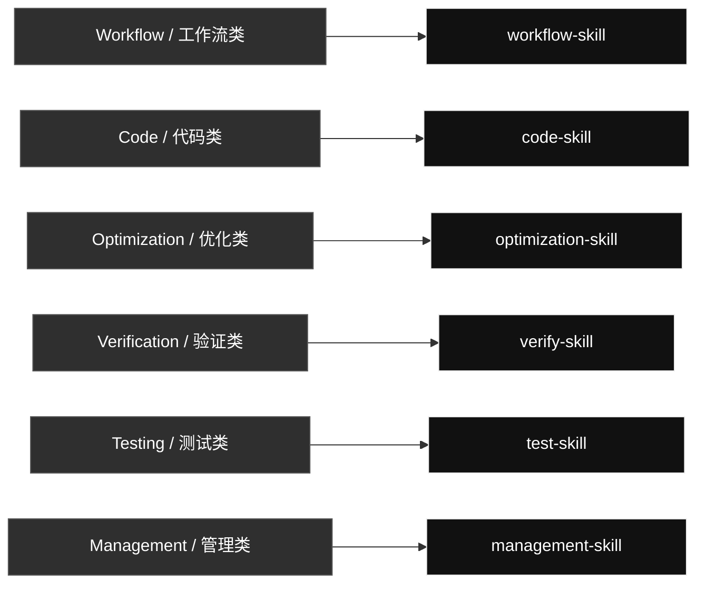

# Current Codex Skills

Generated: 2026-06-14

## Skill Contents

### Workflow / 工作流类

#### `workflow-skill`

Controls task decomposition, goal checks, routing, iteration, and final evidence for Codex requests.

- **Text and Markdown tasks**: Text, markdown, explanation, classification, and rewrite requests with explicit format targets.
- **Code tasks**: Code, Python, Unity C#, prompt-in-code, frontend/UI, scripts, and executable behavior requests.
- **Visual and generated artifacts**: Image, UI, browser screenshot, document, PDF, report, and generated file tasks.
- **Global skill edits**: Create, merge, rename, delete, reorganize, or update global Codex skills.
- **Management tasks**: Account/profile switching and global skill GitHub sync through management-skill.
- **Final evidence reports**: Evidence PDFs and completion reports when the task needs proof.

### Code / 代码类

#### `code-skill`

Combines prompt, coding approach, Python, Unity C#, and small-code content.

- **Prompt Creating**: Prompt generation only: create, rewrite, or embed prompts into the corresponding text or code.
- **Karpathy Coding Guidelines**: Code thinking and implementation approach for assumptions, simple design, naming, branching, and surgical edits.
- **Python Code Checker**: Python modules, scripts, tests, snippets, prompt assignments, formatting, contracts, error handling, and logging rules.
- **Unity C# Minimal Style**: Unity MonoBehaviours, ScriptableObjects, managers, gameplay systems, editor scripts, lifecycle methods, and Unity C# style.
- **Easy Code Spark**: Small bounded code tasks that can use the Spark small-task route when the task is obvious and low risk.

### Optimization / 优化类

#### `optimization-skill`

Turns stable repeated workflows into reusable local scripts, references, or assets when that saves tokens.

- **Skill Optimization**: Optimize fixed or repeated skill workflows into local scripts, references, assets, or templates that save tokens.
- **Official skill compliance**: Audit skill structure, frontmatter, trigger descriptions, references, scripts, assets, and token-use behavior.
- **Local script conversion**: Turn stable repeated test, image, browser, computer-control, report, or generation steps into reusable local code.
- **Reference extraction**: Move long stable instructions into references/ so they load only when the task needs them.
- **Assets and templates**: Store reusable fixtures, templates, or media in assets/ when those files are part of the optimized skill.

### Verification / 验证类

#### `verify-skill`

Checks UI, scripts, generated artifacts, skills, and workflows against the user's requirement.

- **UI Review**: UI/UX, layout, responsive checks, screenshots, frontend polish, browser states, and Taste Skill visual QA.
- **Local Script Verification**: Optimized local scripts and workflows with concrete cache inputs, real outputs, rerun behavior, and output paths.
- **Skill Verification**: SKILL.md frontmatter, trigger wording, referenced files, old-name cleanup, route behavior, and skill structure.
- **Generated Artifact Verification**: Markdown, images, PDFs, documents, reports, data files, and exports through open/render/parse/inspect checks.
- **PDF Evidence Review**: Verify generated PDF reports contain real Input, Used, Output, and Why Pass evidence.

### Testing / 测试类

#### `test-skill`

Runs real executable checks and produces evidence-rich PDF reports.

- **Done Means Tested**: After code or workflow changes, run a small real usage test with concrete inputs and real outputs.
- **Test PDF Report**: Generate a PDF report that records exactly what input was given, what command/tool was used, what output came back, and why it passes.
- **Code/API/CLI Tests**: Real scripts, commands, CLI invocations, API calls, local handlers, stdout, files, JSON, and returned values.
- **UI/Browser Tests**: Real page states, screenshots, viewport sizes, console/runtime evidence, and interaction results.
- **Image/Document/PDF Tests**: Real source/output images, generated files, rendered documents, parsed PDFs, and artifact paths.
- **Comparison/Audit Reports**: Before/after, expected/actual, audit findings, and pass/fail evidence with concrete artifacts.

### Management / 管理类

#### `management-skill`

Routes Codex profile management and global skill GitHub sync through the right support skill.

- **Codex Switch**: Local Codex auth profiles, saved profile listing, usage snapshots, login refresh, profile backup/import, and confirmed account switching.
- **GitHub Sync**: Global skill mirror status, preuse checks, public-safety scan, sync, pull, push, commit, and remote hash verification.
- **Privacy-Safe Management**: Auth files, tokens, cookies, profile IDs, raw logs, cache files, and secrets stay local and are never published.

## Management Support Skill Contents

These are real mirrored skills used by `management-skill`, but they are not shown as separate primary map rows.

### [`codex-switch`](./codex-switch/)

Manages local Codex auth profiles and account switching without exposing private auth data.

- **List profiles**: Inspect saved local auth profile files.
- **Live usage probes**: Run isolated live checks only when current usage matters.
- **Switch profile**: Copy a confirmed saved profile onto auth.json after explicit confirmation.
- **Refresh/login backup**: Run browser login and save a refreshed profile backup.
- **Save current auth**: Back up the current auth.json under a requested local profile name.
- **Import auth file**: Import a user-supplied auth file into a named local profile.
- **Privacy guardrails**: Never expose or publish tokens, auth files, account IDs, or raw logs.

### [`github-sync`](./github-sync/)

Syncs, commits, and pushes Codex skill changes to the public GitHub mirror with privacy checks.

- **sync**: Normal before/after route for skill work.
- **status**: Dry-run preview of local-to-remote changes.
- **preuse**: Read-only inspection before using or editing skills.
- **pull**: Accept remote changes into local skills.
- **push**: Publish local skill changes to GitHub.
- **public safety scan**: Block auth files, secrets, cache, logs, and generated private artifacts.

## Skill List

| Category | Skill | Purpose |
|---|---|---|
| Code | `code-skill` | Unified code skill for all code-related Codex work. Use for writing, editing, refactoring, debugging, reviewing, optimizing, or explaining code; prompt generation and prompt-in-code work; Python modules, scripts, tests, and snippets; Unity C# MonoBehaviours, ScriptableObjects, managers, and gameplay systems; and obvious bounded code tasks that may use Spark when an allowed model route exists. |
| Management | `codex-switch` | Inspect, manage, and switch local Codex auth profiles under `~/.codex`. Use when the user wants local Codex account/profile switching, finding `auth*.json` files, identifying which account each file belongs to, reviewing the latest locally observed Codex usage or rate-limit snapshot for each account, refreshing or backing up a local login, or switching the active profile by copying one saved auth file onto `auth.json` without deleting anything or exposing raw tokens. |
| Management | `github-sync` | Sync, commit, and push Qin's user global Codex skills with the GitHub repository qin-codex-skills. Use when Codex needs to read, use, create, edit, rename, delete, or update global skills under ~/.codex/skills; when global skill changes should be committed and pushed to GitHub; or when local and remote global-skill state must be compared without placing .git metadata inside ~/.codex/skills. Always keep the public mirror safe by excluding caches, generated artifacts, auth files, tokens, secrets, local logs, and other private personal data. |
| Management | `management-skill` | Unified management skill for local Codex account/profile operations and global skill GitHub synchronization. Use when the user asks to manage Codex auth profiles, switch local accounts, inspect profile state, sync global skills, commit or push skill changes, compare local and remote skill state, or run management workflows that should route through codex-switch or github-sync without exposing private data. |
| Optimization | `optimization-skill` | Optimize repetitive Codex skills and fixed workflows into reusable local files, scripts, references, or assets that save tokens and execution time. Use when the user explicitly asks to optimize a skill or repeated process into local code/files; when a skill workflow is stable but too verbose; when repeated test, image, browser, computer-control, report, or generation steps can become deterministic Python scripts; or when Codex notices a highly repeated fixed flow that should be made reusable. Must prepare references first, follow code-skill for all code/script work, and verify the optimized workflow with real execution before finishing. |
| Testing | `test-skill` | Unified testing and report skill. Use when code, UI, scripts, automations, generated assets, or content have been created or changed; when the user asks to test, verify, QA, smoke test, validate, prove, or generate a report; and whenever completed work needs real executable evidence plus a concise visual PDF report. Requires real runnable tests with concrete generated inputs, real inputs/outputs, the exact command/tool used, and a clear pass reason instead of mock-only, signature-only, or pass/OK-only checks. |
| Verification | `verify-skill` | General verification skill for checking whether workflows, local scripts, UI/UX, generated artifacts, skill edits, and process optimizations actually satisfy the user's requirement. Use when Codex is asked to verify, review, audit, validate, inspect quality, confirm a workflow, check UI/visual quality, or validate that an optimized local script/process still works. For UI verification, fetch/read leonxlnx/taste-skill and combine it with the local UI problem index before deciding whether the UI passes. |
| Workflow | `workflow-skill` | Global task workflow controller for Codex requests. Use at the start of any user task that needs decomposition, explicit goals, skill routing, code/script/workflow work, testing, verification, iteration to completion, or a final evidence report. It breaks the request into steps, defines artifact-specific pass criteria, routes code work through code-skill before test-skill and verify-skill, loops until the stated goals pass, and keeps process detail in the report instead of the final chat. |

## Structure

- Code work enters through `code-skill`.
- Repeated fixed workflow optimization enters through `optimization-skill`.
- Verification work enters through `verify-skill`.
- Real tests and report artifacts sit under `test-skill`.
- Auth and GitHub mirror maintenance enter through `management-skill`, which selects `codex-switch` or `github-sync` internally.
- Each skill may contain multiple internal routes; choose only the route needed for the current request instead of running every listed case.

## Current Notes

- The old code skills were merged into `code-skill`.
- The old testing skills were merged into `test-skill`.
- UI review was broadened into `verify-skill`.
- The old image workflow skill was deleted.
