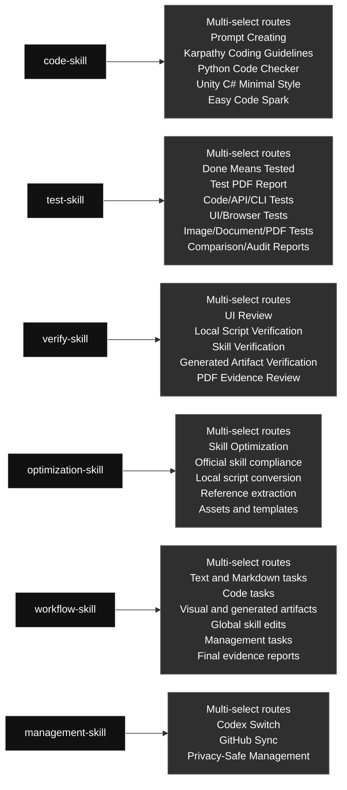

# Current Codex Skills

Chinese version: [current_global_skills_overview.zh.md](./current_global_skills_overview.zh.md)

## Skill Map

### Skill Contents At A Glance

#### [`code-skill`](./code-skill/) · Code / 代码类

- **Big function:** Combines prompt, coding approach, Python, Unity C#, and small-code modules, selecting every applicable module for the task.
- **Selectable modules (multi-select):** Prompt Creating; Karpathy Coding Guidelines; Python Code Checker; Unity C# Minimal Style; Easy Code Spark
- **Selection rule:** Use every module that applies to the task; this is not one-of, and unrelated modules should not run.

#### [`test-skill`](./test-skill/) · Testing / 测试类

- **Big function:** Runs real executable checks and produces evidence-rich PDF reports, combining evidence routes when a result spans code, UI, images, documents, or PDFs.
- **Selectable modules (multi-select):** Done Means Tested; Test PDF Report; Code/API/CLI Tests; UI/Browser Tests; Image/Document/PDF Tests; Comparison/Audit Reports
- **Selection rule:** Use every module that applies to the task; this is not one-of, and unrelated modules should not run.

#### [`verify-skill`](./verify-skill/) · Verification / 验证类

- **Big function:** Checks UI, scripts, generated artifacts, skills, and workflows, combining verification routes when the user's requirement spans artifacts.
- **Selectable modules (multi-select):** UI Review; Local Script Verification; Skill Verification; Generated Artifact Verification; PDF Evidence Review
- **Selection rule:** Use every module that applies to the task; this is not one-of, and unrelated modules should not run.

#### [`optimization-skill`](./optimization-skill/) · Optimization / 优化类

- **Big function:** Turns stable repeated workflows into reusable local scripts, references, or assets, combining optimization routes when that saves tokens.
- **Selectable modules (multi-select):** Skill Optimization; Official skill compliance; Local script conversion; Reference extraction; Assets and templates
- **Selection rule:** Use every module that applies to the task; this is not one-of, and unrelated modules should not run.

#### [`workflow-skill`](./workflow-skill/) · Workflow / 工作流类

- **Big function:** Controls task decomposition, goal checks, routing, iteration, and final evidence, with multi-select routes for mixed Codex requests.
- **Selectable modules (multi-select):** Text and Markdown tasks; Code tasks; Visual and generated artifacts; Global skill edits; Management tasks; Final evidence reports
- **Selection rule:** Use every module that applies to the task; this is not one-of, and unrelated modules should not run.

#### [`management-skill`](./management-skill/) · Management / 管理类

- **Big function:** Routes Codex profile management and global skill GitHub sync, using one or both management routes as required.
- **Selectable modules (multi-select):** Codex Switch; GitHub Sync; Privacy-Safe Management
- **Selection rule:** Use every module that applies to the task; this is not one-of, and unrelated modules should not run.

Generated: 2026-06-14

### Skill Contents

#### Workflow / 工作流类

##### `workflow-skill`

- **Big function:** Controls task decomposition, goal checks, routing, iteration, and final evidence, with multi-select routes for mixed Codex requests.
- **Selectable modules (multi-select):** Text and Markdown tasks; Code tasks; Visual and generated artifacts; Global skill edits; Management tasks; Final evidence reports
- **Selection rule:** Use every module that applies to the task; this is not one-of, and unrelated modules should not run.

#### Code / 代码类

##### `code-skill`

- **Big function:** Combines prompt, coding approach, Python, Unity C#, and small-code modules, selecting every applicable module for the task.
- **Selectable modules (multi-select):** Prompt Creating; Karpathy Coding Guidelines; Python Code Checker; Unity C# Minimal Style; Easy Code Spark
- **Selection rule:** Use every module that applies to the task; this is not one-of, and unrelated modules should not run.

#### Optimization / 优化类

##### `optimization-skill`

- **Big function:** Turns stable repeated workflows into reusable local scripts, references, or assets, combining optimization routes when that saves tokens.
- **Selectable modules (multi-select):** Skill Optimization; Official skill compliance; Local script conversion; Reference extraction; Assets and templates
- **Selection rule:** Use every module that applies to the task; this is not one-of, and unrelated modules should not run.

#### Verification / 验证类

##### `verify-skill`

- **Big function:** Checks UI, scripts, generated artifacts, skills, and workflows, combining verification routes when the user's requirement spans artifacts.
- **Selectable modules (multi-select):** UI Review; Local Script Verification; Skill Verification; Generated Artifact Verification; PDF Evidence Review
- **Selection rule:** Use every module that applies to the task; this is not one-of, and unrelated modules should not run.

#### Testing / 测试类

##### `test-skill`

- **Big function:** Runs real executable checks and produces evidence-rich PDF reports, combining evidence routes when a result spans code, UI, images, documents, or PDFs.
- **Selectable modules (multi-select):** Done Means Tested; Test PDF Report; Code/API/CLI Tests; UI/Browser Tests; Image/Document/PDF Tests; Comparison/Audit Reports
- **Selection rule:** Use every module that applies to the task; this is not one-of, and unrelated modules should not run.

#### Management / 管理类

##### `management-skill`

- **Big function:** Routes Codex profile management and global skill GitHub sync, using one or both management routes as required.
- **Selectable modules (multi-select):** Codex Switch; GitHub Sync; Privacy-Safe Management
- **Selection rule:** Use every module that applies to the task; this is not one-of, and unrelated modules should not run.

## Skill List

| Category | Skill | Purpose |
|---|---|---|
| Code | `code-skill` | Unified code skill for all code-related Codex work. Use for writing, editing, refactoring, debugging, reviewing, optimizing, or explaining code; prompt generation and prompt-in-code work; Python modules, scripts, tests, and snippets; Unity C# MonoBehaviours, ScriptableObjects, managers, and gameplay systems; and obvious bounded code tasks that may use Spark when an allowed model route exists. Its internal routes are multi-select: use every route that applies to the task, not a one-of choice. |
| Management | `management-skill` | Unified management skill for local Codex account/profile operations and global skill GitHub synchronization. Use when the user asks to manage Codex auth profiles, switch local accounts, inspect profile state, sync global skills, commit or push skill changes, compare local and remote skill state, or run management workflows without exposing private data. Its management routes are multi-select when a request genuinely needs both profile and GitHub sync work. |
| Optimization | `optimization-skill` | Optimize repetitive Codex skills and fixed workflows into reusable local files, scripts, references, or assets that save tokens and execution time. Use when the user explicitly asks to optimize a skill or repeated process into local code/files; when a skill workflow is stable but too verbose; when repeated test, image, browser, computer-control, report, or generation steps can become deterministic Python scripts; or when Codex notices a highly repeated fixed flow that should be made reusable. Must prepare references first, follow code-skill for all code/script work, and verify the optimized workflow with real execution before finishing. Its optimization routes are multi-select: combine every route needed by the repeated workflow. |
| Testing | `test-skill` | Unified testing and report skill. Use when code, UI, scripts, automations, generated assets, or content have been created or changed; when the user asks to test, verify, QA, smoke test, validate, prove, or generate a report; and whenever completed work needs real executable evidence plus a concise visual PDF report. Requires real runnable tests with concrete generated inputs, real inputs/outputs, the exact command/tool used, and a clear pass reason instead of mock-only, signature-only, or pass/OK-only checks. Its evidence routes are multi-select: combine every test/report route needed by the artifact. |
| Verification | `verify-skill` | General verification skill for checking whether workflows, local scripts, UI/UX, generated artifacts, skill edits, and process optimizations actually satisfy the user's requirement. Use when Codex is asked to verify, review, audit, validate, inspect quality, confirm a workflow, check UI/visual quality, or validate that an optimized local script/process still works. For UI verification, fetch/read leonxlnx/taste-skill and combine it with the local UI problem index before deciding whether the UI passes. Its verification routes are multi-select: combine every route needed by the artifact. |
| Workflow | `workflow-skill` | Global task workflow controller for Codex requests. Use at the start of any user task that needs decomposition, explicit goals, skill routing, code/script/workflow work, testing, verification, iteration to completion, or a final evidence report. It breaks the request into steps, defines artifact-specific pass criteria, routes code work through code-skill before test-skill and verify-skill, loops until the stated goals pass, and keeps process detail in the report instead of the final chat. Its routes are multi-select: combine every skill route needed by the task. |

## Structure

- Code work enters through `code-skill`.
- Repeated fixed workflow optimization enters through `optimization-skill`.
- Verification work enters through `verify-skill`.
- Real tests and report artifacts sit under `test-skill`.
- Auth and GitHub mirror maintenance enter through `management-skill` internal routes.
- Each skill may contain multiple internal routes; select every route needed for the current request. This is multi-select, not one-of, and unrelated cases should not run.

## Current Notes

- The old code skills were merged into `code-skill`.
- The old testing skills were merged into `test-skill`.
- UI review was broadened into `verify-skill`.
- The old image workflow skill was deleted.
