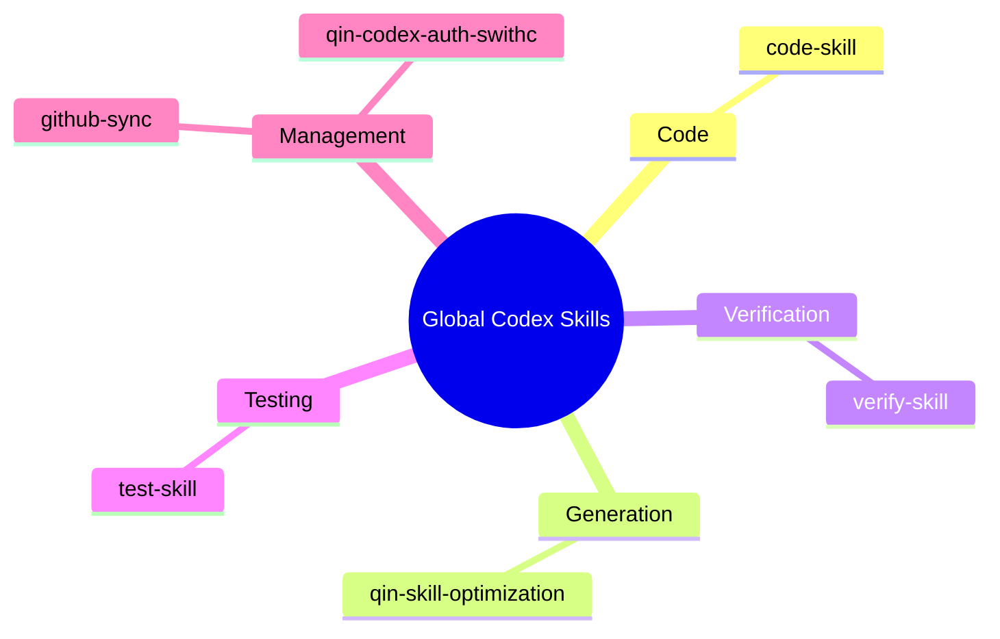

# Current Global Codex Skills

Generated: 2026-06-14

## Skill List

| Category | Skill | Purpose |
|---|---|---|
| Code | `code-skill` | Unified code skill for all code-related Codex work. Use for writing, editing, refactoring, debugging, reviewing, optimizing, or explaining code; prompt generation and prompt-in-code work; Python modules, scripts, tests, and snippets; Unity C# MonoBehaviours, ScriptableObjects, managers, and gameplay systems; and obvious bounded code tasks that may use Spark when an allowed model route exists. |
| Management | `github-sync` | Sync, commit, and push Qin's user global Codex skills with the GitHub repository qin-codex-skills. Use before reading, using, creating, editing, renaming, deleting, or updating global skills under ~/.codex/skills, and after any global-skill edit when the saved skill code should be committed and pushed to GitHub without placing .git metadata inside ~/.codex/skills. Always keep the public mirror safe by excluding caches, generated artifacts, auth files, tokens, secrets, local logs, and other private personal data. |
| Management | `qin-codex-auth-swithc` | Inspect and switch saved Codex ChatGPT auth profiles under `~/.codex`. Use when the user wants to find `auth*.json` files, identify which account each file belongs to, review the latest locally observed Codex usage or rate-limit snapshot for each account, and switch the active profile by copying one saved auth file onto `auth.json` without deleting anything. |
| Generation | `qin-skill-optimization` | Optimize an existing Codex skill or prompt-driven instruction layer from concrete failure evidence, pre-use review, or finalization checks. Use when a skill, retry/check prompt, agent instruction block, or other instruction-driven workflow mostly works but should be tightened without changing the underlying job. Scan peer skills first when relevant, merge duplicate requirements into one clear rule, prefer the smallest prompt-first fix when the issue lives in the instruction layer, and verify behavior after the change. |
| Testing | `test-skill` | Unified testing and report skill. Use after code, UI, scripts, automations, generated assets, or content have been created or changed; when the user asks to test, verify, QA, smoke test, validate, prove, or generate a report; and whenever completed work needs real executable evidence plus a concise visual PDF report. Requires real runnable tests with concrete generated inputs instead of mock-only or signature-only checks. |
| Verification | `verify-skill` | General verification skill for checking whether workflows, local scripts, UI/UX, generated artifacts, skill edits, and process optimizations actually satisfy the user's requirement. Use when Codex is asked to verify, review, audit, validate, inspect quality, confirm a workflow, optimize a repeated process into a local script, or check UI/visual quality. For UI verification, fetch/read leonxlnx/taste-skill and combine it with the local UI problem index before deciding whether the UI passes. |

## Mind Map

## Structure

- Code work enters through `code-skill`.
- Verification work enters through `verify-skill`.
- Real tests and report artifacts sit under `test-skill`.
- Auth and GitHub mirror maintenance sit under Management.

## Current Notes

- The old code skills were merged into `code-skill`.
- The old testing skills were merged into `test-skill`.
- UI review was broadened into `verify-skill`.
- The old image workflow skill was deleted.
