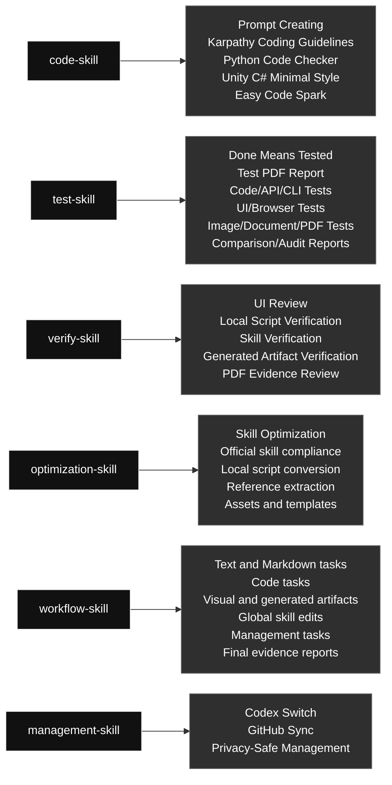

# Current Codex Skills

Language: [English](#english) | [中文](#zh)

## Skill Map

## English

### Skill Contents At A Glance

#### [`code-skill`](./code-skill/) · Code / 代码类

- **Big function:** Combines prompt, coding approach, Python, Unity C#, and small-code content.
- **Internal flow:** Prompt Creating -> Karpathy Coding Guidelines -> Python Code Checker -> Unity C# Minimal Style -> Easy Code Spark

#### [`test-skill`](./test-skill/) · Testing / 测试类

- **Big function:** Runs real executable checks and produces evidence-rich PDF reports.
- **Internal flow:** Done Means Tested -> Test PDF Report -> Code/API/CLI Tests -> UI/Browser Tests -> Image/Document/PDF Tests -> Comparison/Audit Reports

#### [`verify-skill`](./verify-skill/) · Verification / 验证类

- **Big function:** Checks UI, scripts, generated artifacts, skills, and workflows against the user's requirement.
- **Internal flow:** UI Review -> Local Script Verification -> Skill Verification -> Generated Artifact Verification -> PDF Evidence Review

#### [`optimization-skill`](./optimization-skill/) · Optimization / 优化类

- **Big function:** Turns stable repeated workflows into reusable local scripts, references, or assets when that saves tokens.
- **Internal flow:** Skill Optimization -> Official skill compliance -> Local script conversion -> Reference extraction -> Assets and templates

#### [`workflow-skill`](./workflow-skill/) · Workflow / 工作流类

- **Big function:** Controls task decomposition, goal checks, routing, iteration, and final evidence for Codex requests.
- **Internal flow:** Text and Markdown tasks -> Code tasks -> Visual and generated artifacts -> Global skill edits -> Management tasks -> Final evidence reports

#### [`management-skill`](./management-skill/) · Management / 管理类

- **Big function:** Routes Codex profile management and global skill GitHub sync through the right support skill.
- **Internal flow:** Codex Switch -> GitHub Sync -> Privacy-Safe Management

Generated: 2026-06-14

### Skill Contents

#### Workflow / 工作流类

##### `workflow-skill`

- **Big function:** Controls task decomposition, goal checks, routing, iteration, and final evidence for Codex requests.
- **Internal flow:** Text and Markdown tasks -> Code tasks -> Visual and generated artifacts -> Global skill edits -> Management tasks -> Final evidence reports

#### Code / 代码类

##### `code-skill`

- **Big function:** Combines prompt, coding approach, Python, Unity C#, and small-code content.
- **Internal flow:** Prompt Creating -> Karpathy Coding Guidelines -> Python Code Checker -> Unity C# Minimal Style -> Easy Code Spark

#### Optimization / 优化类

##### `optimization-skill`

- **Big function:** Turns stable repeated workflows into reusable local scripts, references, or assets when that saves tokens.
- **Internal flow:** Skill Optimization -> Official skill compliance -> Local script conversion -> Reference extraction -> Assets and templates

#### Verification / 验证类

##### `verify-skill`

- **Big function:** Checks UI, scripts, generated artifacts, skills, and workflows against the user's requirement.
- **Internal flow:** UI Review -> Local Script Verification -> Skill Verification -> Generated Artifact Verification -> PDF Evidence Review

#### Testing / 测试类

##### `test-skill`

- **Big function:** Runs real executable checks and produces evidence-rich PDF reports.
- **Internal flow:** Done Means Tested -> Test PDF Report -> Code/API/CLI Tests -> UI/Browser Tests -> Image/Document/PDF Tests -> Comparison/Audit Reports

#### Management / 管理类

##### `management-skill`

- **Big function:** Routes Codex profile management and global skill GitHub sync through the right support skill.
- **Internal flow:** Codex Switch -> GitHub Sync -> Privacy-Safe Management

### Management Support Skill Contents

These are real mirrored skills used by `management-skill`, but they are not shown as separate primary map rows.

#### [`codex-switch`](./codex-switch/)

- **Big function:** Manages local Codex auth profiles and account switching without exposing private auth data.
- **Internal flow:** List profiles -> Live usage probes -> Switch profile -> Refresh/login backup -> Save current auth -> Import auth file -> Privacy guardrails

#### [`github-sync`](./github-sync/)

- **Big function:** Syncs, commits, and pushes Codex skill changes to the public GitHub mirror with privacy checks.
- **Internal flow:** sync -> status -> preuse -> pull -> push -> public safety scan

## 中文

语言: [English](#english) | [中文](#zh)

### Skill 内容一览

#### [`code-skill`](./code-skill/) · 代码类 / Code

- **大功能：** 合并 prompt、代码思路、Python、Unity C# 和小代码任务相关内容。
- **内部流程：** Prompt Creating -> Karpathy Coding Guidelines -> Python Code Checker -> Unity C# Minimal Style -> Easy Code Spark

#### [`test-skill`](./test-skill/) · 测试类 / Testing

- **大功能：** 执行真实测试，并生成带输入、方法、输出和通过原因的 PDF 报告。
- **内部流程：** Done Means Tested -> Test PDF Report -> Code/API/CLI Tests -> UI/Browser Tests -> Image/Document/PDF Tests -> Comparison/Audit Reports

#### [`verify-skill`](./verify-skill/) · 验证类 / Verification

- **大功能：** 检查 UI、脚本、生成物、skill 和工作流是否真的满足用户要求。
- **内部流程：** UI Review -> 本地脚本验证 -> Skill 验证 -> 生成物验证 -> PDF 证据检查

#### [`optimization-skill`](./optimization-skill/) · 优化类 / Optimization

- **大功能：** 把稳定重复的流程优化成本地脚本、引用资料、资产或模板，用来节省 token 和执行时间。
- **内部流程：** Skill Optimization -> 官方 skill 合规检查 -> 本地脚本转换 -> 引用资料抽取 -> 资产和模板

#### [`workflow-skill`](./workflow-skill/) · 工作流类 / Workflow

- **大功能：** 统一控制 Codex 任务拆分、目标检查、skill 路由、循环验证和最终证据。
- **内部流程：** 文本和 Markdown 任务 -> 代码任务 -> 视觉和生成物 -> 全局 skill 编辑 -> 管理任务 -> 最终证据报告

#### [`management-skill`](./management-skill/) · 管理类 / Management

- **大功能：** 统一管理 Codex 本地账号/Profile 操作，以及全局 skill 的 GitHub 同步。
- **内部流程：** Codex Switch -> GitHub Sync -> 隐私安全管理

生成日期: 2026-06-14

### 技能内容

#### 工作流类 / Workflow

##### `workflow-skill`

- **大功能：** 统一控制 Codex 任务拆分、目标检查、skill 路由、循环验证和最终证据。
- **内部流程：** 文本和 Markdown 任务 -> 代码任务 -> 视觉和生成物 -> 全局 skill 编辑 -> 管理任务 -> 最终证据报告

#### 代码类 / Code

##### `code-skill`

- **大功能：** 合并 prompt、代码思路、Python、Unity C# 和小代码任务相关内容。
- **内部流程：** Prompt Creating -> Karpathy Coding Guidelines -> Python Code Checker -> Unity C# Minimal Style -> Easy Code Spark

#### 优化类 / Optimization

##### `optimization-skill`

- **大功能：** 把稳定重复的流程优化成本地脚本、引用资料、资产或模板，用来节省 token 和执行时间。
- **内部流程：** Skill Optimization -> 官方 skill 合规检查 -> 本地脚本转换 -> 引用资料抽取 -> 资产和模板

#### 验证类 / Verification

##### `verify-skill`

- **大功能：** 检查 UI、脚本、生成物、skill 和工作流是否真的满足用户要求。
- **内部流程：** UI Review -> 本地脚本验证 -> Skill 验证 -> 生成物验证 -> PDF 证据检查

#### 测试类 / Testing

##### `test-skill`

- **大功能：** 执行真实测试，并生成带输入、方法、输出和通过原因的 PDF 报告。
- **内部流程：** Done Means Tested -> Test PDF Report -> Code/API/CLI Tests -> UI/Browser Tests -> Image/Document/PDF Tests -> Comparison/Audit Reports

#### 管理类 / Management

##### `management-skill`

- **大功能：** 统一管理 Codex 本地账号/Profile 操作，以及全局 skill 的 GitHub 同步。
- **内部流程：** Codex Switch -> GitHub Sync -> 隐私安全管理

### 管理支持 Skill 内容

这些也是真实同步到仓库的 skill，由 `management-skill` 调用，但不作为主图里的单独主入口展示。

#### [`codex-switch`](./codex-switch/)

- **大功能：** 管理本地 Codex auth profile 和账号切换，同时避免暴露私密 auth 数据。
- **内部流程：** 列出 profiles -> 实时用量探测 -> 切换 profile -> 刷新/登录备份 -> 保存当前 auth -> 导入 auth 文件 -> 隐私保护

#### [`github-sync`](./github-sync/)

- **大功能：** 把全局 Codex skill 安全同步、提交并推送到公开 GitHub 镜像。
- **内部流程：** sync -> status -> preuse -> pull -> push -> 公开安全扫描

## Skill List

| Category | Skill | Purpose |
|---|---|---|
| Code | `code-skill` | Unified code skill for all code-related Codex work. Use for writing, editing, refactoring, debugging, reviewing, optimizing, or explaining code; prompt generation and prompt-in-code work; Python modules, scripts, tests, and snippets; Unity C# MonoBehaviours, ScriptableObjects, managers, and gameplay systems; and obvious bounded code tasks that may use Spark when an allowed model route exists. |
| Management | `codex-switch` | Inspect, manage, and switch local Codex auth profiles under `~/.codex`. Use when the user wants local Codex account/profile switching, finding `auth*.json` files, identifying which account each file belongs to, reviewing the latest locally observed Codex usage or rate-limit snapshot for each account, refreshing or backing up a local login, or switching the active profile by copying one saved auth file onto `auth.json` without deleting anything or exposing raw tokens. |
| Management | `github-sync` | Sync, commit, and push Qin's user global Codex skills with the GitHub repository qin-codex-skills. Use when Codex needs to read, use, create, edit, rename, delete, or update global skills under ~/.codex/skills; when global skill changes should be committed and pushed to GitHub; or when local and remote global-skill state must be compared without placing .git metadata inside ~/.codex/skills. Always keep the public mirror safe by excluding caches, generated artifacts, auth files, tokens, secrets, local logs, and other private personal data. |
| Management | `management-skill` | Unified management skill for local Codex account/profile operations and global skill GitHub synchronization. Use when the user asks to manage Codex auth profiles, switch local accounts, inspect profile state, sync global skills, commit or push skill changes, compare local and remote skill state, or run management workflows that should route through codex-switch or github-sync without exposing private data. |
| Optimization | `optimization-skill` | Optimize repetitive Codex skills and fixed workflows into reusable local files, scripts, references, or assets that save tokens and execution time. Use when the user explicitly asks to optimize a skill or repeated process into local code/files; when a skill workflow is stable but too verbose; when repeated test, image, browser, computer-control, report, or generation steps can become deterministic Python scripts; or when Codex notices a highly repeated fixed flow that should be made reusable. Must prepare references first, follow code-skill for all code/script work, and verify the optimized workflow with real execution before finishing. |
| Testing | `test-skill` | Unified testing and report skill. Use when code, UI, scripts, automations, generated assets, or content have been created or changed; when the user asks to test, verify, QA, smoke test, validate, prove, or generate a report; and whenever completed work needs real executable evidence plus a concise visual PDF report. Requires real runnable tests with concrete generated inputs, real inputs/outputs, the exact command/tool used, and a clear pass reason instead of mock-only, signature-only, or pass/OK-only checks. |
| Verification | `verify-skill` | General verification skill for checking whether workflows, local scripts, UI/UX, generated artifacts, skill edits, and process optimizations actually satisfy the user's requirement. Use when Codex is asked to verify, review, audit, validate, inspect quality, confirm a workflow, check UI/visual quality, or validate that an optimized local script/process still works. For UI verification, fetch/read leonxlnx/taste-skill and combine it with the local UI problem index before deciding whether the UI passes. |
| Workflow | `workflow-skill` | Global task workflow controller for Codex requests. Use at the start of any user task that needs decomposition, explicit goals, skill routing, code/script/workflow work, testing, verification, iteration to completion, or a final evidence report. It breaks the request into steps, defines artifact-specific pass criteria, routes code work through code-skill before test-skill and verify-skill, loops until the stated goals pass, and keeps process detail in the report instead of the final chat. |

## Structure

- Code work enters through `code-skill`.
- Repeated fixed workflow optimization enters through `optimization-skill`.
- Verification work enters through `verify-skill`.
- Real tests and report artifacts sit under `test-skill`.
- Auth and GitHub mirror maintenance enter through `management-skill`, which selects `codex-switch` or `github-sync` internally.
- Each skill may contain multiple internal routes; choose only the route needed for the current request instead of running every listed case.

## Current Notes

- The old code skills were merged into `code-skill`.
- The old testing skills were merged into `test-skill`.
- UI review was broadened into `verify-skill`.
- The old image workflow skill was deleted.
