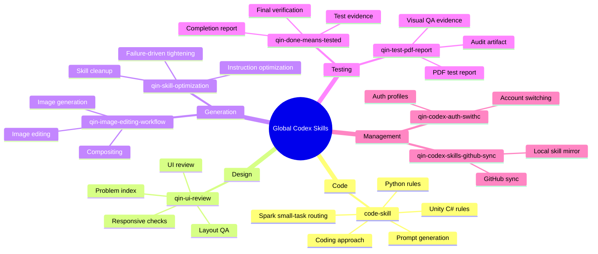

# Current Global Codex Skills

Generated: 2026-06-14

## Skill List

| Category | Skill | Purpose |
|---|---|---|
| Code | `code-skill` | Unified code skill for coding approach, Spark routing, prompt generation, Python rules, and Unity C# rules. |
| Design | `qin-ui-review` | UI/UX review, polish, QA, layout, visual hierarchy, responsive behavior, and UI problem indexing. |
| Generation | `qin-image-editing-workflow` | Image generation, editing, compositing, regeneration, and image workflow routing. |
| Generation | `qin-skill-optimization` | Skill or instruction-layer optimization from concrete failure evidence or finalization checks. |
| Testing | `qin-done-means-tested` | Mandatory completion verification and concise reporting after edits or generated work. |
| Testing | `qin-test-pdf-report` | Visual PDF reports for testing, QA, validation, audits, and evidence packaging. |
| Management | `qin-codex-auth-swithc` | Inspect and switch saved Codex ChatGPT auth profiles under `~/.codex`. |
| Management | `qin-codex-skills-github-sync` | Sync local global Codex skills with the GitHub mirror repository. |

## Mind Map

## Structure

- Code work enters through `code-skill`.
- UI quality work enters through `qin-ui-review`.
- Image and skill-generation workflows sit under Generation.
- Completion checks and report artifacts sit under Testing.
- Auth and GitHub mirror maintenance sit under Management.

## Current Notes

- `qin-destiny` is no longer a global skill; it was moved to `/Users/qin/Documents/FilesManagement/Destiny`.
- `qin-git-push-safety` was deleted.
- The old code skills were merged into `code-skill`.
- The automatic sync helper still depends on `gh`; SSH-based Git mirror checks were used for current-state confirmation.
