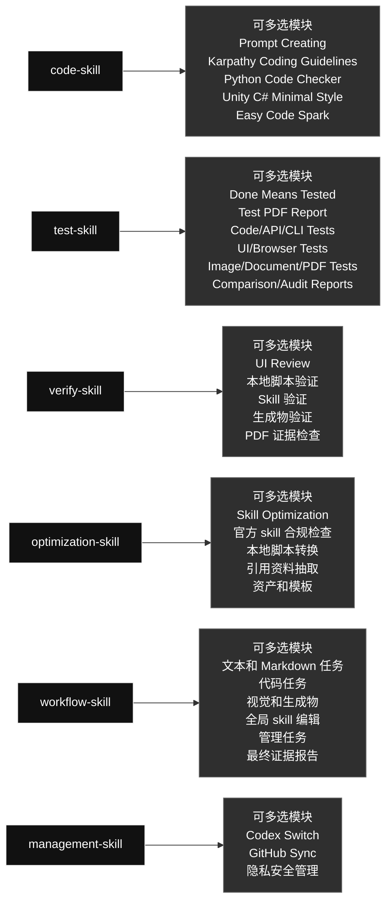

# 当前 Codex Skills

英文版: [current_global_skills_overview.md](./current_global_skills_overview.md)

## 技能图

### Skill 内容一览

#### [`code-skill`](./code-skill/) · 代码类 / Code

- **大功能：** 合并 prompt、代码思路、Python、Unity C# 和小代码模块，按任务需要多选所有适用模块。
- **可多选模块：** Prompt Creating; Karpathy Coding Guidelines; Python Code Checker; Unity C# Minimal Style; Easy Code Spark
- **选择规则：** 需要哪个模块就用哪个；同一个任务可以同时使用多个模块，不是单选，也不要运行无关模块。

#### [`test-skill`](./test-skill/) · 测试类 / Testing

- **大功能：** 执行真实测试，并生成带输入、方法、输出和通过原因的 PDF 报告，跨代码、UI、图片、文档或 PDF 时组合证据路线。
- **可多选模块：** Done Means Tested; Test PDF Report; Code/API/CLI Tests; UI/Browser Tests; Image/Document/PDF Tests; Comparison/Audit Reports
- **选择规则：** 需要哪个模块就用哪个；同一个任务可以同时使用多个模块，不是单选，也不要运行无关模块。

#### [`verify-skill`](./verify-skill/) · 验证类 / Verification

- **大功能：** 检查 UI、脚本、生成物、skill 和工作流是否满足用户要求，跨类型任务可组合多个验证路线。
- **可多选模块：** UI Review; 本地脚本验证; Skill 验证; 生成物验证; PDF 证据检查
- **选择规则：** 需要哪个模块就用哪个；同一个任务可以同时使用多个模块，不是单选，也不要运行无关模块。

#### [`optimization-skill`](./optimization-skill/) · 优化类 / Optimization

- **大功能：** 把稳定重复的流程优化成本地脚本、引用资料、资产或模板，必要时组合多个优化路线来节省 token 和执行时间。
- **可多选模块：** Skill Optimization; 官方 skill 合规检查; 本地脚本转换; 引用资料抽取; 资产和模板
- **选择规则：** 需要哪个模块就用哪个；同一个任务可以同时使用多个模块，不是单选，也不要运行无关模块。

#### [`workflow-skill`](./workflow-skill/) · 工作流类 / Workflow

- **大功能：** 统一控制 Codex 任务拆分、目标检查、skill 路由、循环验证和最终证据，遇到混合任务时多选所需路线。
- **可多选模块：** 文本和 Markdown 任务; 代码任务; 视觉和生成物; 全局 skill 编辑; 管理任务; 最终证据报告
- **选择规则：** 需要哪个模块就用哪个；同一个任务可以同时使用多个模块，不是单选，也不要运行无关模块。

#### [`management-skill`](./management-skill/) · 管理类 / Management

- **大功能：** 统一管理 Codex 本地账号/Profile 操作和全局 skill 的 GitHub 同步，按需要使用一个或两个管理路线。
- **可多选模块：** Codex Switch; GitHub Sync; 隐私安全管理
- **选择规则：** 需要哪个模块就用哪个；同一个任务可以同时使用多个模块，不是单选，也不要运行无关模块。

生成日期: 2026-06-14

### 技能内容

#### 工作流类 / Workflow

##### `workflow-skill`

- **大功能：** 统一控制 Codex 任务拆分、目标检查、skill 路由、循环验证和最终证据，遇到混合任务时多选所需路线。
- **可多选模块：** 文本和 Markdown 任务; 代码任务; 视觉和生成物; 全局 skill 编辑; 管理任务; 最终证据报告
- **选择规则：** 需要哪个模块就用哪个；同一个任务可以同时使用多个模块，不是单选，也不要运行无关模块。

#### 代码类 / Code

##### `code-skill`

- **大功能：** 合并 prompt、代码思路、Python、Unity C# 和小代码模块，按任务需要多选所有适用模块。
- **可多选模块：** Prompt Creating; Karpathy Coding Guidelines; Python Code Checker; Unity C# Minimal Style; Easy Code Spark
- **选择规则：** 需要哪个模块就用哪个；同一个任务可以同时使用多个模块，不是单选，也不要运行无关模块。

#### 优化类 / Optimization

##### `optimization-skill`

- **大功能：** 把稳定重复的流程优化成本地脚本、引用资料、资产或模板，必要时组合多个优化路线来节省 token 和执行时间。
- **可多选模块：** Skill Optimization; 官方 skill 合规检查; 本地脚本转换; 引用资料抽取; 资产和模板
- **选择规则：** 需要哪个模块就用哪个；同一个任务可以同时使用多个模块，不是单选，也不要运行无关模块。

#### 验证类 / Verification

##### `verify-skill`

- **大功能：** 检查 UI、脚本、生成物、skill 和工作流是否满足用户要求，跨类型任务可组合多个验证路线。
- **可多选模块：** UI Review; 本地脚本验证; Skill 验证; 生成物验证; PDF 证据检查
- **选择规则：** 需要哪个模块就用哪个；同一个任务可以同时使用多个模块，不是单选，也不要运行无关模块。

#### 测试类 / Testing

##### `test-skill`

- **大功能：** 执行真实测试，并生成带输入、方法、输出和通过原因的 PDF 报告，跨代码、UI、图片、文档或 PDF 时组合证据路线。
- **可多选模块：** Done Means Tested; Test PDF Report; Code/API/CLI Tests; UI/Browser Tests; Image/Document/PDF Tests; Comparison/Audit Reports
- **选择规则：** 需要哪个模块就用哪个；同一个任务可以同时使用多个模块，不是单选，也不要运行无关模块。

#### 管理类 / Management

##### `management-skill`

- **大功能：** 统一管理 Codex 本地账号/Profile 操作和全局 skill 的 GitHub 同步，按需要使用一个或两个管理路线。
- **可多选模块：** Codex Switch; GitHub Sync; 隐私安全管理
- **选择规则：** 需要哪个模块就用哪个；同一个任务可以同时使用多个模块，不是单选，也不要运行无关模块。

## Skill 列表

| 类别 | Skill | 用途 |
|---|---|---|
| 代码类 / Code | `code-skill` | Unified code skill for all code-related Codex work. Use for writing, editing, refactoring, debugging, reviewing, optimizing, or explaining code; prompt generation and prompt-in-code work; Python modules, scripts, tests, and snippets; Unity C# MonoBehaviours, ScriptableObjects, managers, and gameplay systems; and obvious bounded code tasks that may use Spark when an allowed model route exists. Its internal routes are multi-select: use every route that applies to the task, not a one-of choice. |
| 管理类 / Management | `management-skill` | Unified management skill for local Codex account/profile operations and global skill GitHub synchronization. Use when the user asks to manage Codex auth profiles, switch local accounts, inspect profile state, sync global skills, commit or push skill changes, compare local and remote skill state, or run management workflows without exposing private data. Its management routes are multi-select when a request genuinely needs both profile and GitHub sync work. |
| 优化类 / Optimization | `optimization-skill` | Optimize repetitive Codex skills and fixed workflows into reusable local files, scripts, references, or assets that save tokens and execution time. Use when the user explicitly asks to optimize a skill or repeated process into local code/files; when a skill workflow is stable but too verbose; when repeated test, image, browser, computer-control, report, or generation steps can become deterministic Python scripts; or when Codex notices a highly repeated fixed flow that should be made reusable. Must prepare references first, follow code-skill for all code/script work, and verify the optimized workflow with real execution before finishing. Its optimization routes are multi-select: combine every route needed by the repeated workflow. |
| 测试类 / Testing | `test-skill` | Unified testing and report skill. Use when code, UI, scripts, automations, generated assets, or content have been created or changed; when the user asks to test, verify, QA, smoke test, validate, prove, or generate a report; and whenever completed work needs real executable evidence plus a concise visual PDF report. Requires real runnable tests with concrete generated inputs, real inputs/outputs, the exact command/tool used, and a clear pass reason instead of mock-only, signature-only, or pass/OK-only checks. Its evidence routes are multi-select: combine every test/report route needed by the artifact. |
| 验证类 / Verification | `verify-skill` | General verification skill for checking whether workflows, local scripts, UI/UX, generated artifacts, skill edits, and process optimizations actually satisfy the user's requirement. Use when Codex is asked to verify, review, audit, validate, inspect quality, confirm a workflow, check UI/visual quality, or validate that an optimized local script/process still works. For UI verification, fetch/read leonxlnx/taste-skill and combine it with the local UI problem index before deciding whether the UI passes. Its verification routes are multi-select: combine every route needed by the artifact. |
| 工作流类 / Workflow | `workflow-skill` | Global task workflow controller for Codex requests. Use at the start of any user task that needs decomposition, explicit goals, skill routing, code/script/workflow work, testing, verification, iteration to completion, or a final evidence report. It breaks the request into steps, defines artifact-specific pass criteria, routes code work through code-skill before test-skill and verify-skill, loops until the stated goals pass, and keeps process detail in the report instead of the final chat. Its routes are multi-select: combine every skill route needed by the task. |

## 结构

- 代码工作进入 `code-skill`。
- 固定重复流程优化进入 `optimization-skill`。
- 验证工作进入 `verify-skill`。
- 真实测试和报告进入 `test-skill`。
- Auth 和 GitHub 镜像维护进入 `management-skill` 内部路由。
- 每个 skill 可能包含多个内部路由；需要哪个就选哪个，同一个任务可以多选，不是单选，也不要运行无关分支。

## 当前说明

- 旧代码类 skill 已合并到 `code-skill`。
- 旧测试类 skill 已合并到 `test-skill`。
- UI review 已扩展到 `verify-skill`。
- 旧图片 workflow skill 已删除。
