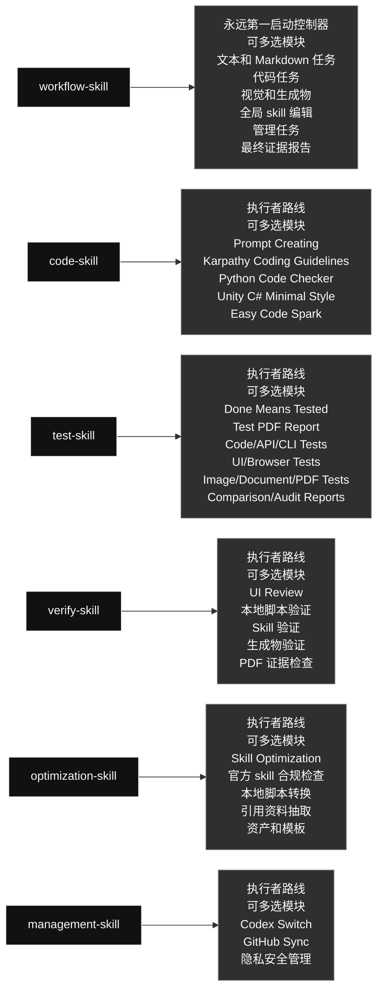

# 当前 Codex Skills

英文版: [current_global_skills_overview.md](./current_global_skills_overview.md)

## 技能图

### Skill 内容一览

#### [`workflow-skill`](./workflow-skill/) · 工作流类 / Workflow

- **角色：** 永远第一启动控制器
- **大功能：** 永远第一个启动任务执行，定义目标、选择执行者 skill、路由工作、循环验证并检查最终证据。
- **可多选模块：** 文本和 Markdown 任务; 代码任务; 视觉和生成物; 全局 skill 编辑; 管理任务; 最终证据报告
- **选择规则：** 需要哪个模块就用哪个；同一个任务可以同时使用多个模块，不是单选，也不要运行无关模块。

#### [`code-skill`](./code-skill/) · 代码类 / Code

- **角色：** 由 workflow-skill 路由启动的执行者
- **大功能：** 在 workflow-skill 路由后执行代码工作，组合 prompt、代码思路、Python、Unity C# 和小代码模块。
- **可多选模块：** Prompt Creating; Karpathy Coding Guidelines; Python Code Checker; Unity C# Minimal Style; Easy Code Spark
- **选择规则：** 需要哪个模块就用哪个；同一个任务可以同时使用多个模块，不是单选，也不要运行无关模块。

#### [`test-skill`](./test-skill/) · 测试类 / Testing

- **角色：** 由 workflow-skill 路由启动的执行者
- **大功能：** 在 workflow-skill 路由后执行真实测试和证据报告，跨代码、UI、图片、文档或 PDF 组合证据路线。
- **可多选模块：** Done Means Tested; Test PDF Report; Code/API/CLI Tests; UI/Browser Tests; Image/Document/PDF Tests; Comparison/Audit Reports
- **选择规则：** 需要哪个模块就用哪个；同一个任务可以同时使用多个模块，不是单选，也不要运行无关模块。

#### [`verify-skill`](./verify-skill/) · 验证类 / Verification

- **角色：** 由 workflow-skill 路由启动的执行者
- **大功能：** 在 workflow-skill 路由后执行验证工作，检查 UI、脚本、生成物、skill 和工作流是否满足用户要求。
- **可多选模块：** UI Review; 本地脚本验证; Skill 验证; 生成物验证; PDF 证据检查
- **选择规则：** 需要哪个模块就用哪个；同一个任务可以同时使用多个模块，不是单选，也不要运行无关模块。

#### [`optimization-skill`](./optimization-skill/) · 优化类 / Optimization

- **角色：** 由 workflow-skill 路由启动的执行者
- **大功能：** 在 workflow-skill 路由后执行优化工作，把稳定重复流程变成本地脚本、引用资料或资产。
- **可多选模块：** Skill Optimization; 官方 skill 合规检查; 本地脚本转换; 引用资料抽取; 资产和模板
- **选择规则：** 需要哪个模块就用哪个；同一个任务可以同时使用多个模块，不是单选，也不要运行无关模块。

#### [`management-skill`](./management-skill/) · 管理类 / Management

- **角色：** 由 workflow-skill 路由启动的执行者
- **大功能：** 在 workflow-skill 路由后执行管理工作，处理 Codex profiles 和全局 skill 的 GitHub 同步。
- **可多选模块：** Codex Switch; GitHub Sync; 隐私安全管理
- **选择规则：** 需要哪个模块就用哪个；同一个任务可以同时使用多个模块，不是单选，也不要运行无关模块。

生成日期: 2026-06-18

### 技能内容

#### 工作流类 / Workflow

##### `workflow-skill`

- **角色：** 永远第一启动控制器
- **大功能：** 永远第一个启动任务执行，定义目标、选择执行者 skill、路由工作、循环验证并检查最终证据。
- **可多选模块：** 文本和 Markdown 任务; 代码任务; 视觉和生成物; 全局 skill 编辑; 管理任务; 最终证据报告
- **选择规则：** 需要哪个模块就用哪个；同一个任务可以同时使用多个模块，不是单选，也不要运行无关模块。

#### 代码类 / Code

##### `code-skill`

- **角色：** 由 workflow-skill 路由启动的执行者
- **大功能：** 在 workflow-skill 路由后执行代码工作，组合 prompt、代码思路、Python、Unity C# 和小代码模块。
- **可多选模块：** Prompt Creating; Karpathy Coding Guidelines; Python Code Checker; Unity C# Minimal Style; Easy Code Spark
- **选择规则：** 需要哪个模块就用哪个；同一个任务可以同时使用多个模块，不是单选，也不要运行无关模块。

#### 优化类 / Optimization

##### `optimization-skill`

- **角色：** 由 workflow-skill 路由启动的执行者
- **大功能：** 在 workflow-skill 路由后执行优化工作，把稳定重复流程变成本地脚本、引用资料或资产。
- **可多选模块：** Skill Optimization; 官方 skill 合规检查; 本地脚本转换; 引用资料抽取; 资产和模板
- **选择规则：** 需要哪个模块就用哪个；同一个任务可以同时使用多个模块，不是单选，也不要运行无关模块。

#### 验证类 / Verification

##### `verify-skill`

- **角色：** 由 workflow-skill 路由启动的执行者
- **大功能：** 在 workflow-skill 路由后执行验证工作，检查 UI、脚本、生成物、skill 和工作流是否满足用户要求。
- **可多选模块：** UI Review; 本地脚本验证; Skill 验证; 生成物验证; PDF 证据检查
- **选择规则：** 需要哪个模块就用哪个；同一个任务可以同时使用多个模块，不是单选，也不要运行无关模块。

#### 测试类 / Testing

##### `test-skill`

- **角色：** 由 workflow-skill 路由启动的执行者
- **大功能：** 在 workflow-skill 路由后执行真实测试和证据报告，跨代码、UI、图片、文档或 PDF 组合证据路线。
- **可多选模块：** Done Means Tested; Test PDF Report; Code/API/CLI Tests; UI/Browser Tests; Image/Document/PDF Tests; Comparison/Audit Reports
- **选择规则：** 需要哪个模块就用哪个；同一个任务可以同时使用多个模块，不是单选，也不要运行无关模块。

#### 管理类 / Management

##### `management-skill`

- **角色：** 由 workflow-skill 路由启动的执行者
- **大功能：** 在 workflow-skill 路由后执行管理工作，处理 Codex profiles 和全局 skill 的 GitHub 同步。
- **可多选模块：** Codex Switch; GitHub Sync; 隐私安全管理
- **选择规则：** 需要哪个模块就用哪个；同一个任务可以同时使用多个模块，不是单选，也不要运行无关模块。

## Skill 列表

| 类别 | Skill | 用途 |
|---|---|---|
| 代码类 / Code | `code-skill` | Executor skill under workflow-skill for code-related Codex work. Use when workflow-skill routes a task into writing, editing, refactoring, debugging, reviewing, optimizing, or explaining code; prompt generation and prompt-in-code work; Python modules, scripts, tests, and snippets; Unity C# MonoBehaviours, ScriptableObjects, managers, and gameplay systems; performance and parallelization opportunities for independent Python or Unity C# workloads; and obvious bounded code tasks that may use Spark when an allowed model route exists. Its internal routes are multi-select: use every route that applies to the task, not a one-of choice. |
| 管理类 / Management | `management-skill` | Executor skill under workflow-skill for management. Use after workflow-skill routes a task into local Codex account/profile operations or global skill GitHub synchronization. Use when the user asks to manage Codex auth profiles, switch local accounts, inspect profile state, sync global skills, commit or push skill changes, compare local and remote skill state, or run management workflows without exposing private data. Its management routes are multi-select when a request genuinely needs both profile and GitHub sync work. |
| 优化类 / Optimization | `optimization-skill` | Executor skill under workflow-skill for post-task optimization of repetitive user workflows into reusable skill resources. Use when the user explicitly asks to optimize a skill or process; when a user repeats a similar task after a completed workflow; when stable image generation, browser/Chrome, computer-control, test, report, generation, or verification steps can become scripts, references, or assets; or when Codex notices a fixed flow that should be faster next time. Optimize the owning user skill after the task is complete; do not modify skills in the middle of an unrelated active task unless skill optimization is the task. Prepare references, use code-skill for code, use test-skill/verify-skill for proof, and verify real execution. |
| 测试类 / Testing | `test-skill` | Executor skill under workflow-skill for testing and report evidence. Use when workflow-skill routes completed work into proof: code, UI, scripts, automations, generated assets, or content have been created or changed; the user asks to test, verify, QA, smoke test, validate, prove, or generate a report; or completed work needs real executable evidence plus a concise visual PDF report. Requires real runnable tests with concrete generated inputs, real inputs/outputs, the exact command/tool used, and a clear pass reason instead of mock-only, signature-only, or pass/OK-only checks. Its evidence routes are multi-select: combine every test/report route needed by the artifact. |
| 验证类 / Verification | `verify-skill` | Executor skill under workflow-skill for verification. Use after workflow-skill routes work into checking whether workflows, local scripts, UI/UX, generated artifacts, skill edits, and process optimizations actually satisfy the user's requirement. Use when Codex is asked to verify, review, audit, validate, inspect quality, confirm a workflow, check UI/visual quality, validate that an optimized local script/process still works, or decide whether a failure is fixable. When verification fails, classify feasibility, try safe alternative repair routes before failing, and stop only for logical impossibility or missing user-controlled access such as tokens or private credentials. For UI verification, fetch/read leonxlnx/taste-skill and combine it with the local UI problem index before deciding whether the UI passes. Its verification routes are multi-select: combine every route needed by the artifact. |
| 工作流类 / Workflow | `workflow-skill` | Global workflow controller for Codex task work. Use for lightweight routing checks on simple requests, and use when concrete coding/programming, file-changing, multi-step, skill-editing, UI/artifact/report, or evidence-heavy tasks need an explicit workflow controller. Before task action, show a user-facing workflow diagram: compact direct-route diagram for lightweight mode, or full task-specific diagram plus target map for explicit mode. For real task work, decompose goals, select executor skills, route code/script work through code-skill before test-skill and verify-skill, loop until pass, and keep process detail in the report. |

## 结构

- 代码工作进入 `code-skill`。
- 固定重复流程优化进入 `optimization-skill`。
- 验证工作进入 `verify-skill`。
- 真实测试和报告进入 `test-skill`。
- Auth 和 GitHub 镜像维护进入 `management-skill` 内部路由。
- 每个 skill 可能包含多个内部路由；需要哪个就选哪个，同一个任务可以多选，不是单选，也不要运行无关分支。

## 当前说明

- 旧代码类 skill 已合并到 `code-skill`。
- 旧测试类 skill 已合并到 `test-skill`。
- UI review 已扩展到 `verify-skill`。
- 旧图片 workflow skill 已删除。
