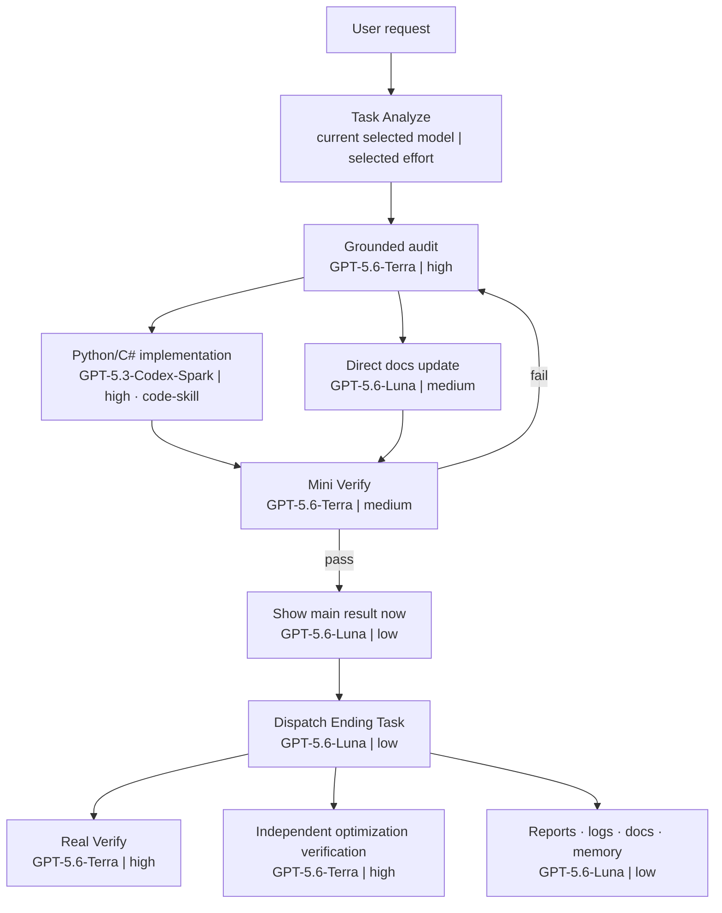

<div align="center">

<picture>
  <source media="(max-width: 600px)" srcset="./management-skill/assets/readme/qin-codex-skills-hero-mobile.svg">
  
</picture>

# qin-codex-skills

### 🧭 Analyze once · 🤖 route each node · 🧪 prove the basic result · 🌙 finish deeply in Ending Task

[](#-the-six-independent-skills)
[](#-how-every-task-starts)
[](#-model--effort-router)
[](#-mini-verify-and-ending-task)

</div>

## ✨ What this repository is

This repository is the public, privacy-safe mirror of Qin's six-skill global Codex workflow. Every task enters through [`task-analyze-skill`](./task-analyze-skill/SKILL.md). The always-loaded AGENTS rule provides a hookless task-start contract. The model selected when the user starts the task runs Task Analyze and route coordination only; it does **not** become the model for the whole workflow.

Task Analyze returns a locked route with the exact installed skill, model, effort, dependencies, input/output, verification point, and stop condition for every executable node. [`workflow-skill`](./workflow-skill/SKILL.md) executes that route without silently replacing its choices.

> [!IMPORTANT]
> **Selected entry model ≠ workflow-wide model.** `GPT-5.6-Sol | ultra` is a valid extreme entry example, but it applies only to Task Analyze. Every downstream model node uses the model and effort chosen for its own work; direct tool-only nodes use their installed tool skill and observable check without a model receipt.

## 🧩 The six independent skills

| | Skill | Exact role |
|---|---|---|
| 🧭 | [`task-analyze-skill`](./task-analyze-skill/SKILL.md) | 100%-trigger independent entry skill. Analyzes the request and returns the complete per-node route. |
| 🗺️ | [`workflow-skill`](./workflow-skill/SKILL.md) | Validates and executes the locked route without inheriting the entry model. |
| 💻 | [`code-skill`](./code-skill/SKILL.md) | Python, C#, Unity C#, prompt-in-code, debugging, refactoring, and authored code probes. Spark first. |
| 🧪 | [`verify-skill`](./verify-skill/SKILL.md) | Mini Verify before the result; Real Verify after the result in Ending Task. |
| ⚡ | [`optimization-skill`](./optimization-skill/SKILL.md) | Reusable workflow improvements with same-behavior proof by a different verifier. |
| 🔐 | [`management-skill`](./management-skill/SKILL.md) | Private routing records, local Codex profiles, and privacy-safe approved-six mirror management. |

<picture>
  <source media="(max-width: 600px)" srcset="./management-skill/assets/readme/qin-codex-skills-hero-mobile.svg">
  
</picture>

## 🧭 How every task starts

The entry skill is always `task-analyze-skill`, but the entry **model can be any model and effort currently selected by the user**. Sol-ultra is only an extreme example.

1. 🧭 The selected pair runs Task Analyze and route coordination only; unavailable metadata is shown as `unverified`, never guessed.
2. 🎯 Static safety, project, modality, language, and skill floors constrain every downstream choice.
3. 🎯 Task Analyze chooses an installed skill for every downstream task and model|effort for every model-executed node.
4. 📝 Easy tasks receive a concise text route.
5. 🗺️ Complex tasks receive a Mermaid dependency workflow plus a numbered `Workflow with models` list.
6. ▶️ Workflow continues in the same task; no lifecycle hook or chat-visible machine plan is required.
7. 🔒 A hookless dispatcher or direct model runner executes dependency-ready nodes in separate `LOCKED_ROUTE_NODE` runs, so downstream work cannot inherit the entrance pair accidentally.
8. 📟 Mini Verify gates the first result. Private adaptive-routing records learn from receipt-backed Mini/Real outcomes afterward.

### First Result Principle

Finish the user requested task, run the smallest meaningful Mini Verify, and show the basically verified result immediately. After the result is shown, continue deeper Real Verify, broader regression checks, optimization proof, reports, logs, documentation, and routing learning in Ending Task. If later verification finds a correctness problem, notify the user, reopen the task, fix it, rerun Mini Verify, and present the corrected result. Never delay a basically verified result for optional deep closeout, and never describe Mini Verify as exhaustive proof.

### 📝 Easy task — text route

Easy tasks do not need a forced diagram:

> **Task:** update one clear value — easy, low effort  
> **Route:** Task Analyze `[current selected model | selected effort]` → direct work `[GPT-5.6-Luna | low]` → Mini Verify `[GPT-5.6-Luna | low]` → main result `[GPT-5.6-Luna | low]` → relevant Ending Task `[planned model | effort]`  
> **Why:** bounded non-code work with one obvious stop condition.

### 🗺️ Complex task — Mermaid route

Complex routes show dependencies, concurrency, fallbacks, Mini Verify, the result boundary, and Ending Task. Every model-executed node displays `[model | effort]`; direct tool nodes display their installed skill and observable stop condition.



## 🚀 How a task runs

<picture>
  <source media="(max-width: 600px)" srcset="./management-skill/assets/readme/task-lifecycle-mobile.svg">
  
</picture>

1. 🧭 Analyze with the current selected entry model/effort.
2. 🎯 Lock one exact model/effort and installed owner skill per node.
3. 🗺️ Execute real sequential, parallel, or mixed dependencies.
4. 💻 Route every active registry-owned code-domain node through `code-skill`; Spark is first for implementation and authored probes.
5. 🧪 Run proportional Mini Verify.
6. ✅ When the requested work and Mini Verify pass, cross Main Goal Done Gate and show the result immediately.
7. 🌙 After the result, dispatch relevant Ending Task branches.
8. 🚨 If background Real Verify finds a correctness failure, notify the user and reopen the task.

## 🤖 Model + effort router

<picture>
  <source media="(max-width: 600px)" srcset="./management-skill/assets/readme/model-router-mobile.svg">
  
</picture>

| Model | Best fit | Supported effort |
|---|---|---|
| `GPT-5.6-Sol` | Missing context, open-ended synthesis, ambiguous architecture, difficult judgment | `low · medium · high · xhigh · max · ultra` |
| `GPT-5.6-Terra` | Grounded source-rich integration, repository search, realistic testing, evidence-heavy review | `low · medium · high · xhigh · max · ultra` |
| `GPT-5.6-Luna` | Direct bounded non-code work, Mini Verify judgment, result delivery, reports/logs/docs | `low · medium · high · xhigh · max` |
| `GPT-5.3-Codex-Spark` | Text-only Python/C#/Unity C# implementation, repair, refactor, authored probes | `low · medium · high · xhigh` |

Model selection is semantic, not a fixed pipeline. Task size alone does not require Sol. A large, well-grounded change may fit Terra; a small Python change should still load `code-skill` and prefer Spark.

A routing rung is the complete `model_name|effort` pair on a weak-to-strong quality ladder; never assume cross-model means cheaper. Downgrade exactly one eligible rung with an effort-first rule: lower effort on the same model first, then after its minimum eligible effort move to the next weaker model at that model's highest eligible effort. Upgrade in the exact reverse direction after a Mini/Real correctness or quality failure. Floors always win.
The adaptive goal is correctness-first routing with receipts used for like-for-like optimization evidence; receipt timing/tokens cannot bypass quality boundaries. Correctness is the gate. Among routes that satisfy it, prefer direct execution for one reversible action, the frozen calibrated pair for similar model work, bounded context, and dependency-safe parallelism. Tokens and elapsed time are receipt evidence for like-for-like optimization; they never override quality or safety boundaries.

Calibration is a bounded search for the selected complete `model|effort` pair for one exact similar-task profile, including `execution_domain`. Effort changes before model. Recommendation output is `selected_pair`, `reason`, `trial`, `success_model`, and `failed_model`; once adjacent receipt-matched pass/fail evidence establishes the bounds, or a receipt-matched pass proves the current hard floor, Task Analyze derives and reuses the calibrated/frozen selected pair with `trial=false`. It does not perpetually downgrade or upgrade. Reopen only for verified Mini/Real correctness or quality failure, material drift, policy/ladder change, or explicit reset. Availability, timeout, execution, telemetry, protocol, or unverified receipt failures remain temporary diagnostics and never rewrite the learned quality best. The entry pair is route metadata, never a learning feature.

## 📟 Runtime receipts

<picture>
  <source media="(max-width: 600px)" srcset="./management-skill/assets/readme/runtime-receipt-mobile.svg">
  
</picture>

Diagram labels are plans, not execution proof. Workflow launches each downstream node on its planned pair, and each model-runner writes its own sanitized runtime receipt recording:

- requested, resolved, and effective model;
- requested and resolved effort;
- allowed reroute and reason, if any;
- input, cached-input, output, reasoning-output, and total tokens;
- model-turn duration, time to first token, and whole-process elapsed time;
- exit code and model/effort match status;
- a bounded workload prompt hash instead of the raw prompt.

`total` is defined as `input + output`; `cached_input` is included in `input` and `reasoning_output` is included in `output`.

The local receipt is strong operational evidence from Codex runtime metadata, not a cryptographically signed backend attestation.

### 🪙 Honest token/time comparisons

Token or time savings may be claimed only from a like-for-like baseline with identical prompts, inputs, topology, sandbox, output contract, and acceptance criteria.

- Cached input is already part of input tokens.
- Reasoning output is already part of output tokens.
- Parallel workflows compare critical-path time, not the sum of branch durations.
- One pair is a smoke result; alternating repeated runs and medians support a durable claim.

## 📚 Private adaptive-routing learning

Personal routing history stays under `task-analyze-skill/local/adaptive-routing/` and is never mirrored. Task Analyze first applies owner/domain and hard safety/project/skill floors, then consults only the exact matching compact sanitized profile. During bounded calibration, a verified pass trials one lower effort on the same model before trying a weaker model. The calibrated/frozen selected pair is derived from the recorded bounds and reused with `trial=false`. Verified failure, material drift, policy/ladder change, or explicit reset reopens the search. Operational or unverified failures may explain a temporary fallback but do not alter learned quality boundaries. Receipt timing/tokens are recorded for like-for-like optimization evidence and do not drive pair ordering.

Management records controlled task-profile enums, the receipt-backed result attempt's requested/resolved/effective pair, Mini/Real verdict, allowlisted failure class, token counts, and timing. It never records raw prompts, task text, results, paths, thread/session IDs, account data, or secrets.

<picture>
  <source media="(max-width: 600px)" srcset="./management-skill/assets/readme/model-experience-mobile.svg">
  
</picture>

The local `task-analyze-skill/local/adaptive-routing/model_experience.json` ledger is condition-keyed, not model-keyed, with generalized summaries and explicit full-pair `success_model`/`failed_model` bounds. This avoids contradictory moving ranges when one model appears in different task conditions. A missing file auto-generates when `recommend`, `status`, or `record` needs it. Matching uses exact controlled condition fields; the current entry pair is route metadata only, never a profile field. Never claim a field or ranking that the recorder does not produce, and never expose this file in the public mirror:

```json
{
  "schema_version": 3,
  "updated_at": "2026-07-10T05:55:12.000000+00:00",
  "conditions": {
    "799b5cc30bcb4d107e081f34c0e6dff164d70cb85dc99397ca7ebca18c907729": {
      "condition": {
        "task_family": "document",
        "execution_domain": "general",
        "artifact": "document",
        "scope": "single",
        "ambiguity": "low",
        "modality": "text",
        "risk": "low",
        "complexity": "easy",
        "owning_skill": "management-skill",
        "project_family": "global-codex-skills",
        "verification_shape": "mini_real"
      },
      "summary": "Repair a bounded README JSON schema example for the global Codex skill mirror.",
      "candidate_ladder": [
        "gpt-5.6-luna|low",
        "gpt-5.6-luna|medium",
        "gpt-5.6-luna|high"
      ],
      "static_suggestion": "gpt-5.6-luna|medium",
      "hard_floor": "gpt-5.6-luna|low",
      "failed_model": "gpt-5.6-luna|low",
      "success_model": "gpt-5.6-luna|medium",
      "tasks": [
        {
          "allowlisted_failure_class": "quality",
          "effective_verdict": "fail",
          "effort_match": true,
          "requested_pair": "gpt-5.6-luna|low",
          "resolved_pair": "gpt-5.6-luna|low",
          "effective_pair": "gpt-5.6-luna|low",
          "executed_pair": "gpt-5.6-luna|low",
          "operational_failure_pairs": [],
          "mini_status": "fail",
          "model_match": true,
          "process_ms": 1200,
          "real_status": "unknown",
          "receipt_status": "pass",
          "recorded_at": "2026-07-10T05:10:00.000000+00:00",
          "run_id": "readme-schema-luna-low",
          "summary": "Mini quality-fail attempt at text-task scope.",
          "token_totals": {
            "input": 80,
            "cached_input": null,
            "output": 50,
            "reasoning_output": 30,
            "total": 130
          },
          "trial": false,
          "turn_completed": true
        },
        {
          "allowlisted_failure_class": "none",
          "effective_verdict": "pass",
          "effort_match": true,
          "requested_pair": "gpt-5.6-luna|medium",
          "resolved_pair": "gpt-5.6-luna|medium",
          "effective_pair": "gpt-5.6-luna|medium",
          "executed_pair": "gpt-5.6-luna|medium",
          "operational_failure_pairs": [],
          "mini_status": "pass",
          "model_match": true,
          "process_ms": 1400,
          "real_status": "pass",
          "receipt_status": "pass",
          "recorded_at": "2026-07-10T05:15:00.000000+00:00",
          "run_id": "readme-schema-luna-medium",
          "summary": "Mini and Real both passed in a second bounded run.",
          "token_totals": {
            "input": 95,
            "cached_input": null,
            "output": 60,
            "reasoning_output": 40,
            "total": 155
          },
          "trial": false,
          "turn_completed": true
        }
      ]
    }
  }
}
```

The result-producing model and effort come from its receipt-backed attempt, never from the verifier. Mini Verify records first; Real Verify updates that same attempt afterward. Searching lowers same-model effort first, then model; calibrated profiles reuse the derived frozen `selected_pair` with `trial=false`. Sticky receipt-matched Mini/Real quality or correctness failures reopen calibration and update the bounds; eligible-ladder or hard-floor changes also reopen it. Availability, timeout, protocol, telemetry, execution, and unverified receipt failures remain operational diagnostics and never change the quality best. An exhausted top boundary returns no selected pair. Safe tiny text/code/command work starts Spark-low; a runtime Spark failure may use the exact planned static fallback without a quality penalty. The ledger is private and is excluded from snapshots, sync, and every public mirror.

Receipts and model selection evidence separate execution domains from model-effort pairs; domain values are explicitly preserved in each `condition`. The table is generated from the staged registry during mirror preparation, so a valid added domain appears automatically.

<!-- EXECUTION_DOMAIN_TABLE -->

## 🧪 Mini Verify and Ending Task

<picture>
  <source media="(max-width: 600px)" srcset="./management-skill/assets/readme/verification-topologies-mobile.svg">
  
</picture>

### 🧪 Mini Verify — before the result

Mini Verify is the main-result gate. It proves the requested result is basically intact and ready to show. Depending on the task, that may be a changed-line check, syntax/compile/schema check, one focused input/output, basic render, parse, or model receipt match.

Mini Verify does **not** claim realistic or exhaustive testing passed.

### 🌙 Real Verify — after the result

Real Verify runs in background Ending Task. It exercises realistic code paths, broader regressions, live interactions, rendered visual quality, integrations, prompt behavior, model-route replay, or same-behavior optimization comparison.

An Ending correctness failure must notify the user and reopen the task. The earlier result remains honestly described as Mini-verified.

### Ending Task may include

- 🔬 Real Verify and realistic replay
- ⚡ independent optimization verification
- 📊 evidence reports and baseline comparisons
- 📝 logs, docs, Markdown, DailyLog/wiki/Obsidian memory
- 🔐 remote status/hash proof after explicitly authorized publishing
- 🧾 no-op inventory when a planned branch has nothing relevant to change

## ⚡ Independent optimization verification

`optimization-skill` implements; a **different** `verify-skill` worker proves same behavior after the main result.

The verifier compares raw before/after inputs and outputs, order, side effects, error semantics, dependencies, and measured tokens/time when savings are claimed. If no different verifier is callable, the correct status is `independent optimization verification blocked`—never self-certification.

## 🧭 Common request routes

| Request | Route |
|---|---|
| Direct answer/read/change | Direct model route: exact model|effort, producer receipt, then Mini/Real learning. |
| Python/C#/Unity C# | `task-analyze-skill → workflow-skill → code-skill → verify-skill` |
| Prompt/instruction | `task-analyze-skill → workflow-skill → prompt gate → verify-skill` |
| Global skill update | `task-analyze-skill → workflow-skill → management-skill → code-skill when Python changes → verify-skill` |
| Explicit optimization | `task-analyze-skill → workflow-skill → optimization-skill → code-skill when needed → verify-skill` |
| Profile or mirror management | `task-analyze-skill → workflow-skill → management-skill → verify-skill` |

All model routes show the basic result after Mini Verify. The exact release sequence is `run-plan` -> read Mini-passed result -> show the self-contained basically verified result -> `release-main-result <handoff>` -> `run-ending <handoff>`. Relevant Real Verify, optimization proof, reports, logs, docs, and memory continue in Ending Task.

## ⚡ Direct action boundary and graduated routes

Task Analyze still runs for every task. One obvious reversible action with no graph executes its installed tool skill directly after the concise route, with no cached plan, model child, or internal dispatcher; Mini Verify checks only the observable state and no tool-only model receipt is fabricated.

| Scenario | Route and Mini Verify |
|---|---|
| Open Chrome | Tool-only `chrome:control-chrome`; no model/receipt/sample; verify Chrome is open. |
| Open YouTube | Tool-only browser action; no model/receipt/sample; verify `youtube.com` is loaded. |
| Search CCTV on YouTube | Tool-only browser interaction; no model/receipt/sample; verify the query and visible results. |
| Design a YouTube-like website | Complex dispatcher through `frontend-app-builder`; grounded implementation; Mini render/core interaction; Ending responsive, console, navigation, accessibility, and visual review. |

## 🧰 Extension recipe

To extend routing, follow the single authoritative [`router-extension-guide`](./task-analyze-skill/references/router-extension-guide.md), whose seam is `routing_policy.py::EXECUTION_DOMAINS`. The entry pair is route metadata, never a profile field. A new active code domain needs all nine registry metadata fields, one executor reference, and generic registry-driven tests. Direct tool-only work uses its installed skill and observable Mini check without a child model, receipt, or adaptive sample; direct model routes carry exact model|effort, a receipt, and Mini/Real learning. Optimize response time and token use only among correctness-passing routes. The public mirror contains exactly six public skills; local `model_experience.json` stays private and excluded.

## 🗂️ Repository structure

```text
qin-codex-skills/
├── task-analyze-skill/   # hookless entry · private adaptive routing · model receipts
├── workflow-skill/       # locked-route execution · Mini gate · Ending dispatch
├── code-skill/           # Python · C# · Unity C# · prompt-in-code
├── verify-skill/         # Mini Verify · Real Verify · visual/artifact proof
├── optimization-skill/   # reusable improvements · independent proof handoff
└── management-skill/     # routing records · profiles · approved-six mirror
```

The local `~/.codex/skills` directory may also contain unrelated global skills such as `chronicle`. Mirror logic explicitly selects the approved six above and preserves unrelated local folders.

## 🛠️ Install and use

Installation has two required pieces:

1. Place the six skill folders under `~/.codex/skills/`.
2. Merge [`task-analyze-skill/assets/global-agents-entry-rule.md`](./task-analyze-skill/assets/global-agents-entry-rule.md) into `~/.codex/AGENTS.md`.

The AGENTS entry rule and Task Analyze loader description form the hookless task-start contract. Task Analyze shows only the human route, then Workflow runs direct model receipts or an internal cached plan through `task_route_dispatcher.py`. No hook file or chat-visible machine plan is required.

The selected entry model may be Luna, Terra, Sol, Spark, or another supported current selection. It analyzes only. The returned route controls downstream models.

For local mirror testing without publishing:

```bash
python3 ~/.codex/skills/management-skill/scripts/sync_global_skills.py status
```

For contract validation:

```bash
python3 ~/.codex/skills/task-analyze-skill/scripts/validate_task_analyze_skill.py
python3 ~/.codex/skills/workflow-skill/scripts/validate_workflow_skill.py
```

## 🔐 Privacy and publishing

The mirror excludes `task-analyze-skill/local/`, caches, work directories, outputs, state databases, auth files, tokens, cookies, keys, secret-looking values, raw prompts, and private runtime logs. Pull preserves the private local routing history.

Editing or testing local skills does not authorize a push. `management-skill` publishes only after an explicit current request and public-safety checks.

## 🧰 Maintainer note

- Durable English README source: [`management-skill/assets/readme/github-readme-template.md`](./management-skill/assets/readme/github-readme-template.md)
- Snapshot generator: [`management-skill/scripts/sync_global_skills.py`](./management-skill/scripts/sync_global_skills.py)
- Task Analyze validator: [`task-analyze-skill/scripts/validate_task_analyze_skill.py`](./task-analyze-skill/scripts/validate_task_analyze_skill.py)
- Hookless internal route dispatcher: [`task-analyze-skill/scripts/task_route_dispatcher.py`](./task-analyze-skill/scripts/task_route_dispatcher.py)
- Private adaptive-routing recorder: [`task-analyze-skill/scripts/model_routing_history.py`](./task-analyze-skill/scripts/model_routing_history.py)
- Workflow validator: [`workflow-skill/scripts/validate_workflow_skill.py`](./workflow-skill/scripts/validate_workflow_skill.py)

## 📚 Source contracts

- [`task-analyze-skill/SKILL.md`](./task-analyze-skill/SKILL.md) — entry boundary, route planning, model/effort choice, receipts
- [`task-analyze-skill/references/adaptive-routing.md`](./task-analyze-skill/references/adaptive-routing.md) — private verification-backed model/effort learning
- [`workflow-skill/SKILL.md`](./workflow-skill/SKILL.md) — locked execution, Mini gate, main result, Ending Task
- [`code-skill/SKILL.md`](./code-skill/SKILL.md) — Qin's Python/C# execution style and Spark-first rules
- [`verify-skill/SKILL.md`](./verify-skill/SKILL.md) — Mini versus Real Verify and evidence routes
- [`optimization-skill/SKILL.md`](./optimization-skill/SKILL.md) — reusable optimization and different-verifier contract
- [`management-skill/SKILL.md`](./management-skill/SKILL.md) — profile/privacy/mirror management

---

<div align="center">

**One entry analysis. Six independent skills. Per-node models. Basic proof first; deep proof in Ending Task.**

</div>
