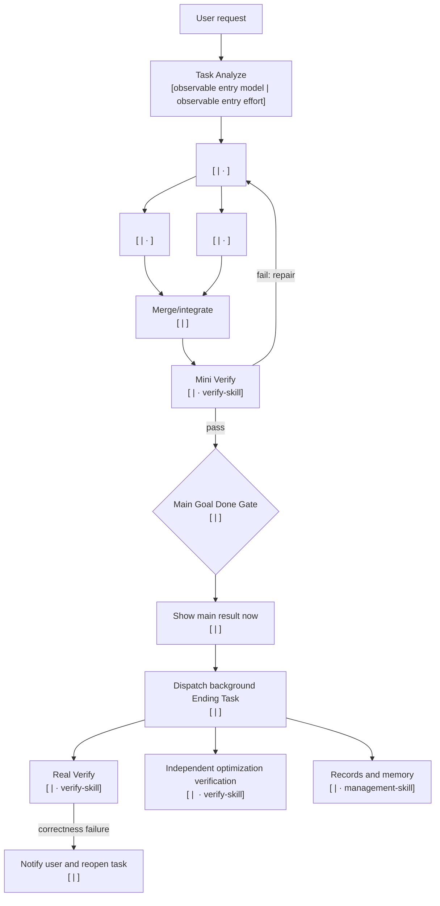

# Task Analyze Route Contract

## First Result Principle

Finish the requested task, run the smallest meaningful Mini Verify, and show the basically verified result immediately. Deeper Real Verify, broader regression, optimization proof, reports, logs, documentation, and routing learning belong after that result in Ending Task. A later correctness failure must notify the user, reopen the task, repair, rerun Mini Verify, and present the corrected result. Mini Verify is basic readiness, never exhaustive proof.

## Easy Direct Tool Action

Task Analyze remains the 100 percent entry skill, but an obvious reversible tool action with no graph runs its installed tool skill directly after the concise route. It uses no cached plan, model child, or internal dispatcher, and tool-only work gets no fabricated downstream model receipt. Mini Verify checks only the observable stop condition. Graduated scenarios:

- Open Chrome: `chrome:control-chrome`, no dispatcher; verify Chrome is open.
- Open Chrome and open YouTube: `chrome:control-chrome`, no dispatcher; verify `youtube.com` is loaded.
- Open Chrome, open YouTube, and search CCTV: `chrome:control-chrome`, no dispatcher; verify the CCTV query and visible results.
- Design a website like YouTube: complex dispatcher route through `build-web-apps:frontend-app-builder`. Assign every node from the current cold-start hint plus exact-profile dynamic ladder; any pair shown in a fixture is illustrative only, never canonical. Model nodes are receipt-backed and the producer is adaptively recorded; Ending checks responsive, console, navigation, accessibility, and visual behavior.

## Extension Guide

For full extension steps, use [`router-extension-guide`](router-extension-guide.md).

A code-domain extension follows the single registry seam in [`router-extension-guide`](router-extension-guide.md): one `EXECUTION_DOMAINS` row, one executor reference, and generic registry-driven tests. Current examples are `python`, `csharp`, and `unity_csharp`; `code_unspecified` is migration/history-only. Keep language rules in executor references, not registry metadata. Additive values do not require a schema bump.

## Easy Task: Text Route

Do not draw Mermaid for an easy task. Show this compact route before execution:

```text
Task: <result> — easy, <overall effort>
Route: Task Analyze [<observable entry model ID> | <observable entry effort> · task-analyze-skill] -> <direct task> [<model ID> | <effort> · <installed skill>] -> Mini Verify [<model ID> | <effort> · verify-skill] -> Main result [<model ID> | <effort>] -> Ending Task [<model ID> | <effort>]
Why these models: <one sentence using static floors plus relevant verified local history>
```

During bounded preflight call `resolve_entry_model.py`; use `unverified` only when exact entry resolution fails. After showing the route, continue the task through Workflow and return the requested result in the same task.

## Complex Task: Mermaid Route

Use real dependencies and concurrency. Label every model-executed node with exact model and effort; direct tool-only nodes name their installed skill and observable stop condition instead.



Follow the diagram with a numbered `Workflow with models` list. Each item names the purpose, exact model ID, effort, owning installed skill, dependencies, and stop condition.

After the visible route, continue through Workflow. Do not stop merely because the route is complete.

## Internal Plan

The user sees only the human route. A structured plan is an internal execution artifact, never conversation output.

When a dispatcher is useful, save schema version 1 JSON inside the active task cache with:

- `complexity` and `topology`;
- an absolute cache directory inside the active task root;
- observable entry metadata;
- bounded result, Mini, and Ending nodes;
- installed skill, exact model, effort, dependencies, prompt, safe sandbox, and routing profile per node;
- `main_result_node` and `mini_verify_node`.

The internal main producer must also carry a complete `routing_recommendation` matching its selected `model|effort`, `trial`, and profile fingerprint. At initial dispatch the controller recomputes the current private recommendation and rejects a stale or self-authored plan before any node runs. Every non-tiny model profile carries exactly the full GPT-5.6 Luna/Terra/Sol ladder with no Spark; an eligible tiny profile carries exactly Spark-low plus that full normal fallback ladder.

Invoke `scripts/task_route_dispatcher.py run-plan <plan-file>`. The dispatcher executes result and Mini nodes first. After the main result is shown, invoke its Ending handoff separately so Real Verify and records remain post-result work.

## Plan-Lock Invariants

The graduated complex fixture is a portable template: materialization injects only the active cache directory and observed entry model|effort, then the real dispatcher validator runs it for every supported entry pair. Downstream node pairs, dependencies, roles, adaptive producer, Ending checks, and controller transitions remain fixture-controlled; direct fixtures retain their exact no-dispatch key set.

- Task Analyze is the individual first node and uses only the selected entry pair.
- Bounded preflight resolves that pair with `resolve_entry_model.py`; no fixed entry model is implied.
- The entry pair is never inherited by downstream nodes.
- Every downstream model and effort is supported and receipt-backed when execution proof is required.
- Every owning skill is installed.
- Active registry-owned code-domain implementation and authored probes use `code-skill` and the domain's applicable style. Spark-low is permitted only for the obvious bounded low-risk easy low-ambiguity text-only tiny-work exception; every other model route uses the exact full normal ladder, regardless of easy/complex classification.
- Mini Verify is downstream of all requested result work and upstream of Main Result.
- Main Result is upstream of Ending Task.
- Ending Real Verify, optimization verification, reports, logs, docs, and memory do not gate the first result.
- The main producer carries a complete `routing_recommendation` proof matching its selected pair, trial flag, and profile fingerprint. Record its receipt after Mini and update that same attempt after Real. For `mini_real`, Mini is provisional and Ending Real recomputes/persists `best_pair` and returns `routing_learning`. This applies to dispatcher and direct non-dispatch model routes; tool-only routes never record adaptive producer samples, verifier models are never recorded as producers, and deterministic controller recording needs no decorative Luna call.
- A later correctness failure notifies and reopens.
- No lifecycle hook or chat-visible machine plan is required.
- Ending wave scheduling requires dependency-ready batches with a three-node concurrency cap.
- For Ending Task, each `optimization-skill` node must have exactly one `verify-skill` ending node with `verifies_node` equal to that optimization node ID.
- A targeted optimization verifier must depend directly on Mini Verify and on its target node; only this verifier may depend on another Ending node.
- Targeted optimizer verifiers must carry explicit `verifies_node`, use a distinct sanitized worker identity from target, and fail when identities are missing or equal.
- Worker identity is `SHA-256(thread_id)`; raw thread IDs are never stored in dispatch manifests.
- Direct-action timings use external wall-clock-to-stop evidence. Complex timing/token claims require passing runtime receipts, and savings claims require like-for-like repeated baselines.
