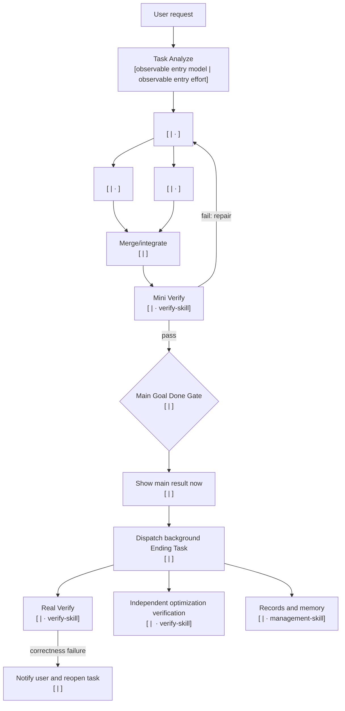

# Task Analyze Route Contract

## Easy Task: Text Route

Do not draw Mermaid for an easy task. Show this compact route before execution:

```text
Task: <result> — easy, <overall effort>
Route: Task Analyze [<observable entry model ID> | <observable entry effort> · task-analyze-skill] -> <direct task> [<model ID> | <effort> · <installed skill>] -> Mini Verify [<model ID> | <effort> · verify-skill] -> Main result [<model ID> | <effort>] -> Ending Task [<model ID> | <effort>]
Why these models: <one sentence using static floors plus relevant verified local history>
```

During bounded preflight call `resolve_entry_model.py`; use `unverified` only when exact entry resolution fails. After showing the route, continue the task through Workflow and return the requested result in the same task.

## Complex Task: Mermaid Route

Use real dependencies and concurrency. Label every non-user node with exact model and effort.



Follow the diagram with a numbered `Workflow with models` list. Each item names the purpose, exact model ID, effort, owning installed skill, dependencies, and stop condition.

After the visible route, continue through Workflow. Do not stop merely because the route is complete.

## Internal Plan

The user sees only the human route. A structured plan is an internal execution artifact, never conversation output.

When a dispatcher is useful, save schema version 1 JSON inside the active task cache with:

- `complexity` and `topology`;
- an absolute cache directory inside the active task root;
- observable entry metadata;
- bounded result, Mini, and Ending nodes;
- installed skill, exact model, effort, dependencies, prompt, safe sandbox, and routing profile per node;
- `main_result_node` and `mini_verify_node`.

Invoke `scripts/task_route_dispatcher.py run-plan <plan-file>`. The dispatcher executes result and Mini nodes first. After the main result is shown, invoke its Ending handoff separately so Real Verify and records remain post-result work.

## Plan-Lock Invariants

- Task Analyze is the individual first node and uses only the selected entry pair.
- Bounded preflight resolves that pair with `resolve_entry_model.py`; no fixed entry model is implied.
- The entry pair is never inherited by downstream nodes.
- Every downstream model and effort is supported and receipt-backed when execution proof is required.
- Every owning skill is installed.
- Python/C#/Unity C# implementation and authored probes use `code-skill`, Qin's applicable style, and Spark first unless a visible fallback reason applies.
- Mini Verify is downstream of all requested result work and upstream of Main Result.
- Main Result is upstream of Ending Task.
- Ending Real Verify, optimization verification, reports, logs, docs, and memory do not gate the first result.
- Record the main result-producer receipt after Mini and update that same attempt after Real. This applies to dispatcher and direct non-dispatch routes; verifier models are never recorded as result producers.
- A later correctness failure notifies and reopens.
- No lifecycle hook or chat-visible machine plan is required.
- Ending wave scheduling requires dependency-ready batches with a three-node concurrency cap.
- For Ending Task, each `optimization-skill` node must have exactly one `verify-skill` ending node with `verifies_node` equal to that optimization node ID.
- A targeted optimization verifier must depend directly on Mini Verify and on its target node; only this verifier may depend on another Ending node.
- Targeted optimizer verifiers must carry explicit `verifies_node`, use a distinct sanitized worker identity from target, and fail when identities are missing or equal.
- Worker identity is `SHA-256(thread_id)`; raw thread IDs are never stored in dispatch manifests.
