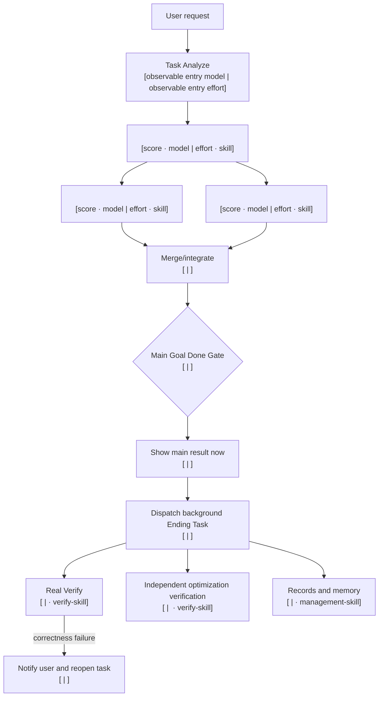

# Task Analyze Route Contract

## Execution Lifecycle Contract

Every result route resolves exactly one machine-readable lifecycle before source work. Eligible low-risk, low-ambiguity score-0-24 single-result work uses `direct` and executes immediately. Every other single result uses `planned_single`: one bounded internal plan followed by one single-thread execution. Any admitted multi-result request uses `planned_graph`: one dependency plan followed by dependency-ready execution; shared writes, ordering, and output dependencies can make all waves sequential without changing the graph lifecycle. The runner emits `execution-lifecycle-notice`, and receipts, summaries, plans, and dispatcher manifests retain the same contract.

The selected model is the lowest suitable capability/history/entry-aware pair for each solving step. Model family follows problem difficulty and information burden; reasoning effort follows estimated steps. A repeated same-topic quality/correctness failure or explicit correction first diagnoses the affected solving route, then strengthens model or effort gradually. Identity, launch, transport, protocol, and timeout failures are operational and quality-neutral. Two verified Real PASS results permit a one-rung trial down; a new topic resets same-session strengthening. Acceptance remains independent: only the released final aggregate receipt can launch one surface-gated projectless Ending, and no-surface work records `intentionally_skipped_simple_task`.

## First Result Principle

Finish the requested task. Every user-facing origin result and result/Ending node uses the compact Result Model Disclosure generated by `scripts/model_identity_disclosure.py`:

```text
Complexity: N/100 (band) · Model: model|effort · Route: no switch|upgrade|downgrade|frozen|fallback
Evidence: runtime receipt|verified entry (no runtime receipt)|task assignment (no runtime receipt)|configured selection (no runtime receipt)|unavailable
```

Add `Model path: prior/selected -> requested/resolved -> effective` between those lines only when the changed route has a distinct model path, collapsing consecutive duplicates. Do not expand the default output into separate current-model, previous-model, evidence-level, switch-summary, or reason lines. Keep the effective pair concrete; only absent identity uses `unknown|unknown`. The full routing data remains in receipts, manifests, and lifecycle ledgers.

For a task with two or more model-executed result/Ending stages, the compact block above identifies the origin result only and is immediately followed by the generated `Model stages (N):` block from `model_identity_disclosure.py render --manifest`. That block is mandatory in the final result and lists every stage's purpose, phase/id, own score/band, effective pair, route, status, evidence, and dependencies. Never collapse a composite implementation/test/publish/deploy/Ending route into the final management action's pair. Detailed tokens, timing, reasons, capability fingerprints, and full pair provenance remain in receipts and ledgers.

For code, emit a user-visible `code-rule-notice` before source work, then load every announced owning/code-philosophy/language/platform/domain Skill. The Code Gate always includes the universal philosophy, exactly one active language profile when registered, and only materially matched categories; a missing notice or universal reference is a routing failure. New C# aliases use the single Unity C# profile. Write the code first, run exactly one smallest safe local Quick Check, and show `CODE READY` immediately. Do not run broad tests, builds, UI/visual checks, full lint, log cleanup, release gates, or repeated source review before presentation. A released result emits `ending-required` only when it exposes `real_test`, `information_update`, or `memory_update`; a no-surface result records `intentionally_skipped_simple_task` with `ending_skip_reason=no_real_test_or_information_or_memory_update`. The parent creates and acknowledges one persistent global projectless `End Task-{task}` only from the final aggregate receipt after all result nodes/subprocesses settle and release; it passes `ending_verification_plan.py create-launches --producer-receipt <final-receipt>` and returns without polling. A child receipt never starts an Ending. Invoke only the exact `codex_app__create_thread` arguments with target `{"type":"projectless"}` and no project/current-task fields, then read the exact thread back through `codex_app__list_threads`. `ack-launch` requires the origin project binding plus observed `threadProjectId=null`; `audit-launches` requires `end_task_trigger_rate=100%`. Project-attached, current-task, same-task-subtask, or unread-back placement is BLOCKED; missing acknowledgement is BLOCKED. Spark-xhigh is the sole lifecycle controller; Luna-low is availability-only. Its compact plan-pointer prompt keeps the same task active for one saved bounded action at a time. Deterministic command/syntax/unit/API/file-state checks run directly. Semantic runtime/integration/code-quality/prompt/UI/visual checks may use plan-saved Terra/Sol `ENDING_CHECK_WORKER` nodes. Those workers read listed Skills, run one check, write evidence, and never edit, repair, route, or close lifecycle. All evidence must PASS. FAIL goes to the immutable origin for repair, one Quick Check, new presentation, and a fresh Spark-first global projectless Ending with `--repair-of-lifecycle-id`, for at most three attempts. Every terminal verdict is recorded automatically and the task remains visible.

All lifecycle handoffs use project-root-relative paths or runtime-derived roots; never require a machine-specific project path.

## Ordinary Entry Contract

The hookless always-loaded bootstrap scores every submission `0-100`, resolves its observable entry pair, inventories material result stages, then chooses a single producer or a real task graph. Eligible single-node text/code production calls `obsidian_adaptive_model_runner.py` exactly once even on cold start. A zero-argument `graph-route-required`/`route-required` response proves no model ran and requires the parent to build one `dynamic_task_graph` and call `task_route_dispatcher.py run-plan` once instead of retrying a single producer. Matching step-capability fingerprint and difficulty history selects the proven boundary first; absent history, routing chooses the weaker of the contextual cold start and entry anchor. Therefore high/Sol entries can downgrade, Luna-max/lower entries can upgrade, and a recovered or frozen lowest-correct pair is reused from either direction. A graph is used only when the request contains at least two distinct bounded result segments with different ownership, model needs, outputs, or dependency-ready concurrency. Every model node has its own score, band, exact pair, purpose, dependencies, stop condition, step kind, and controlled capability tags; implementation and local-test history never collapse into one model decision. A low-risk, low-ambiguity text/code/write/execute node scoring `0-24` runs the same-session outcome gate, then tries Spark-low only with no stronger session route even inside a larger task; a non-Spark eligible node states its exception category and concrete reason, and an Ending quality failure suppresses Spark for that fingerprint. Exact/tool/image work uses the score-only script and creates no fake model learning. Two or three independent read-only sources retain their byte-cost shortcut; exact-owned small text sources may be captured locally with zero model tokens before one adaptive synthesis, while every ineligible case retains the prior model-source path. Neither path adds foreground verification; Ending Real begins only after presentation.

A low-risk generic analysis at score `0-49` may use `lean_bounded_worker` only when it names one to three immutable project-relative text files, each source and the combined input stay under the hard byte limits, and the result contract demands exact one-line minified JSON. The result worker still sees the current project `AGENTS.md`, source files, sandbox, selected pair, shell execution, and output contract; it omits the already-consumed global routing lifecycle and disables unrelated apps, browser/computer/image features, plugin catalogs, and Skill search for that child only. Code, writable, media, domain-Skill, complex/advanced, large, or non-exact work uses `full`. The runtime view links only authentication and session authorities, never copies credentials, never overwrites a conflict, records the exact disabled-feature set, and falls back to unchanged `full` on Windows or unavailable link support. The child receipt and benchmark route signature disclose the actual mode.

- One obvious reversible action uses one tool action and presents the observed result immediately.
- Exact-scoped read-only work stays inline with no subagent or route. An exact named-source audit first runs one bounded `rg` per authoritative file for every exact user-named target and direct definition, then answers once. Anchor named members directly; enclosing-class or call-site anchors, guessed identifier families, separate planning, broad searches, whole-file reads, rereads, and pre-result checks are forbidden. Present immediately.
- An exact bounded multi-file allowlist uses one boundary-labelled broad search, not parallel agents, separate locator/read rounds, or one full read per file.
- Requested text/code production uses the smallest adaptive producer surface. Code runs one proportional Quick Check before presentation. One detached Ending Real runs the bounded explicit tests needed for the changed result; safe independent checks may run concurrently inside it, and failures route through origin repair then fresh Spark-first verification.
- A dependency-coupled task stays one producer or a linear chain; it is never split by file count alone. Distinct nodes with shared writes stay ordered. Independent nodes with disjoint ownership run in the same dependency-ready wave.

The graduated examples are therefore inline by default:

- Open Chrome: perform the action and present completion; launch Ending with the smallest observable completion/record check.
- Open Chrome and open YouTube: perform the action, present completion, then verify `youtube.com` in Ending Real.
- Open Chrome, open YouTube, and search CCTV: perform the action, present completion, then inspect the query/results in Ending Real.
- Design a website like YouTube: use one adaptive producer, present the completed draft, then run render and interaction checks in Ending Real. Apparent complexity alone does not create a dispatcher.

## Dynamic Foreground Budget

Load full Task Analyze for explicit model routing/benchmarking, Task Analyze maintenance, or a real dependency graph. Full activation still defaults to one producer when segmentation would only duplicate context. A bounded task graph does not require prior benchmark evidence; only a claim that it saves time or tokens does. Read-only source graphs retain byte/context admission, disjoint allowlists, and dependency-only-or-fused merge rules. Writable graphs declare non-overlapping ownership for parallel nodes and explicit dependencies for shared targets.

For an admitted route, the entry model may coordinate the route but must not duplicate a child's source inspection. Every collaboration child starts with `LOCKED_ROUTE_NODE`, produces only its assigned result and Quick Check, and never starts End/Fix work. After its passing receipt exists, the entry parent binds it to Ending. Collaboration plus dispatcher must never execute the same branch twice.

- One admitted deterministic model node uses one producer, immediate result release, and post-result Real Verify.
- Multiple result branches require pairwise-disjoint `source_allowlist` values. The main merge either sets `reads_dependency_results_only=true` with no source allowlist, or sets `fuses_owned_source_with_dependencies=true` with exactly one additional disjoint source allowlist and direct dependencies on every other result node.
- Plans set `first_result_timeout_seconds` (normally 180 seconds for bounded work and 600 seconds for a complex graph). Deadline exhaustion stops foreground execution and preserves partial evidence.
- A buffered admitted entry process returns as soon as the result is complete with Ending pending; Real Verify never delays that return.

## Extension Guide

For full extension steps, use [`router-extension-guide`](router-extension-guide.md).

A code-domain extension follows the single registry seam in [`router-extension-guide`](router-extension-guide.md): one `EXECUTION_DOMAINS` row, one executor reference, and generic registry-driven tests. Current active examples are `python` and `unity_csharp`; `csharp` and `code_unspecified` are migration/history-only. Keep language rules in executor references, not registry metadata. Additive values do not require a schema bump.

## Admitted Single Node: Text Route

Show this compact route only after full Task Analyze was explicitly activated and positive performance admission selected one delegated node. Do not draw Mermaid for one admitted node:

```text
Task: <result> — admitted single node
Route: Task Analyze [<observable entry model ID> | <observable entry effort> · task-analyze-skill] -> <direct task> [<model ID> | <effort> · <installed skill>] -> Show main result immediately -> Ending Task Real Verify [<model ID> | <effort> · verify-skill]
Why this route is admitted: <one sentence naming current comparable end-to-end evidence>
```

During the admitted preflight call `resolve_entry_model.py`; use `unverified` only when exact entry resolution fails. After showing the route, continue through Workflow and return the requested result in the same task. If admission is absent, execute inline with no route display.

## Dynamic Complex Graph: Mermaid Route

Use this for an explicitly activated dependency graph. Show real dependencies and concurrency. Label every model-executed node with its own score, band, exact model and effort; direct tool-only nodes name their installed skill and observable stop condition instead.



Follow the diagram with a numbered `Workflow with models` list. Each item names the purpose, exact model ID, effort, owning installed skill, dependencies, and stop condition.

After the admitted route is visible, continue through Workflow. Do not stop merely because the route is complete.

## Internal Plan

The user sees only the human route. A structured plan is an internal execution artifact, never conversation output.

When a dispatcher is useful, save schema version 2 JSON inside the active task cache with:

- `routing_mode=dynamic_task_graph`, parent `complexity_score`/band, `complexity`, and `topology`;
- an absolute cache directory inside the active task root;
- observable entry metadata propagated into every adaptive recommendation and result/Ending receipt;
- bounded result and Ending nodes;
- installed skill, node `complexity_score`/band, exact model, effort, `selection_basis`, purpose, dependencies, prompt, safe sandbox, ownership, stop condition, and routing profile per node;
- main-producer `model_memory_scope` with module plus file/symbol/code/operation when known; omitted file/symbol values intentionally fall back to module-level project evidence;
- `main_result_node` and one post-result Real verifier.

The internal main producer carries a complete `routing_recommendation` matching its selected catalog-derived quality `model|effort`, `trial`, and profile fingerprint. The controller recomputes it and rejects stale or self-authored plans. The optional priority producer remains outside the quality ladder but is a valid dynamic result node for an eligible score-0-24 text/code/write/execute segment, including a downstream segment. It needs `selection_basis=spark_priority` and a quality fallback. A non-Spark eligible small node must include a concrete `spark_exception_reason`.

The plan also carries `first_result_timeout_seconds`. Dispatcher stdout is a compact locator only; the full manifest remains on disk. Read-only locked nodes omit broad user configuration by default because their prompt already includes the exact owning skill path and domain reference; set `load_user_config=true` only when a configured plugin/tool surface is genuinely required.

## Dynamic decomposition requirements

For `routing_mode=dynamic_task_graph` plans, `decomposition` is required and must be:

- `policy: "max_safe"`, meaning split every safely independent bounded stage and retain a coupled stage only with stated continuity evidence.
- `stage_inventory` contains exactly one item per result node and no ending nodes.

Each `stage_inventory` item must include at least:

- `stage_id`, `node_id`, `logical_stage_ids`, `purpose`, `score`, `band`, `model_intent`, `operation`,
  `dependencies`, `inputs`, `outputs`, `stop_condition`, `coupling`, `parallelizable`, `objective_scope`,
  `mutable_state`, `failure_escalation`, `external_side_effects`.
- `score`, `band`, `model_intent`, and `dependencies` match the mapped node.
- Each result node's `model_memory_scope` may declare a controlled `step_kind` and stable `capability_tags`; otherwise the runner derives them from bounded categorical fields and `task_summary`. Distinctive tool/image/test/browser/API/visual stages should declare them explicitly.
- `logical_stage_ids` must be a single item except when continuity is declared; multi-item items require
  `coupling: linear`, `parallelizable: false`, and a concrete `continuity_reason` naming shared state, coherent reasoning,
  prompt/context mutation, or cumulative verification.
- `operation`/`coupling` must match node role constraints.
- Small text/code/write/execute/side-effect-safe result nodes without Spark must include both
  `spark_exception_category` and `spark_exception_reason` when applicable.
- Same-wave `independent` stages must set a shared `objective_scope`, disjoint `inputs`, disjoint `mutable_state`,
  and a shared `deterministic_merge_node` whose dependency closure covers every sibling in that wave.

Full foreground and ending manifests for dynamic runs include `model_switch_summary` with:

- `nodes`: one summary entry for each planned node (ending nodes are `pending` in the foreground manifest and
  reconciled to executed outcomes in the ending manifest).
- For each entry: `requested_pair`, `resolved_pair`, `effective_pair`, `model_evidence_source`, `evidence_level`,
  `dependency_wave`, `relations.{entry_pair,dependencies,same_wave_siblings}`, `route_change`, `reason`,
  `tokens`, `elapsed_ms`, `status`, `failure_class`, and `operational_fallback`.
- `aggregate`: integer counters `spark_usage_nodes`, `quality_pair_nodes`, `operational_fallback_nodes`,
  `quality_failure_nodes`, `parallel_waves`, and `unsplit_continuity_groups`.
- For a verified non-targeted Ending failure, `main_result_node` is marked as `quality` failure.
- This final `model_switch_summary` distinguishes independent task assignment from a literal fallback or switch: an
  unreceipted assigned pair is concrete with `model_evidence_source=task_assignment`, `evidence_level=UNVERIFIED (no runtime receipt)`,
  `route_change=no_switch`, and an explicit no-runtime-switch reason. Only the one zero-token operational fallback, a verified quality
  failure upgrade, or verified-success downgrade changes the route.

Invoke `scripts/task_route_dispatcher.py run-plan <plan-file>`. The dispatcher executes only result nodes before release. After the main result is shown, invoke its Ending handoff separately so Real Verify and records remain post-result work.

## Plan-Lock Invariants

Admitted dispatcher fixtures are topology-only portable templates, not execution authorization: materialization injects only the active cache directory and observed entry model|effort, then the real dispatcher validator runs them for every supported entry pair. Ordinary graduated fixtures remain inline and contain no dispatcher plan. Current positive performance admission plus a fresh frozen recommendation is still required before open-ended execution. A runner-generated independent-source plan must retain its cost-admission receipt, source-count, disjointness, read-only, and dependency-only-or-fused-final merge gates. Downstream node pairs, dependencies, roles, adaptive producer, Ending checks, and controller transitions remain fixture-controlled only inside admitted templates.

- Task Analyze appears first only in the human route for explicitly activated work and uses the selected entry pair; schema-version-2 dispatcher nodes begin with result work and carry entry metadata separately.
- Bounded preflight resolves that pair with `resolve_entry_model.py`; no fixed entry model is implied, and each downstream history lookup uses it only as a cold-start anchor or route-direction reference.
- The current pair performs ordinary inline work. In an admitted route, downstream nodes use their locked pairs rather than silently inheriting the entry pair.
- Every downstream model and effort is supported and receipt-backed when execution proof is required.
- Every owning skill is installed.
- Active registry-owned code-domain implementation and authored probes use `code-skill`. Plan nodes and ordinary fallbacks use the generated quality ladder; ordinary text/code result producers execute the contextual quality recommendation directly.
- Main Result is upstream of Ending Task.
- Ending Real Verify, optimization verification, reports, logs, docs, and memory do not gate the first result.
- Optional related-memory preflight is read-only, bounded, and advisory. An unavailable provider or no matches never blocks routing. Ending updates only related sanitized memory after the result; model-switch memory waits for Real Verify.
- The main producer carries a complete Obsidian-derived `routing_recommendation` proof matching its selected pair, trial flag, and profile fingerprint. Bind its receipt to `ending_task_ledger.py start`; the terminal event records model-quality learning through `project-memory-skill/scripts/obsidian_model_memory.py`. Tool-only routes never record adaptive producer samples, verifier models are never recorded as producers, and deterministic controller recording needs no decorative model call.
- A later correctness failure notifies and reopens.
- No lifecycle hook or chat-visible machine plan is required.
- Ending wave scheduling requires dependency-ready batches with a three-node concurrency cap.
- Grounded low-risk text-answer plans use one result node unless disjoint source allowlists plus a dependency-only or exact-owned fused-final merge prove non-duplicated fan-out. Writable dynamic graphs instead prove ownership through non-overlapping targets and dependencies.
- First-result deadline gates every foreground wave and fallback. Deadline exhaustion cannot launch another plan.
- For Ending Task, each `optimization-skill` node must have exactly one `verify-skill` ending node with `verifies_node` equal to that optimization node ID.
- A targeted optimization verifier must depend directly on Main Result and on its target node; only this verifier may depend on another Ending node.
- Targeted optimizer verifiers must carry explicit `verifies_node`, use a distinct sanitized worker identity from target, and fail when identities are missing or equal.
- Worker identity is `SHA-256(thread_id)`; raw thread IDs are never stored in dispatch manifests.
- Direct-action timings use external wall-clock-to-stop evidence. Complex timing/token claims require passing runtime receipts, and savings claims require like-for-like repeated baselines.
