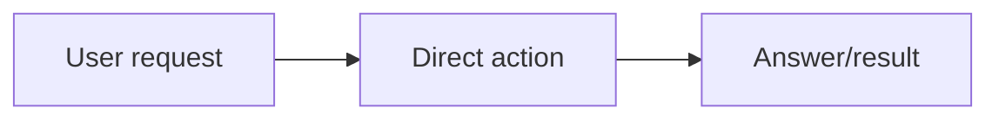

# Workflow Skill

Use this as the workflow layer for user tasks. It has two modes:

- **Lightweight routing check** for simple, obvious, low-risk work.
- **Explicit workflow controller** for concrete Python/C# coding/programming, any prompt-related task, file-changing, multi-step, skill-editing, UI/artifact/report, or evidence-heavy work.

The explicit workflow turns a request into a target map, chooses the relevant executor skill routes, drives execution, runs the foreground mini real test, returns the user-facing result when that gate passes, and moves every non-result-changing tail item to the same comprehensive `Ending Workflow` subagent when subagent tools are available. Final response is not allowed until the `Ending Workflow Tool-Call Gate` below is satisfied.

## Always-First Rule

`workflow-skill` is the entrypoint and controller for substantive task work. Start with its routing decision before any other user/global skill when executing a task that needs planning, implementation, verification, or evidence. Other skills are executors selected by `workflow-skill`; they should not be treated as independent first-entry controllers for task work.

Make the task-size decision before exploration. First classify the request as one of:

- **Fast-path simple**: direct wording such as "change value(s)", "change A to B", "rename X", "update this label/text/key", "open this", "run this status command", or another bounded low-risk action where the target file/object is obvious.
- **Explicit workflow**: unclear scope, broad search, behavior change, prompt/code logic change, public API/runtime impact, UI/visual output, generated artifact, security/payment/private data, deployment, merge/loss risk, or user-requested testing/proof.

If the first classification is fast-path simple, do not read project memory, scan unrelated files, run broad searches, start formal verification, or append DailyLog/wiki/Obsidian records before the user-facing result. Do the direct edit/action, run only a tiny local confirmation, answer on the user-facing path, then delegate the separate task-local `Ending Workflow` lane to a focused subagent for extended real tests beyond the mini check, documents, wiki, logs, Markdown, sync/status, or any other update that will not influence the delivered result. This ending delegation is required even for simple tasks; it is not optional closeout, but it must stay task-local and related-information focused. The final chat response must still report the concrete ending-worker tool-call status.

For tiny direct answers, obvious file inspection, state listing, or one-shot command execution, keep the target map implicit and lightweight. Do the requested action directly, then answer with the result. Do not expand into a formal target map, executor route list, report, or code/verify spine unless the request has real risk, ambiguity, side effects, or a verification requirement.

## Simple Task Fast Path

Use the fast path when the user asks for a simple, obvious, low-risk action and the expected result is directly knowable without broad reading or proof. Execute it directly, run the smallest reasonable local confirmation in the main task, return the result to the user-facing path, then delegate the same task-local `Ending Workflow` task to a subagent when subagent tools are available.

Fast-path examples include:

- change one clear text/value/label from A to B;
- rename a local function, variable, label, heading, or file when the scope is obvious and the user is not asking for behavior changes;
- open a website or file;
- run one clearly requested status/list/read command;
- make a tiny mechanical edit that does not alter real project functionality, data, security, deployment, public API behavior, or UI/visual quality.

For fast-path tasks:

- show the compact direct-route diagram and one-line model route before the direct action;
- do not write a formal target map;
- do not route through `verify-skill`;
- do not read project memory, broad instructions, or unrelated files before the direct action unless the target is not identifiable without them;
- do not run broad tests, regression sweeps, audits, reports, optimization, or Obsidian recording in the main foreground path;
- do only the minimum local confirmation needed to avoid an obvious mistake, such as re-reading the changed line, checking the opened URL, or confirming the command returned;
- answer in one or a few lines with what changed or what happened;
- return the user-facing result immediately after the direct action and minimal confirmation. Do not append DailyLog/wiki/Obsidian memory, broad checks, reports, docs, Markdown summaries, or extended real tests in the main foreground path before the result is ready. After the answer path is clear, always delegate the task-local `Ending Workflow` task to a subagent when the subagent tool is callable. The worker may decide no durable file changes are needed, but the worker must be started and the final response must report the tool-call status.

Upgrade out of the fast path when scope is unclear, multiple files or references are not obvious, the edit may affect real project behavior, tests, generated artifacts, UI/visual output, public APIs, auth/security/payment/data handling, deployment, merge safety, or when the user explicitly asks to verify, test, audit, sync, record, or prove the result.

## Start Diagram Rule

Before task action, write a user-facing workflow diagram first whenever `workflow-skill` handles the request.

- In lightweight mode, show a compact direct-route diagram and one sentence naming the direct action and stop condition.
- In explicit workflow mode, show a task-specific Mermaid diagram and the target map before implementation, file edits, tool-side effects, or worker-skill execution.
- The diagram must name the actual work inside the route: relevant files, artifacts, commands, tests, reports, skill sync, browser checks, or verification steps. Do not hide the task behind generic labels such as "do work" or "process".
- Keep the diagram concise. Show meaningful task-level steps, not every tiny shell command.
- If the request is ambiguous, dangerous, destructive, or needs credentials, show the diagram up to the decision point and ask for the missing approval/input before side effects.
- Read `references/start-diagram-template.md` when a quick fill-in template would save time or keep the diagram consistent.

## Model Phase Contract

Always show the model route before execution whenever `workflow-skill` handles a task.

- **Hard model-route gate:** if no user-visible `Workflow with models` numbered list has been shown for an explicit workflow in the current turn, do not edit files, run shell commands, open browser/computer tools, call executor skills, or perform other task side effects. Show the diagram and model list first, then continue. A prose note, hidden reasoning, or table alone does not satisfy this gate. If you realize after starting that the gate was missed, stop immediately, show the missing `Workflow with models` list, name it as a route correction, and then resume.
- In explicit workflow mode, add a visible `Workflow with models` numbered list to the target map before file edits, shell commands, browser/computer actions, or worker-skill execution. Each step label must include the model in parentheses, for example `1. Inspect current rule (best available workflow model)` or `2. Patch text (gpt-5.3-codex-spark)`. A table may follow, but it cannot replace the numbered step-model list.
- In lightweight mode, add one short model route after the compact diagram before the direct action. Use `GPT-5.3-Codex-Spark` for direct text/value edits, command/simple-check interpretation, and small local confirmations; use `GPT-5.5` with light reasoning (`gpt-5.5`, low effort) only as the protected fallback when Spark is unreachable or too limited for that phase; use the best available reasoning model only for the tiny route decision or final judgment when needed.
- The workflow creation, task decomposition, target-map writing, route selection, ambiguity/risk decisions, and final route judgment phases always use the best available workflow/reasoning model by default.
- Verification judgment always uses the best available verification/reasoning model by default. Image tasks, visual understanding, comprehensive reading/checking, deep review, merge/loss audits, security/legal/financial/high-stakes review, and final pass/fail judgment also use the best available reasoning model.
- All actual execution that does not require image/visual reading, comprehensive reading, comprehensive checking, broad repo archaeology, deep debugging, high-stakes review, or final pass/fail judgment is forced to `GPT-5.3-Codex-Spark` (`gpt-5.3-codex-spark`). This includes writing text, drafting or editing prompts/rules/instructions, simple Markdown or config text edits, log/wiki/DailyLog/Obsidian memory edits, command-line work, shell/Git status checks, simple file inspection or summarization, small tests/probes, optimization implementation, and Python/C# implementation or test-code authoring.
- Shell commands run in local tools. The Spark assignment covers the AI text/reasoning used to choose simple commands, write command-adjacent text, interpret simple command output, and author small probes/tests.
- Image reading, visual understanding, large or cross-file reading, comprehensive verification/review, merge/loss audits, security/legal/financial/high-stakes review, ambiguous architecture/debugging, and final pass/fail judgment use the best available reasoning/planning model unless a selected tool/executor requires a stricter route.
- Code verification commands run in local tools, but any AI-authored test/probe code, failure interpretation that changes code, or repair iteration remains on `GPT-5.3-Codex-Spark` unless the protected fallback below is triggered.
- Protected Spark fallback: if `GPT-5.3-Codex-Spark` cannot be reached, selected, or delegated, or if a Spark-required phase hits Spark rate/capacity/access/tool/context/output limits, switch that phase to `GPT-5.5` with light reasoning (`gpt-5.5`, low effort). This is not silent fallback: show `Model switch: Spark -> GPT-5.5 light` in the `Workflow with models` step, name the concrete reason, keep the same execution scope, and switch later Spark-default phases back to Spark when Spark is available. If both Spark and `GPT-5.5` light are unavailable, mark the phase blocked or ask for user direction.

Use this compact shape unless the task needs more detail:

```text
Workflow with models
1. Plan route and pass target (best available workflow model) - workflow creation, risk, scope, and stop condition.
2. Edit text/prompt/rule/code or run simple commands (gpt-5.3-codex-spark; fallback gpt-5.5 light when Spark is unreachable/limited) - all ordinary execution and text/code updates.
3. Read images or run comprehensive review, if needed (best available reasoning model) - image, visual, large-reading, deep-review, or high-stakes phases only.
4. Verify result and final judgment (best available verification model) - compare evidence with the user's target.
```

Optional table detail:

| Phase | Model | Scope |
|---|---|---|
| Planning / target map / route | best available workflow model | workflow plan, risk, ambiguity, pass targets |
| Text / Markdown / prompt / rule / memory drafting | `GPT-5.3-Codex-Spark` (`gpt-5.3-codex-spark`), protected fallback `GPT-5.5` light (`gpt-5.5`, low effort) | ordinary text, instruction, log, wiki, DailyLog, Obsidian, and Markdown work that is not comprehensive reading/checking |
| Command-line / simple file checks | `GPT-5.3-Codex-Spark`, protected fallback `GPT-5.5` light, plus local commands | status/list/read/grep/simple test interpretation; commands provide evidence |
| Code / optimization implementation / tests / probes | `GPT-5.3-Codex-Spark`, protected fallback `GPT-5.5` light, plus local commands | Python/C# implementation, optimization edits, test/probe authoring, and code-level repair |
| Image or comprehensive review | best available reasoning model plus local evidence | image reading, visual QA, large reading, deep audits, merge/loss checks |
| Verification / final judgment | best available verification model plus local evidence | compare observed output with pass targets |

## Generated File Placement

Put intermediate files, temporary inputs, caches, generated scratch data, logs, previews, and other non-final artifacts in the relevant `cache/` directory. Use the current task or project directory's `cache/` folder for task-specific artifacts, or this skill's `cache/` folder for skill-internal artifacts. Create the folder if needed. Final deliverables go only to the user-requested path or the active workspace `outputs/` directory.

## Internal Route Selection

This skill controls a workflow with many possible executor branches. Do not run every branch just because it exists. Select every branch that matches the requested artifact and task type, and combine branches when the task spans text, Python code, C# code, UI, image, internal ChatGPT-in-Chrome visual generation, document/PDF, global skill edit, optimization, management-skill for GitHub sync or auth/profile switching, or mixed work.

### Prompt Task Gate

Run this gate before choosing a generic text, code, or mixed route. If the user request is about prompt behavior, prompt wording, prompt files/templates/strings/constants, system/developer/user instructions, model or agent instructions, AI output behavior, extraction/generation/checker prompts, prompt tests, prompt review, or a prompt/rule that is not triggering, classify the work as prompt-related.

The gate also matches loose editing language when the object is a prompt or instruction: add, update, remove, edit, rewrite, repair, simplify, shorten, tighten, make smarter, make easier to trigger, test, review, optimize, stop case-stacking, or explain why the prompt is not working.

When this gate matches:

1. Show `Prompt idea -> Prompt goal -> Problems -> Solution` before drafting or revising prompt text.
2. Read the source prompt or current instruction/rule when it exists.
3. Decide whether the prompt is standalone text or embedded in Python/C# executable behavior.
4. For standalone prompt/instruction work, use the prompt route and verify with a representative prompt test or contract inspection.
5. For embedded prompt strings/constants/templates in Python/C# code, combine the code route with the prompt rules. Do not let the code route skip the prompt purpose workflow.

Prompt task matching takes precedence over the generic text route whenever the request is really about changing or testing AI instructions. Use code routing only in addition to the prompt gate when executable Python/C# behavior must change.

Read `references/routing-matrix.md` when a task spans multiple artifact types, touches global skills, edits or writes prompts/instructions, or the correct route is not obvious from the request.

Read `references/image-generation.md` when the task is visual/image-related, the user did not provide a reference image and one would materially improve the result, a project expects ChatGPT-in-Chrome image output, or a project skill mentions the workflow image-generation route.

Use `scripts/validate_workflow_skill.py` only to validate this skill's routing contract after editing the skill.

## Trigger

Use this skill as the starting routing decision for user task requests before invoking any other user/global skill.

Write the explicit target map only when the task is worth that overhead:

- concrete Python or C# code/programming work
- any prompt-related task, including prompt/instruction authoring, updates, review, or optimization, plus testing, editing, add/remove/rewrite, and standalone prompt text not embedded in code
- non-trivial file edits, behavior changes, or edits with unclear scope
- multi-step work with dependencies or unclear order
- UI, image, document, PDF, report, or generated artifact work
- visual updates that need or would benefit from ChatGPT-generated image assets, concepts, sketches, or references before implementation, especially when the user did not provide a reference image
- skill creation, deletion, renaming, reorganization, or sync
- browser/computer-control workflows with observable pass criteria
- tests, verification, debugging, repair, optimization, or evidence reports
- anything high-risk, high-stakes, ambiguous, or likely to require iteration

Keep the workflow lightweight for simple obvious work:

- answering a direct question
- reading, listing, or summarizing a file
- checking status
- running a clearly requested command
- opening a website or file
- making a simple mechanical A-to-B edit, rename, or value/text change when the target and scope are obvious and it does not affect real project functionality
- returning a short explanation where no file changes, side effects, or formal proof are needed

Even in lightweight mode, show the small direct-route diagram first. Use judgment: if the simple-looking request has hidden side effects, may change state, may be destructive, or needs proof, upgrade to explicit workflow mode.

## Workflow

For explicit workflow mode, run the start diagram and start contract, route the necessary executor skills, execute the work, run the foreground mini real test against the target, and loop until that foreground gate passes. The main task must not skip reasonable checking just because a comprehensive ending subagent exists: it owns the result-producing work plus the smallest meaningful verification needed to know the delivered result is not obviously broken. After the user-facing target and mini test pass, return the result first on the user-facing path. Extended real testing, log checks, documentation updates, DailyLog/wiki/Obsidian records, Markdown updates, and any other closeout that does not influence the delivered code/artifact must run afterward through a bounded `Ending Workflow` subagent when subagent tools are available. The final response still waits for the ending-worker tool-call lifecycle to complete, no-op, reopen the task, or report blocked.

For prompt-related work, the first workflow decision after the start diagram is the Prompt Task Gate. If it matches, keep the prompt purpose workflow visible in the target map and use the prompt pass target even when the prompt lives inside a larger skill, file, or codebase.

For lightweight mode, display only the compact direct-route diagram, make the smallest routing decision needed, perform the direct action, and answer.

If a lightweight or fast-path task starts expanding into broad verification, DailyLog/wiki/Obsidian updates, report writing, optimization, or multi-step closeout before the direct result is returned, treat that as a workflow failure. Stop the expansion and return the user result first. Run secondary closeout only afterward through an `Ending Workflow` subagent.

## Start Contract

For lightweight mode, before the direct action, write this compact shape with task-specific labels:



Then do the direct action.

For explicit workflow mode, before doing the work, write a task-specific Mermaid start diagram followed by a short target map:

1. `Task slices`: the ordered pieces of work.
2. `Artifacts`: what will exist or change, such as text, Python/C# code, image, UI, PDF, Markdown, skill files, or GitHub state.
3. `Pass targets`: what observable result proves each artifact is correct.
4. `Skill route`: the skills needed and the order they must run; the first skill must be `workflow-skill`.
5. `Workflow with models`: a numbered task-specific list where every step name includes the model in parentheses, such as `1. Plan route (best available workflow model)` and `2. Patch prompt text (gpt-5.3-codex-spark; fallback gpt-5.5 light)`. Show Spark for text writing, prompt/rule drafting, command-line or simple checks, code writing/editing, code tests/probes, and log/wiki/Markdown closeout. Show `GPT-5.5` light only when the protected Spark fallback is actually needed, with the reason in that step. Show the best available workflow/verification/reasoning model only for workflow creation, image/comprehensive reading/checking, verification judgment, route decisions, and final judgment. Include any blocked model requirement.
6. `Foreground result gate`: the exact mini real test or small evidence check that allows the user-facing result to be returned.
7. `Ending Workflow subagent`: the bounded post-result worker that will handle the same task-local ending task for simple and comprehensive workflows: extended real tests beyond the foreground mini check, log checks, docs, wiki/DailyLog/Obsidian records, Markdown updates, sync/status checks, or no-op closeout confirmation after the user-facing result when those items do not change the delivered result.
8. `Stop condition`: foreground completion means the result is delivered and the mini real test passed; full closeout means the `Ending Workflow` subagent completed, reported no durable closeout needed, or reported a reopened failure.

Make the pass target match the artifact:

- Text: required sections, wording constraints, format, and destination.
- Prompt/instruction: show the purpose workflow `Prompt idea -> Prompt goal -> Problems -> Solution`; inspect the current prompt seriously when one exists; define purpose, inputs or variables, output contract, reusable general rules, and destination; include missing logic when the current prompt does not cover the goal; keep it concise, direct, and free of redundant case-by-case warnings unless examples are explicitly requested; test or inspect the updated prompt against the target output contract.
- Image: image type, source/reference image, output image, transparency or opaque-canvas requirement, visible changes, dimensions or visual constraints.
- Python/C# code: behavior, real input, command or app flow, real output, and pass reason.
- UI: page or screenshot target, viewport sizes, interaction state, and visual blockers.
- Link or URL: exact URL plus response, page state, or extracted content.
- Document/PDF/report: file path, rendered or parsed content, and required evidence fields.
- Skill: frontmatter, trigger description, references, scripts, route behavior, old-name cleanup, and sync state.
- GitHub or management: local input state, command used, remote or profile result, and privacy constraints.

Begin after the target map unless the request is ambiguous, dangerous, destructive, or needs user credentials.

Skip the written target map in lightweight mode, but do not skip the compact direct-route diagram.

## Mandatory Execution Spine

For concrete Python or C# code/programming, local Python scripts, C# automations, global-skill Python scripts, or any task that creates or edits Python/C# executable behavior, run this order:

```text
workflow-skill -> code-skill -> verify-skill -> goal check
```

- `code-skill`: executor for writing, editing, refactoring, or reasoning about Python/C# code and helper scripts only.
- `verify-skill`: executor for the foreground mini real test, optional extended real tests, evidence capture, report generation, and comparing the observed result against the original pass targets, including UI, generated artifacts, skill instructions, or process requirements. Do not accept import-only, signature-only, mock-only, or bare `OK` evidence when a mini real usage check is practical.
- Model route for this spine: `workflow-skill` planning uses the best available workflow/reasoning model; all Python/C# implementation, test-code/probe authoring, code-level debugging, and code-changing repair loops use `GPT-5.3-Codex-Spark` unless the protected Spark fallback visibly switches that phase to `GPT-5.5` light; local test/build commands provide evidence; foreground mini-test and final pass/fail judgment use the best available verification/reasoning model against that evidence.

For non-code artifacts, replace `code-skill` with the relevant production skill or direct artifact work, then still use `verify-skill` when objective evidence or a report is required. For standalone text/prompt/rule writing, log/wiki/Markdown edits, optimization edits, and simple command-line checks, follow the Model Phase Contract: use `GPT-5.3-Codex-Spark` unless the phase requires image reading, comprehensive reading/checking, deep review, or final judgment; use `GPT-5.5` light only through the protected Spark fallback.

For visual or image-generation tasks where the user or project expects ChatGPT-in-Chrome output, or where a generated reference would materially improve the result, use this skill's internal image-generation route before continuing downstream implementation. Read `references/image-generation.md`, classify the image as asset, concept, sketch, reference, or final visual, then use the owning project/browser runner when one exists. If the platform is not macOS, ChatGPT is not logged in, or Chrome/ChatGPT is unavailable, skip only the image-generation step, continue work that does not depend on the missing image, and include the platform/login blocker in the final response.

Do not apply the full spine to simple read-only work, plain Q&A, obvious file viewing, opening a website, a single clear command that only reports state, or a simple mechanical edit/rename/value change that does not alter real project functionality. Use the full spine only when the task changes Python/C# executable behavior, artifacts, needs debugging, has unclear references, or benefits from real verification evidence.

For standalone prompt/instruction work, do not route through `code-skill` unless the prompt is being embedded in Python or C# executable code. Treat the prompt as a text artifact, test or inspect the resulting prompt against the target output contract when practical, and verify that the rule is stated at the right level of abstraction.

For any prompt-related task, always start by showing the user this purpose workflow before drafting or revising the prompt:

```text
Prompt idea -> Prompt goal -> Problems -> Solution
```

Use the workflow to understand what the prompt is trying to do, what current wording fails to do, and the smallest complete fix. If a source prompt exists, read it carefully before changing it. Add missing logic when the prompt lacks logic needed for the goal. Prefer replacing a weak or conflicting block with one clear principle over appending redundant rules. The final prompt should be complete, direct, and testable against the target output contract; it may be longer when that length carries necessary logic. After updating, test with a representative input/output scenario when practical; otherwise inspect the prompt against the contract and state why that inspection is enough.

For global skill creation, deletion, rename, or editing, include `management-skill` before reading/editing and after verification when the user wants the saved skill pushed. Use the GitHub sync route inside `management-skill` for the actual mirror operation.

Choose the foreground evidence format by complexity. Simple successful mini-test results can be reported in a few chat lines with the command/tool used, the real output, and why it passes. Generate a PDF/report artifact only when the user explicitly asks for one, a repo rule requires one, or the evidence is long, table-heavy, visual, screenshot-based, image-comparison-based, document-like, or otherwise easier to review as an artifact.

When a report is generated, every passing row must include `Input`, `Used`, `Output`, and `Why Pass` with real evidence.

## Optimization Gate

Optimization is the last optional ring, not a default branch. Do not run `optimization-skill` just because a task succeeded. Run it only when one of these is true:

- the user explicitly asks to optimize a skill, prompt, script, or workflow;
- the same or substantially identical workflow has repeated at least three times;
- the completed workflow is clearly stable, deterministic, and likely to be reused many times, so a script, reference, asset, or shorter prompt would save future token cost without changing behavior.

Before optimization, the original task must already be verified unless optimization is the user's primary request. During optimization, inspect whether code, workflow steps, references, assets, or prompt wording can reduce repeated work or token usage. After optimization, return to `verify-skill` and prove the optimized path preserves the same user-facing behavior.

## User-Facing Output Completeness

When any workflow step produces material for the user to read, copy, run, compare, or decide from, preserve the complete relevant data. This applies to examples, test code, stdout/stderr, command results, code return values, generated JSON, tables, lists, findings, warnings, errors, and any important information surfaced during execution.

- Do not silently omit rows, fields, result values, errors, warnings, or important context to save tokens.
- Do not use `...`, `{1, 2, 3, ...}`, "etc.", "and so on", "truncated", or sample-only placeholders where the user needs the full data or a reusable artifact.
- For code and test evidence, print or relay the actual output/result values from the run, including meaningful failure output and logs. Do not replace real results with a bare status such as `OK`, `PASS`, or `done`.
- If the complete data is too large for chat, unsafe to expose, or better reviewed as a file, create or point to the complete artifact/log/report, state exactly what it contains, include exact counts or boundaries, and show enough direct evidence in chat for the user to trust that nothing important was dropped.
- If the user explicitly asks for a summary, say it is a summary and still include all critical values, failures, warnings, counts, and decision-relevant details.

## Completion Loop

After `verify-skill`, compare the foreground mini-test evidence with the target map.

- If the delivered result is complete and the foreground mini real test passes, return the user-facing result immediately on the user-facing path. Say that extended real testing, log checks, documentation, sync/status checks, or memory closeout are `Ending Workflow` subagent scope when those items remain, then satisfy the `Ending Workflow Tool-Call Gate` before final response.
- If a selected `Ending Workflow` subagent check later fails and the failure can affect the user-facing result, reopen the task, report the failing evidence, fix the issue, and rerun the foreground mini test before returning again.
- If the Optimization Gate passes, run `optimization-skill` after the foreground result has been returned unless optimization is the user's primary task. Verify the optimized path with a mini real test and treat extended same-behavior checks as `Ending Workflow` subagent scope unless the user asked to wait.
- If the foreground mini real test or required pass target is not met, continue from the relevant execution step, fix the issue, retest, and verify again before returning.
- Do not stop because the method was attempted. Stop only because the target is met, the user changes the goal, or a real blocker prevents progress.

For lightweight mode, the stop condition is simply that the direct requested answer, file read, status check, or command output was delivered.

For fast-path simple edits or actions, foreground completion is the direct action plus minimal local confirmation. Do not append daily-log/wiki memory or a verification report before the result is ready. Always delegate records, docs, Markdown/wiki/log updates, extended checks, or no-op closeout confirmation through `Ending Workflow` after the answer path is clear, keep that ending pass task-local and related-information focused, then report the ending-worker tool-call status in the final response.

## Ending Workflow

`Ending Workflow` is the mandatory post-result lane. It exists so simple tasks stay fast while comprehensive tasks still get proper ending work. The main task spends time only on result-producing work plus a reasonable foreground mini verification; the ending subagent handles every non-result-changing tail item.

- After a fast-path direct result, lightweight result, or explicit foreground mini real test passes, return the result to the user path immediately, then start a bounded `Ending Workflow` subagent when the subagent tool is callable. This applies no matter whether the task is fast-path simple, lightweight, or explicit workflow.
- The only allowed ending statuses are `Ending Workflow delegated` and `Ending Workflow blocked: no subagent tool`. Do not use `Ending Workflow deferred`, `Ending Workflow not needed`, or silent skip statuses.
- `Ending Workflow Related Update Scope`: the ending task is task-local, proportional, and document-related. It should check the relevant log/history and directly related docs/wiki/Obsidian/Markdown pages for the current task, update stale or missing related information, and stop when those related updates are done. Do not set fixed time limits in the skill. Do not turn ending into broad testing, whole-repo archaeology, whole-vault scans, or unrelated cleanup.
- Do not bundle previous tasks into the current `Ending Workflow`. The worker may mention a directly stale prior record only when the current task changes that same contract, but it must not reopen old tasks, re-audit the whole project, or scan the whole vault/repo unless the user explicitly asks for that or the foreground result depends on it.
- The main agent must call the available subagent/delegation tool for the ending task whenever that tool exists in the current environment. A worker may report that no durable file updates are needed only after completing the `Related Closeout Inventory`; a no-op from the changed file alone is invalid.
- Give the subagent only the comprehensive ending scope: real tests beyond the foreground mini verification, DailyLog/wiki/Obsidian/log updates, Markdown/docs/report-index updates, sync/status inspection, comprehensive records, or verification that no durable closeout is needed. Any update that will not influence the code/artifact/result must be assigned here instead of done in the main task. For project-specific work, it must update the related project memory page such as `Projects/<Project>/index.md` or the matching local project `.md`, not only DailyLog. It must not change the delivered result unless it finds a real failure and reopens the task.
- `Related Closeout Inventory`: before updating or reporting no-op, the worker must identify touched or created files, the project or global-skill area, user corrections, public contract/schema/mock API/fixture/output-shape terms, and docs or memory surfaces likely affected. It must inspect only the bounded task-local related sources such as repo `AGENTS.md` or instructions, README/API/mockup/docs/Markdown/report indexes, tests/fixtures/validators, Obsidian DailyLog/wiki/Projects/Skills pages required by current rules, and any project memory page named by higher-priority instructions.
- No-op is allowed only after the worker reports the checked sources and a per-source reason such as current, not relevant, or no durable lesson. No-op is forbidden for a user correction, repeated failure, global skill change, project contract, schema, mock API, fixture, public output shape, or API/documentation behavior change until related docs/wiki/Obsidian surfaces are inspected and either updated or explicitly proven current. If the worker cannot inspect the related information, it must report blocked or reopen the task, not no-op. Do not report no-op from the changed file alone.
- Use one same-purpose `Ending Workflow` subagent per user task rather than inventing separate ad hoc workers for docs, tests, logs, wiki, or Markdown. Give that worker the task-specific ending checklist and let it complete or report no-op.
- If no subagent tool is callable and closeout is required by higher-priority project/global rules, state `Ending Workflow blocked: no subagent tool`, then keep only the minimum required closeout in the main agent and avoid expanding it into broad foreground work.
- If no subagent tool is callable and closeout would otherwise be optional, state `Ending Workflow blocked: no subagent tool` instead of deferring or silently skipping it.
- If the `Ending Workflow` subagent later finds a real failure, resume work, tell the user the ending worker reopened the task, and continue from the failing evidence.
- If a higher-priority environment rule requires a minimal memory closeout before final response, still delegate the ending task to a subagent when callable; use the main agent only for the minimum needed to unblock the response.
- All log/wiki/DailyLog/Obsidian/Markdown closeout drafting and file edits are Spark-default execution: use `GPT-5.3-Codex-Spark`, not the newest/current selected reasoning model; if Spark is unreachable or too limited, use the protected fallback `GPT-5.5` light and state the switch.
- Do not run optimization after verification just because verification passed. Run optimization only when the Optimization Gate passes, and treat any optimization closeout the same way: verified result first, mandatory `Ending Workflow` subagent after the result path.

## Ending Workflow Tool-Call Gate

This is a hard pre-final gate. The final response is not allowed until the main agent has either completed the subagent/delegation lifecycle or stated that the subagent tool is not callable.

1. Detect the callable subagent/delegation tool in the current environment. When it exists, call it for one `Ending Workflow` worker with the task-specific closeout checklist. A plan, queue note, intention, or written promise is not delegation.
2. Record the worker id, name, or tool-return handle immediately as `Ending Workflow delegated: <worker-id-or-name>`.
3. Wait for the ending worker to complete with changed closeout files, report a no-op inventory summary with checked sources and per-source reasons, report blocked closeout with remaining items, or report a reopened failure. If the tool has a close action for completed workers, close the ending worker before final response.
4. If the worker reports a real failure that can affect the delivered result, reopen the main task instead of finalizing. Repair and rerun the foreground mini test before a new final response.
5. If no subagent/delegation tool is callable, state `Ending Workflow blocked: no subagent tool` before doing any required minimum closeout in the main agent.
6. Every final response after task work must report one visible ending state: `Ending Workflow delegated: <worker-id-or-name> completed`, `Ending Workflow delegated: <worker-id-or-name> no-op`, `Ending Workflow delegated: <worker-id-or-name> blocked`, `Ending Workflow delegated: <worker-id-or-name> reopened task`, or `Ending Workflow blocked: no subagent tool`. A no-op final state must include a concise checked-source inventory summary; a blocked state must include remaining items.

## Final Response

Keep the final chat short without making it incomplete. State what changed, what passed, where the deliverables are, and any remaining unverified scope. Always include the visible `Ending Workflow` state from the `Ending Workflow Tool-Call Gate`; when the state is no-op, include the checked-source inventory summary. If the evidence is simple, include it directly in chat with the real output values. If a report artifact was generated, do not repeat the full process report in chat; point to the complete report and summarize the key pass/fail result.

## Guardrails

- Do not start a worker skill before `workflow-skill` for task work.
- Do not over-process simple work. Use only the compact direct-route diagram, and avoid formal target maps, internal route expansion, PDF reports, or verification loops when the request is a direct answer, file read, status check, or one clear command with no meaningful side effects.
- Do not route simple obvious edits/actions through `verify-skill` or Obsidian recording before answering. If the user asks for "change A to B", "rename X to Y", "open this site", or a similarly bounded low-risk action, execute it directly, answer, then delegate `Ending Workflow` to a subagent for records, deeper checks, or no-op closeout confirmation.
- Do not run every skill branch just because it exists; select every branch that is actually needed for the task.
- Do not stop before the stated pass targets are met unless there is a real blocker.
- Do not omit `Workflow with models` in explicit workflow mode. Do not show an explicit diagram/target map without numbered steps that include the model in parentheses. Do not silently substitute another model for `GPT-5.3-Codex-Spark` on ordinary text-writing, command-line/simple-check, Python/C# code-writing, or code-testing phases; the only default fallback is the visible protected switch to `GPT-5.5` light when Spark is unreachable or limited.
- If the model route was omitted or a Spark-required execution phase used the active reasoning model without the protected `GPT-5.5` light fallback being displayed with a reason, treat it as a routing failure. Correct the route immediately, then redo the affected task step under the displayed model contract.
- Do not replace `verify-skill` evidence with a method-only or status-only claim.
- Do not block the user's final result on post-pass logging, wiki updates, DailyLog entries, docs, Markdown updates, extended real tests beyond the foreground mini check, optimization notes, or other non-user-facing closeout after verification has passed. Return the result first; then run all of that through one mandatory comprehensive `Ending Workflow` subagent when callable.
- Do not send a final response with only an intended, planned, queued, or silent ending. Final response requires an actual ending-worker tool call lifecycle, or `Ending Workflow blocked: no subagent tool` when no callable tool exists.
- Do not run `optimization-skill` for one-off work, vague possibilities, or novelty. Use it only for explicit optimization requests, repeated-at-least-three-times workflows, or high-confidence reusable stable processes.
- Do not hide incomplete data behind ellipses, placeholder ranges, or token-saving summaries when the user needs the complete output.
- Do not push to GitHub unless the user request or active workflow requires saved global-skill changes.
- For prompt work, trigger on any prompt-related request, not only explicit edit verbs. Do not pad the prompt with obvious prohibitions, near-duplicate warnings, or case-by-case exclusions. State the general rule once, add missing logic when the prompt does not cover the task, use the output contract to constrain shape, and only include examples when the user explicitly asks for examples.
- For prompt editing problems, including add, update, remove, rewrite, or repair requests, fix the prompt's purpose and failure point first; add necessary new logic, but do not keep adding redundant lines to cover every observed case.
- If a prompt-related request did not use the prompt route, treat that as a routing miss. Correct it by rerunning the Prompt Task Gate, showing `Prompt idea -> Prompt goal -> Problems -> Solution`, and then testing or contract-inspecting the prompt update.

## Examples

- "Create a new skill and push it" -> decompose, use management-skill with its GitHub sync route, code-skill for Python/C# scripts when needed, verify-skill, then sync.
- "Fix this Python script" -> decompose, use code-skill, run a real Python input through verify-skill, then verify behavior.
- "Review this UI" -> decompose visual targets, use verify-skill UI route, capture real evidence, and report blockers.
- "What does this file say?" -> lightweight mode: show compact direct-route diagram, read the file, and answer; no formal target map.
- "Run `date`" -> lightweight mode: show compact direct-route diagram, run the command, and report the output.

## Verification

After editing this skill:

1. Run the structural validator:

   ```bash
   python3 scripts/validate_workflow_skill.py --skill-dir /Users/qin/.codex/skills/workflow-skill --output cache/workflow-skill-validation/result.json
   ```

2. Run the skill-creator quick validator when a Python with PyYAML is available.
3. Run `verify-skill` with real evidence; generate a PDF only when the evidence is long, table-heavy, visual, comparison-based, explicitly requested, or required by the repo.
4. If optimization was changed or triggered, run the optimized path and verify that behavior remains the same.
