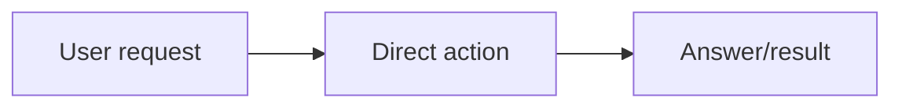

# Workflow Skill

Use this as the workflow layer for user tasks. It has two modes:

- **Lightweight routing check** for simple, obvious, low-risk work.
- **Explicit workflow controller** for concrete Python/C# coding/programming, prompt/instruction authoring, prompt updates or optimization, file-changing, multi-step, skill-editing, UI/artifact/report, or evidence-heavy work.

The explicit workflow turns a request into a target map, chooses the relevant executor skill routes, drives execution, checks whether the target is actually met, and prevents stopping before completion.

## Always-First Rule

`workflow-skill` is the entrypoint and controller for substantive task work. Start with its routing decision before any other user/global skill when executing a task that needs planning, implementation, verification, or evidence. Other skills are executors selected by `workflow-skill`; they should not be treated as independent first-entry controllers for task work.

For tiny direct answers, obvious file inspection, state listing, or one-shot command execution, keep the target map implicit and lightweight. Do the requested action directly, then answer with the result. Do not expand into a formal target map, executor route list, report, or code/test/verify spine unless the request has real risk, ambiguity, side effects, or a verification requirement.

## Start Diagram Rule

Before task action, write a user-facing workflow diagram first whenever `workflow-skill` handles the request.

- In lightweight mode, show a compact direct-route diagram and one sentence naming the direct action and stop condition.
- In explicit workflow mode, show a task-specific Mermaid diagram and the target map before implementation, file edits, tool-side effects, or worker-skill execution.
- The diagram must name the actual work inside the route: relevant files, artifacts, commands, tests, reports, skill sync, browser checks, or verification steps. Do not hide the task behind generic labels such as "do work" or "process".
- Keep the diagram concise. Show meaningful task-level steps, not every tiny shell command.
- If the request is ambiguous, dangerous, destructive, or needs credentials, show the diagram up to the decision point and ask for the missing approval/input before side effects.
- Read `references/start-diagram-template.md` when a quick fill-in template would save time or keep the diagram consistent.

## Generated File Placement

Put intermediate files, temporary inputs, caches, generated scratch data, logs, previews, and other non-final artifacts in the relevant `cache/` directory. Use the current task or project directory's `cache/` folder for task-specific artifacts, or this skill's `cache/` folder for skill-internal artifacts. Create the folder if needed. Final deliverables go only to the user-requested path or the active workspace `outputs/` directory.

## Internal Route Selection

This skill controls a workflow with many possible executor branches. Do not run every branch just because it exists. Select every branch that matches the requested artifact and task type, and combine branches when the task spans text, Python code, C# code, UI, image, document/PDF, global skill edit, optimization, management-skill for GitHub sync or auth/profile switching, or mixed work.

Read `references/routing-matrix.md` when a task spans multiple artifact types, touches global skills, edits or writes prompts/instructions, or the correct route is not obvious from the request.

Use `scripts/validate_workflow_skill.py` only to validate this skill's routing contract after editing the skill.

## Trigger

Use this skill as the starting routing decision for user task requests before invoking any other user/global skill.

Write the explicit target map only when the task is worth that overhead:

- concrete Python or C# code/programming work
- prompt/instruction authoring, updates, review, or optimization, including standalone prompt text not embedded in code
- editing files or changing executable behavior
- multi-step work with dependencies or unclear order
- UI, image, document, PDF, report, or generated artifact work
- skill creation, deletion, renaming, reorganization, or sync
- browser/computer-control workflows with observable pass criteria
- tests, verification, debugging, repair, optimization, or evidence reports
- anything high-risk, high-stakes, ambiguous, or likely to require iteration

Keep the workflow lightweight for simple obvious work:

- answering a direct question
- reading, listing, or summarizing a file
- checking status
- running a clearly requested command
- returning a short explanation where no file changes, side effects, or formal proof are needed

Even in lightweight mode, show the small direct-route diagram first. Use judgment: if the simple-looking request has hidden side effects, may change state, may be destructive, or needs proof, upgrade to explicit workflow mode.

## Workflow

For explicit workflow mode, run the start diagram and start contract, route the necessary executor skills, execute the work, test it, verify it against the target, and loop until the stop condition is met.

For lightweight mode, display only the compact direct-route diagram, make the smallest routing decision needed, perform the direct action, and answer.

## Start Contract

For lightweight mode, before the direct action, write this compact shape with task-specific labels:



Then do the direct action.

For explicit workflow mode, before doing the work, write a task-specific Mermaid start diagram followed by a short target map:

1. `Task slices`: the ordered pieces of work.
2. `Artifacts`: what will exist or change, such as text, Python/C# code, image, UI, PDF, Markdown, skill files, or GitHub state.
3. `Pass targets`: what observable result proves each artifact is correct.
4. `Skill route`: the skills needed and the order they must run; the first skill must be `workflow-skill`.
5. `Stop condition`: the exact condition that allows final completion.

Make the pass target match the artifact:

- Text: required sections, wording constraints, format, and destination.
- Prompt/instruction: purpose, inputs or variables, output contract, reusable general rules, and destination; keep it concise, direct, and free of case-by-case warnings unless examples are explicitly requested.
- Image: source image, output image, visible changes, dimensions or visual constraints.
- Python/C# code: behavior, real input, command or app flow, real output, and pass reason.
- UI: page or screenshot target, viewport sizes, interaction state, and visual blockers.
- Link or URL: exact URL plus response, page state, or extracted content.
- Document/PDF/report: file path, rendered or parsed content, and required evidence fields.
- Skill: frontmatter, trigger description, references, scripts, route behavior, old-name cleanup, and sync state.
- GitHub or management: local input state, command used, remote or profile result, and privacy constraints.

Begin after the target map unless the request is ambiguous, dangerous, destructive, or needs user credentials.

Skip the written target map in lightweight mode, but do not skip the compact direct-route diagram.

## Mandatory Execution Spine

For concrete Python or C# code/programming, local Python scripts, C# automations, global-skill Python scripts, or any task that creates or edits Python/C# executable behavior, run this order:

```text
workflow-skill -> code-skill -> test-skill -> verify-skill -> goal check
```

- `code-skill`: executor for writing, editing, refactoring, or reasoning about Python/C# code and helper scripts only.
- `test-skill`: executor for small real tests with concrete input and real output. Do not accept import-only, signature-only, mock-only, or bare `OK` evidence when real usage is practical.
- `verify-skill`: executor for comparing the observed result against the original pass targets, including UI, generated artifacts, skill instructions, or process requirements.

For non-code artifacts, replace `code-skill` with the relevant production skill or direct artifact work, then still use `test-skill` and `verify-skill` when objective evidence or a report is required.

Do not apply the full spine to simple read-only work, plain Q&A, obvious file viewing, or a single clear command that only reports state. Use the full spine only when the task changes Python/C# code, executable behavior, artifacts, needs debugging, or benefits from real verification evidence.

For standalone prompt/instruction work, do not route through `code-skill` unless the prompt is being embedded in Python or C# executable code. Treat the prompt as a text artifact, test or inspect the resulting prompt against the target output contract when practical, and verify that the rule is stated at the right level of abstraction.

For global skill creation, deletion, rename, or editing, include `management-skill` before reading/editing and after verification when the user wants the saved skill pushed. Use the GitHub sync route inside `management-skill` for the actual mirror operation.

Choose the final evidence format by complexity. Simple successful results can be reported in a few chat lines with the command/tool used, the real output, and why it passes. Generate a PDF/report artifact only when the user explicitly asks for one, a repo rule requires one, or the evidence is long, table-heavy, visual, screenshot-based, image-comparison-based, document-like, or otherwise easier to review as an artifact.

When a report is generated, every passing row must include `Input`, `Used`, `Output`, and `Why Pass` with real evidence.

## Completion Loop

After `test-skill` and `verify-skill`, compare the observed evidence with the target map.

- If every pass target is met, provide concise chat evidence for simple results and generate a report artifact only when the evidence complexity, visual material, explicit user request, or repo rule warrants it.
- If any pass target is not met, continue from the relevant execution step, fix the issue, retest, and verify again.
- Do not stop because the method was attempted. Stop only because the target is met, the user changes the goal, or a real blocker prevents progress.

For lightweight mode, the stop condition is simply that the direct requested answer, file read, status check, or command output was delivered.

## Final Response

Keep the final chat short. State what changed, what passed, where the deliverables are, and any remaining unverified scope. If the evidence is simple, include it directly in chat. If a report artifact was generated, do not repeat the full process report in chat; point to the report and summarize the key pass/fail result.

## Guardrails

- Do not start a worker skill before `workflow-skill` for task work.
- Do not over-process simple work. Use only the compact direct-route diagram, and avoid formal target maps, internal route expansion, PDF reports, or test/verify loops when the request is a direct answer, file read, status check, or one clear command with no meaningful side effects.
- Do not run every skill branch just because it exists; select every branch that is actually needed for the task.
- Do not stop before the stated pass targets are met unless there is a real blocker.
- Do not replace `test-skill` evidence with a method-only or status-only claim.
- Do not push to GitHub unless the user request or active workflow requires saved global-skill changes.
- For prompt work, do not pad the prompt with obvious prohibitions, near-duplicate warnings, or case-by-case exclusions. State the general rule once, use the output contract to constrain shape, and only include examples when the user explicitly asks for examples.

## Examples

- "Create a new skill and push it" -> decompose, use management-skill with its GitHub sync route, code-skill for Python/C# scripts when needed, test-skill, verify-skill, then sync.
- "Fix this Python script" -> decompose, use code-skill, run a real Python input through test-skill, then verify behavior.
- "Review this UI" -> decompose visual targets, use verify-skill UI route, capture real evidence, and report blockers.
- "What does this file say?" -> lightweight mode: show compact direct-route diagram, read the file, and answer; no formal target map.
- "Run `date`" -> lightweight mode: show compact direct-route diagram, run the command, and report the output.

## Verification

After editing this skill:

1. Run the structural validator:

   ```bash
   python3 scripts/validate_workflow_skill.py --skill-dir /Users/qin/.codex/skills/workflow-skill --output cache/workflow-skill-validation/result.json
   ```

2. Run the skill-creator quick validator when a Python with PyYAML is available.
3. Run `test-skill` with real evidence; generate a PDF only when the evidence is long, table-heavy, visual, comparison-based, explicitly requested, or required by the repo.
4. Run `verify-skill` against the requested outcome and the selected evidence/report format.
