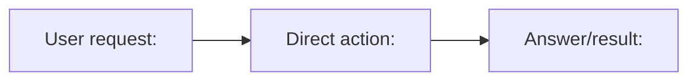
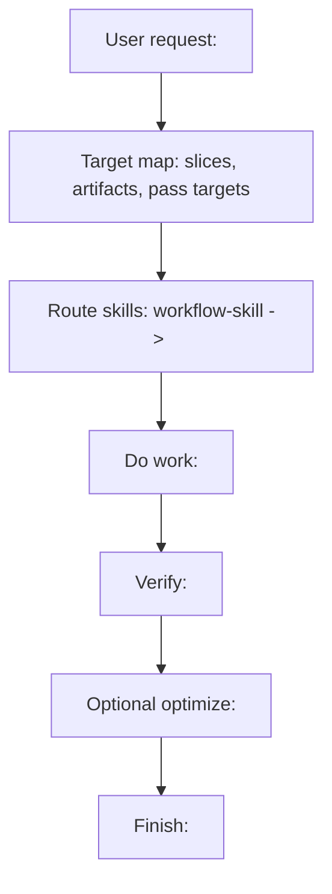
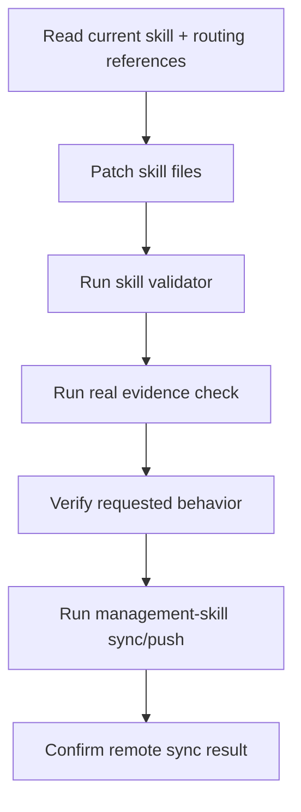
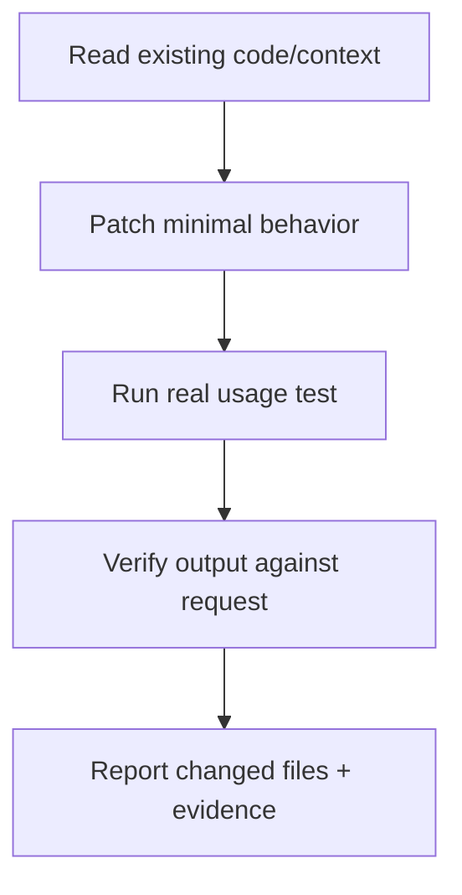

# Start Diagram Template

Use this reference when `workflow-skill` needs a fast task-specific diagram and target map before work begins.

## Lightweight Direct Route

Use for direct answers, file reads, status checks, or one clear command with no meaningful side effects.

Direct route: `<action>`; stop when `<observable answer/result>` is delivered.

## Explicit Workflow Route

Use for file edits, code, debugging, generated artifacts, skill work, verification, UI, reports, or any multi-step task.

Target map:
- `Task slices`: `<ordered work>`
- `Artifacts`: `<files/artifacts/state that will change>`
- `Pass targets`: `<observable proof>`
- `Skill route`: `workflow-skill -> <skills in order>`
- `Stop condition`: `<exact finish condition>`

## Skill Edit And Push Route

Use when editing global skills and publishing them.

Target map:
- `Task slices`: read skill, patch focused files, validate, verify with real evidence, push.
- `Artifacts`: `SKILL.md`, references/scripts/assets, generated validation output, remote skill mirror.
- `Pass targets`: validator passes, requested trigger/workflow behavior is present, public-safety sync allows push, remote commit/hash is reported.
- `Skill route`: `workflow-skill -> management-skill -> code-skill -> verify-skill -> management-skill`.
- `Stop condition`: global skill mirror has the verified update or a real sync blocker is reported.

## Code Change Route

Use when changing executable code or scripts.

Target map:
- `Task slices`: inspect, edit, run concrete input, verify observed output.
- `Artifacts`: changed code, test inputs/logs/report if needed.
- `Pass targets`: real behavior matches request; no import-only or status-only proof.
- `Skill route`: `workflow-skill -> code-skill -> verify-skill`.
- `Stop condition`: observed output satisfies every pass target.
