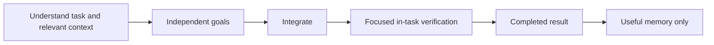

# Optional task diagram

Use a diagram only when dependencies help the user understand the work. Name actual goals and model assignments; omit it for simple work.

Skill-governed stages and memory retain the selected model and effort. Only independent unconstrained stages may route adaptively. Memory can be skipped when absent or unnecessary.
