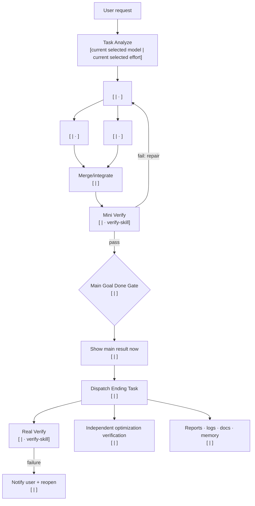
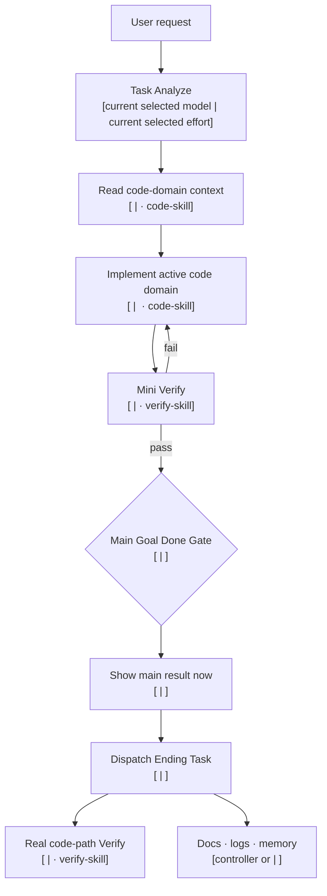

# Workflow Display Templates

`task-analyze-skill` chooses the display. The entry placeholders mean the model and effort currently selected when the user starts the task; they are never hard-coded to Sol.

## Easy Task: Text Only

```text
Task: <result> — easy, <overall effort>
Route: Task Analyze [current selected model | current selected effort] -> <direct action> [<model> | <effort>, <skill>] -> Mini Verify [<model> | <effort>, verify-skill] -> Main result [<model> | <effort>] -> Ending Task [<model> | <effort>]
Why these models: <one sentence>
```

Do not add Mermaid, a formal target map, or broad explanation for an easy task. Mini Verify may be one minimal action-done confirmation.

## Complex Task: Mermaid



Follow with a numbered `Workflow with models` list. Every item names exact model ID, effort, skill, dependency, and stop condition.

## Sequential Code Route



Tiny model routes use exactly Spark-low plus the full normal fallback ladder. Every non-tiny model route uses the exact full Luna-low→Sol-ultra ladder with no Spark. Never raise Spark effort; use the learned normal fallback when Spark cannot execute.

## Global Skill Edit Route

```mermaid
flowchart TD
  U["User request"] --> A["Task Analyze<br/>[current selected model | current selected effort]"]
  A --> B["Audit authoritative skills<br/>[<dynamic selected model> | <effort> · management-skill]"]
  B --> C["Update contracts/docs<br/>[<dynamic selected model> | <effort>]"]
  C --> P["Update Python validators/helpers<br/>[<dynamic selected model> | <effort> · code-skill]"]
  P --> V["Mini Verify: syntax + focused contract scenarios<br/>[<dynamic selected model> | <effort> · verify-skill]"]
  V -->|fail| C
  V -->|pass| G{"Main Goal Done Gate<br/>[<dynamic selected model> | <effort>]"]
  G --> R["Show main result now<br/>[<dynamic selected model> | <effort>]"]
  R --> E["Dispatch Ending Task<br/>[controller or <dynamic selected model> | <effort>]"]
  E --> RV["Real replay + loader/runtime proof<br/>[<dynamic selected model> | <effort> · verify-skill]"]
  E --> OV["Independent optimization check<br/>[<dynamic selected model> | <effort>]"]
  E --> D["README · report · logs · memory<br/>[controller or <dynamic selected model> | <effort>]"]
```

Add publish/sync nodes only when the user explicitly requested them.

All displayed pairs are dynamic selections. Categories/model roles are cold-start hints only. For `mini_real`, Mini PASS is provisional; Ending Real updates the same producer run and returns routing learning before an exact-profile route freezes.

## Topology Rules

- Parallel: Mini Verify each independent result branch before merge when a merge check cannot expose its basic failure.
- Sequential: one consolidated Mini Verify after the last dependent result-bearing step.
- Mixed: one integration Mini Verify after merge, plus only necessary isolated branch checks.
- Main Result always follows Mini Verify.
- Ending Task always follows Main Result.
- Real Verify and optimization verification never feed the first Main Result.
